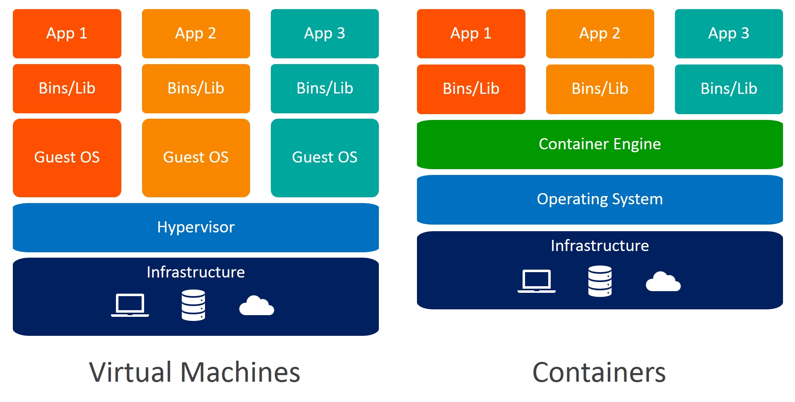
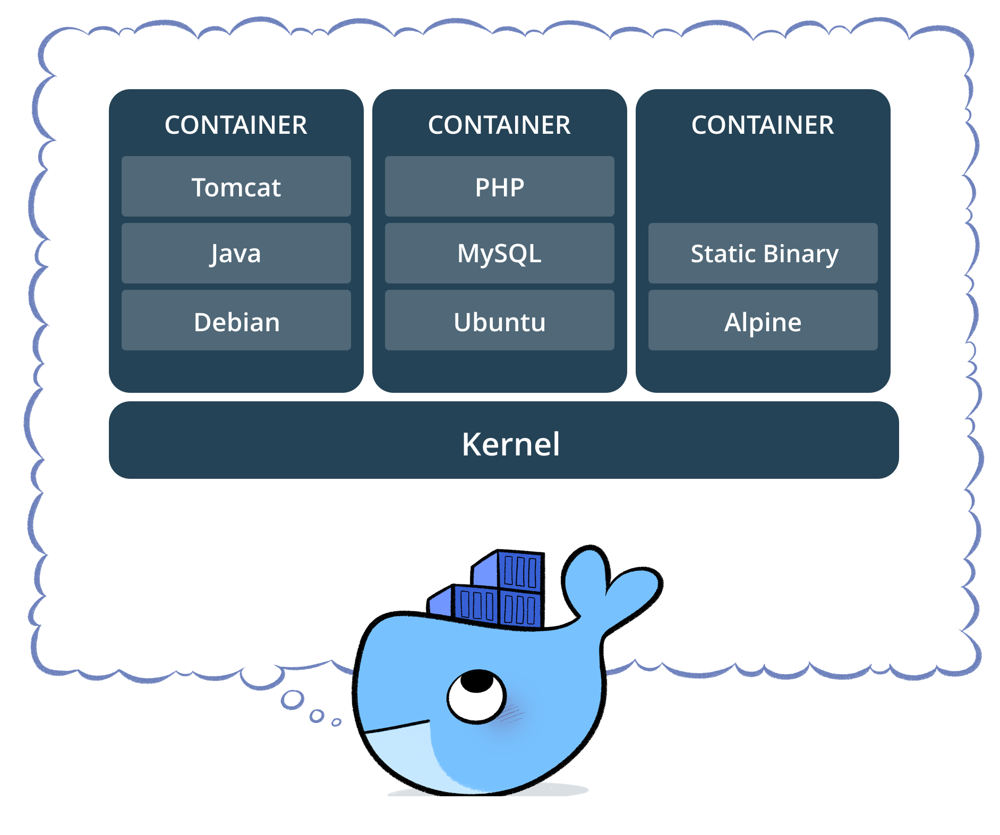

# Docker Course 
Autor: Caio Delgado  

## Capítulo 01 - Fundamentos

### O que é o Docker

Docker é uma plataforma Open Source escrita em Go  (Linguagem de programação em alta performance desenvolvida pela Google)  que ajuda a criação e a administração de ambientes isolados.

Com a utilização do Docker podemos gerenciar toda a infraestutura de uma aplicação, bem como garantir que ambientes de desenvolvimento, homologação e produção contenham os mesmos componentes e versões de aplicações, a fim de minimizar impactos no processo de desenvolvimento e entrega de software.

O Docker trabalha com uma virtualização a nível do sistema operacional, onde o mesmo utiliza de recursos como o kernel do sistema hospedeiro para executar seus containers. Diferente do modelo tradicional de Máquinas Virtuais, o Docker não necessita da instalação de um sistema operacional por completo, e sim apenas dos arquivos necessários para a aplicação ser executada.

### Por que usar Docker

Em 2013, Docker introduziu o que se tornou o padrão da industria para containers, trouxe uma maneira simples, rápida e eficiente de executar aplicações sem a complexidade de uma máquina virtual.

Docker garante um ecossistema consistente, fazendo com que o desenvolvedor possa trabalhar sem se preocupar, por exemplo, com a abertura de tickets para uma equipe de infraestrutura provisionar um ambiente por completo, atrasando o trabalho de entrega de software.

Existem diversas engines e runtimes de containers e até é possível utilizar containers sem Docker, mas atualmente o Docker é a engine/runtime de container mais utilizada no mercado, o que torna o conhecimento do mesmo um **"Must have"** e dificilmente encontramos vagas na área de tecnologia que não pedem um conhecimento, mesmo que básico, de containers ou Docker.

### O que é um container

Um container consiste de um ambiente completo (uma aplicação e todas suas dependências, bibliotecas, binários, arquivos de configuração) em um unico pacote. Ao containerizar uma plataforma de aplicação e suas dependências as diferenças em distribuições de sistemas operacionais e camadas inferiores da infraestrutura são abstraídas.

> Imagine que o container Docker é como se fosse um container real em um navio (servidor), todos os containeres estão lado a lado, porém seu conteúdo (ecossistema) não tem interferencia de outros containers.

Podemos dizer também que um container é a unidade mínima computacional do Docker, ou seja, o menor recurso que o Docker pode fornecer.

### Versões

O Docker possui basicamente duas versões, a versão da comunidade (Community Edition) e a versão empresarial (Enterprise Edition).

A versão Community é de uso gratuito e também tem seu código aberto.

A maioria dos sistemas docker em produção utiliza a versão Docker Community Edition. O licenciamento anual da versão Enterprise custa cerca de US$750 por nó, o que torna o processo inviável para algumas empresas.

> **ATENÇÃO:** Para fins da prova Docker Certified Associate **(Docker DCA)** a versão Community deve ser utilizada apenas em ambientes de desenvolvimento e não deve ser utilizada em produção. Para produção a unica versão a ser utilizada é a Enterprise Edition.

A versão enterprise conta com recursos como o **UCP** (Universal Control Plane) e o **DTR** (Docker Trusted Registry), bem como suporte da Docker Inc.

A recomendação Mínima para a versão enterprise do Docker EE é:
* 8GB de RAM para nós Managers
* 4GB de RAM para nós Workers
* 2vCPUs para nós Managers
* 10GB de espaço em disco livre para a partição `/var` em nós Managers (Minimo de 6GB Recomendado)
* 500MB de espaço em disco livre para a partição `/var` em nós workers

A recomendação para ambientes de produção do Docker EE é:
* 16GB de RAM para nós Managers
* 4vCPUs para nós Managers
* 25 a 100GB de espaço livre em disco.

### Instalação

Iremos instalar o Docker em máquinas virtuais para que possamos facilitar o estudo, para isto utilizaremos uma solução chamada **Vagrant** somado ao **Virtualbox**, você pode utilizar a solução de virtualização que preferir, porém eu indico que você siga exatamente como listado no curso uma vez que caso você precise de suporte eu possa lhe ajudar.

> Lembre-se de habilitar a virtualização Intel VT-x ou AMD SVN na UEFI/BIOS.

#### Instalando o Vagrant e Virtualbox 

Para instalar o Virtualbox siga os passos:

1. Acesse a página de [Downloads do Virtualbox](https://www.virtualbox.org/wiki/Downloads) e faça o download da versão coorespondente ao seu sistema operacional.
2. Execute a instalação do pacote do Virtualbox.
2.1. Para linux execute o programa de instalação de pacotes (`sudo dpkg -i <pacote>.deb` para sistemas debian-like ou `sudo rpm -i <pacote>.rpm`)
2.2. Para Windows, clique sob o instalador e avance até o final da instalação.
2.3. Para MacOS, clique sob o instalador e avance até o final da instalação.

Para Instalar o vagrant siga os passos:

1. Acesse a página de [Downloads do Vagrant](https://www.vagrantup.com/downloads.html) e faça o Download da versão correspondente ao seu sistema operacional
2. Execute a instalação do pacote do vagrant
2.1. Para linux execute o programa de instalação de pacotes (`sudo dpkg -i <pacote>.deb` para sistemas debian-like ou `sudo rpm -i <pacote>.rpm`)
2.2. Para Windows, clique sob o instalador e avance até o final da instalação.
2.3. Para MacOS, clique sob o instalador e avance até o final da instalação.
3. Após a instalação abra um terminal ou um prompt de comando e execute o comando `vagrant --version` para verificar se o pacote foi instalado com sucesso.

