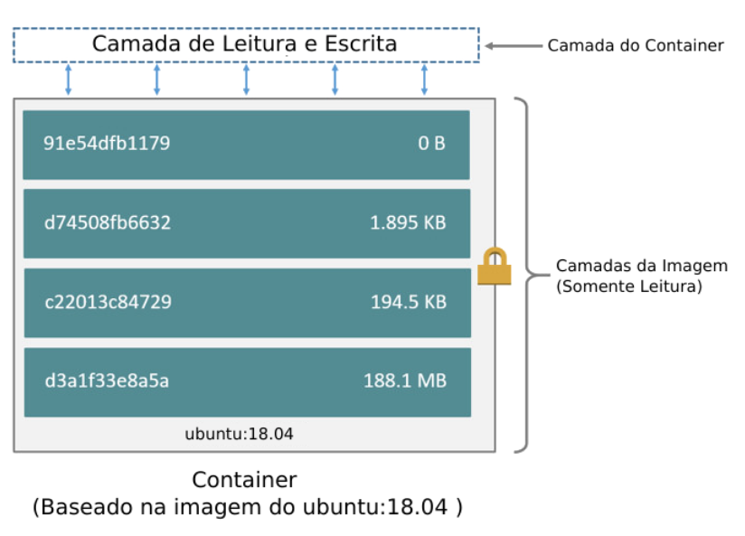
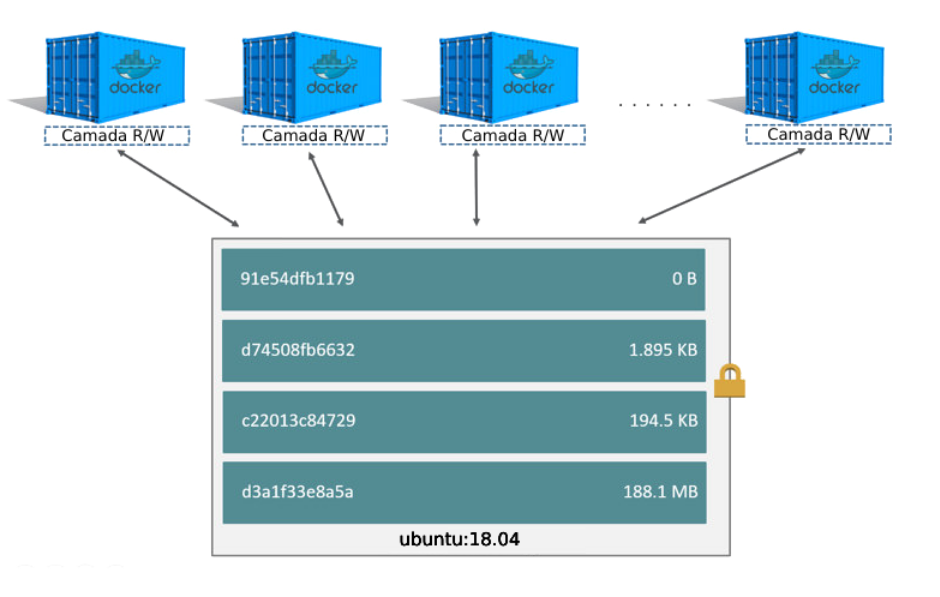
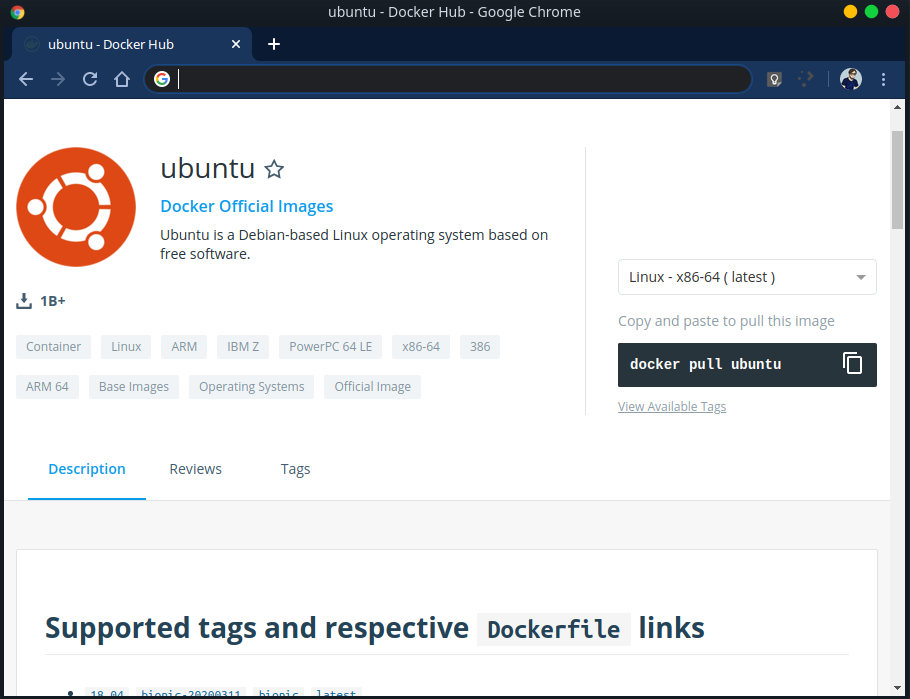
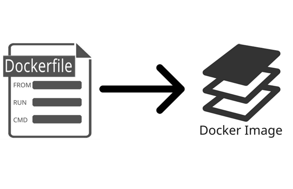

# Docker Course 
Autor: Caio Delgado  

## Capítulo 02 - Imagens

### Conceitos

#### Docker Image

Uma imagem Docker é um pacote executável que inclui tudo o que é necessário para executar um aplicativo, incluindo o código, bibliotecas, variáveis de ambientes e arquivos de configuração.

As imagens do Docker possuem camadas intermediárias que aumentam a capacidade de reutilização, diminuem o uso do disco e aceleram a construção do docker, permitindo que cada etapa seja armazenada em cache. Essas camadas intermediárias não são mostradas por padrão.

A principal diferença entre um container e uma imagem é a camada gravável superior. Todas as gravações no container que adicionam novos dados ou modificam dados existentes são armazenados nessa camada gravável. Quando o container é excluido, a camada gravável também é excluida. A imagem subjacente permanece inalterada.

Um ponto interessante é que em um cenário onde temos 1 container com a imagem `ubuntu:18.04` por exemplo, ocuparia `200MB` ( estamos considerando este tamanho para a imagem citada) somados a quantidade de dados específicos deste container ( vamos considerar `50MB` para este exemplo) totalizando `250MB`. o mesmo caso com 10 containers serão utilizados os `200MB` da imagem somados aos 50MB de cada container em execução, pois suas camadas readonly é compartilhada, totalizando assim `750MB` no total. 

> O mesmo cenário em máquinas virtuais seria exponencialmente maior, uma vez que precisamos instalar todo o sistema operacional e parametrizar cada máquina individualmente.

#### Dockerhub

Estas imagens ficam armazenadas em repositórios locais e/ou remotos, um exemplo de repositório remoto é o DockerHub que é um repositório publico de imagens docker onde podemos escolher e utilizar as imagens para subir nossos containers. 

#### Dockerfile

O Dockerfile é um arquivo de instruções de como deve ser gerada a imagem Docker, através deste arquivo podemos criar novas imagens para serem utilizadas.

### Dockerfile

