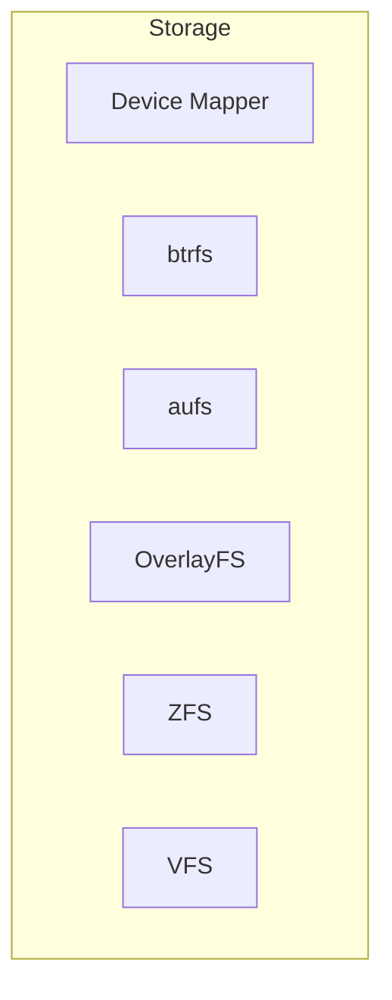
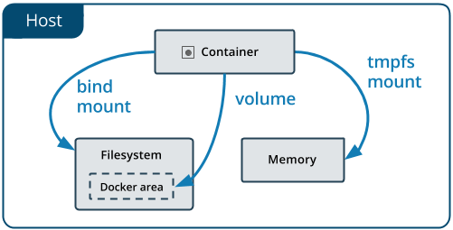

### Storage Drivers




* **Device Mapper**: Framework de gerenciamento de volumes linux
* **btrfs**: CoW (copy-on-write) filesystem, pode ser utilizado para combinar diversos blocos físicos em um único sistema btrfs
* **aufs**: Union Filesystem. Driver antigo, não deve ser utilizado em kernel > 4.0 , overlay2 é superior
* **OverlayFS**: Union Filesystem morderno, também conhecido como overlay2, é o recomendado pelo docker.
* **ZFS**: Next Generation filesystem, suporta gerenciamento de volume, snapshot, checksum, compressão, replicação, etc...
* **VFS**: cada camada é diretamente um diretório no disco, sem suporte ao CoW (copy-on-write)

> **CoW** ou **copy-on-write** é uma tecnica de gestão de recursos criada para duplicar ou copiar em recursos modificáveis. Se um recurso é duplicado mas não modificado, não é preciso criar um novo recurso, é feito o compartilhamento do recurso atual.

Para visualizar o storage driver em uso basta executar o comando
```bash
docker system info | grep Storage
```

A alteração do storage driver padrão deve ser feita através do arquivo de parametrização `daemon.json` no qual falaremos mais adiante

```json
{
    "storage-driver": "overlay2"
}
```

### Docker Volumes

Volume é um diretório especialmente designado, seja em um ou mais containers que compartilham o sistema de arquivos UnionFS

Os volumes são projetados para manter os dados, independentemente do ciclo de vida do container. O Docker nunca exclui um volume automaticamente quando você remove um container.

Existem 3 tipos de Volumes:

* **host** - Reside no sistema de arquivos do host do docker e pode ser acessado dentro de um container;
* **nomeado** - Volume gerenciado e criado pelo Docker, na criação do volume é dado um nome para o mesmo.
* **anônimo** - Volume gerenciado e criado pelo Docker, na criação do volume não é informado o nome para o mesmo e o Docker se encarrega de nomea-lo com uma hash de 64 caracteres.

Existem alguns tipos de montagem para os volumes. O volume do tipo **host** tem sua montagem realizada como um **bind mount** e existe ainda um volume do tipo **tmpfs mount** o qual reside na memória do sistema (volátil)



Existem algumas vantagens ao se utilizar volumes do Docker ao invés de **bind mounts**

* Volumes são mais fáceis de efetuar o backup ou migração que bind mounts;
* É possível efetuar a gerência de volumes utilizando o Docker CLI ou o Docker API;
* Volumes podem ser compartilhados de maneira mais segura entre múltiplos containers;
* Drivers de Volumes podem habilitar o armazenamento em hosts remotos ou provedores de cloud, criptografar o conteúdo ou adicionar novas funcionalidades;
* Novos volumes podem ter seu conteúdo pré-populados por um container.

### Gerenciar Volumes

Para utilizar volumes no docker utilizamos a opção **-v** ou **--volume** para indicar qual volume deve ser montado no container.

Também podemos montar um volume utilizando a opção `--mount` que é mais explicita e verbosa. 

A maior diferença é que a sintaxe do `-v` combina todas as opções no mesmo campo, enquanto a `--mount` separa elas. Contrario a bind mounts, todas as opções para volumes são disponíveis para ambas flags `-v` e `--mount`. 

Quando usamos volumes com serviços, somente a opção `--mount` é suportada.


Primeiramente vamos montar um volume do tipo host através de um **bind mount**
```bash
docker container run -dit --name servidor -v /srv:/srv debian
docker container exec servidor df -Th
```

O parâmetro **-v** seguido de um diretório em caminho absoluto ou relativo separado por **:** a um caminho absoluto faz com que o diretório **/srv** da máquina hospedeira seja montado dentro do container gerado.

Vamos efetuar a cópia de alguns arquivos para o volume, verificando o conteúdo da pasta antes e após a execução
```bash
docker container exec servidor ls -lR /srv
sudo cp -r ~/dockerfiles /srv
docker container exec servidor ls -lR /srv
```
_Note que os arquivos copiados para a pasta **/srv** do host estão sendo exibidos também na pasta **/srv** do container_

Vamos remover o container e cria-lo novamente utilizando um **volume anônimo**
```bash
docker container rm -f servidor
docker container run -dit --name servidor -v /volume debian
```

Podemos utilizar o comando **docker container inspect** para verificar o local e nome do volume criado
```bash
docker container inspect servidor | grep volume
```
_Por padrão, os volumes criados e gerenciados pelo docker se localizam no diretório **/var/lib/docker/volumes**_

Podemos também visualizar informações do volume através do comando **docker volume inspect**
```bash
docker volume ls
docker volume inspect <hash>
```

Visualize o volume criado no container
```bash
docker container exec servidor df -Th
docker container exec servidor ls -lR /volume
```

Copie os arquivos no host hospedeiro e verifique o conteúdo no container
```bash
sudo cp -r ~/dockerfiles /var/lib/docker/volumes/<hash>/_data
docker container exec servidor ls -lR /volume
```

Vamos remover o container e cria-lo novamente utilizando um **volume nomeado**
```bash
docker container rm -f servidor
docker container run -dit --name servidor -v volume:/volume debian
docker volume ls
```

Perceba que a diferença de um volume **nomeado** para um **anônimo** é apenas o nome do volume

Para criar o mesmo container utilizando a flag `--mount` precisamos passar o `source` e o`target`

```bash
docker container run -dit --name servidor2 --mount source=volume2,target=/volume2  debian
``` 

Podemos inspecionar o container filtrando o volume com a opção `-f` ou `--format` 
```bash
docker container inspect servidor --format '{{json .Mounts }}' 
docker container inspect servidor2 -f '{{json .Mounts }}'
```

Podemos também visualizar de uma maneira mais agradavel ao instalar o `jq` e passar a saida dos comandos acima para o jq
```bash
sudo apt-get update && sudo apt-get install jq -y
docker container inspect servidor --format '{{json .Mounts }}' | jq 
docker container inspect servidor2 -f '{{json .Mounts }}' | jq
```

CONTINUAR https://docs.docker.com/storage/bind-mounts/


### Selinux Labels

O mode `:z` indica que o conteúdo do bind mount é compartilhado entre multiplos containers

O mode `:Z` indica que o conteúdo do bind mount é privado e não compartilhado


Para remover um volume no docker podemos utilizar a opção **rm**
```bash
docker volume ls
docker volume rm <hash>
docker volume rm $(docker volume ls -q)
```
_O comando **docker volume ls -q** lista os volumes por **id**_
> **ATENÇÃO:** a remoção do volume através do comando **_docker volume rm_** faz com que o volume seja excluído, não sendo possível a recuperação dos dados.


### Volumes Personalizados

