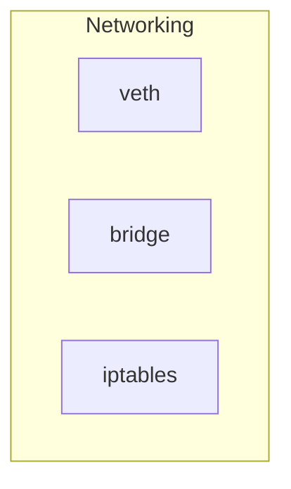
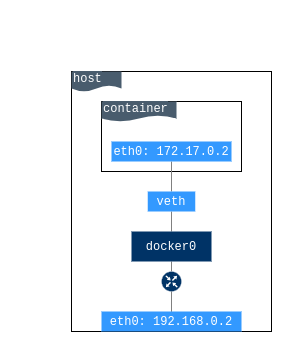
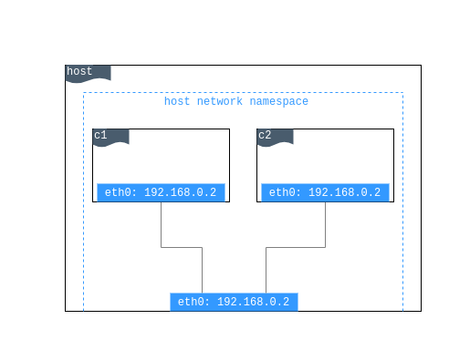

### Networking

Um dos motivos pelos quais os contêineres e serviços do Docker são tão poderosos é que você pode conecta-los entre si ou a outros serviços. Para isso, utilizamos as redes docker.

Recursos de Network utilizados pelo docker:

* **veth**: Virtual Ethernet
* **bridge**: Interface Bridge
* **iptables**: Regras de isolamento de redes

#### Network Drivers

O sistema de redes do docker é "plugável" com a utilização de drivers. Existem diversos drivers para fornecer recursos e funcionalidades de rede:

* `bridge`: Driver de rede padrão. Se não especificarmos um driver, é o tipo de rede que o docker irá utilizar. Geralmente utilizamos redes bridge quando a aplicação será executada em containers isolados que precisam de comunicação.
* `host`: Para containers isolados, remove o isolamento de rede entre o container e o host Docker e utiliza a rede diretamente.
* `overlay`: Redes utilizadas para conectar multiplos Docker Daemons e habilitar os serviços de swarm (cluster) para se comunicarem entre si. 
* `macvlan`: Redes Macvlan possibilitam que configuremos um endereço MAC a um container, fazendo com que ele apareça como um dispositivo físico na rede. O docker daemon faz o roteamento do trafégo entre containers pelo MAC Address.
* `none`: Redes do tipo none disabilitam toda parte de redes do container, não pode ser utilizada com swarm (cluster).
* `plugins`: Utilizados para extender a funcionalidade de redes docker

##### Bridge

É a rede padrão do Docker, caso o container seja criado sem especificar um driver de rede a rede do tipo bridge é criada. Esta rede é criada utilizando um driver de rede de ponte que instancia uma interface de rede no linux chamada de dockerX sendo X um numero. Por padrão a rede bridge conta com um serviço interno de DNS, ou seja, os containers respondem internamente através de seu nome. Também é possivel conectar e desconectar containers on-the-fly.

##### Host

É a rede onde o IP da máquina é compartilhado com o container, nesta rede não é possível existir dois containers utilizando a mesma porta de rede.

