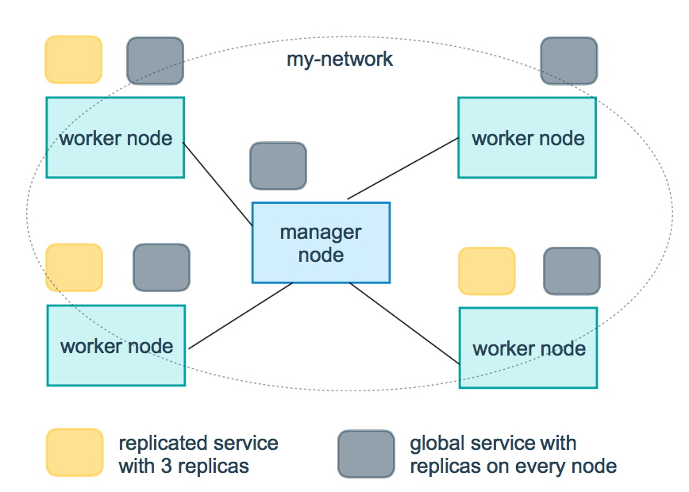

# Docker Swarm

Docker Swarm é uma ferramenta de orquestração de containers, que possibilita o usuário a gerenciar multiplos containers distribuidos em diversas máquinas hosts. Habilitando ferramentas para dimensionamento, rede, proteção e manutenção dos containers.

## Conceitos

**Cluster** 

Cluster é um conjunto de computadores que trabalham em grupo de modo a ser visto como um sistema único.

Utilizamos clusters para ganhar mais poder computacional e maior confiabilidade orquestrando um número de máquinas de "baixo custo" para obter um maior poder de processamento.


**Node** 


Utilizamos o nome Node, ou nó,  quando nos referimos a qualquer elemento computacional que faz parte de um cluster, seja ele um nó do tipo primário (master) ou um do tipo secundário (follower).

Iremos nos referir aos nossos "computadores¨  como Master/Node

Em um passado não tão distante, os termos _Master/Slave_ eram utilizados para se referir aos nós e as ações na qual eles desempenhavam. Em 2020 um forte movimento aconteceu para acabar com essa terminologia, uma vez que ela traz referências a escravidão. Não é sobre aguardar alguem ser ofendido. É sobre remover estes termos com base em coisas terríveis e desumanas.

Algumas alternativas a serem utilizadas para se referir aos nodes:


* Main / Secondary
* Conductor/ Follower
* Leader / Follower
* Host / Client
* Sender / Reciever
* Producer / Consumer
* Primary / Replica
* Primary / Secondary
* Manager / Worker

## Raft Consensus


Quando trabalhamos com sistemas distribuidos, precisamos de algum algorítmo para tratar da confiabilidade do cluster. Um dos algoritmos mais utilizados para este meio é o Raft Consensus.

O Docker Swarm implementa o algorítmo Raft Consensus para gerencia do estado global do cluster.

O nome Raft é uma palavra em inglês que quer dizer Jangada, a referênca é porque para montarmos uma jangada, necessitamos de, ao menos, três toras de madeira.

Consensus é uma palavra em ingles que quer dizer Consenso. É também um dos problemas fundamentais em sistemas distribuidos com tolerância a falhas. Involve multiplos servidores aceitando valores. 

O site [The Secret Lives of Data](http://thesecretlivesofdata.com/raft/) possúi um ótimo guia sobre como ocorre o raft consensus.

Temos também uma página no github dedicado ao [raft](https://raft.github.io/)

Quando temos um sistema composto por um único nó, podemos dizer que este nó armazena um valor único, temos também o cliente que envia este valor para o servidor, neste ponto o cliente e o servidor entram em um "consensus", um valor é simples com um único nó.

Quando temos diversos servidores, como podemos chegar em um consenso ? esse é o problema de sistemas distribuidos.

Como chegamos em um concenso em multiplos nodes? Utilizando algoritmos como o Raft Consensus.

Pensando de uma maneira mais macro, o raft define os nós em três estados básicos:

* Follower
* Candidate
* Leader

Todos os nós começam em um estado de seguidor, se os seguidores não encontrarem um líder, eles se tornam candidatos.

O candidato requisita votos de outros nós e os nós respondem com o voto, o candidato vira um lider se ele tiver os votos de uma maioria dos nodes. Esse processo é chamado de Eleição do Líder


O problema básico evitado ao se utilizar o raft consensus é chamado de `split-brain` ou cérebro dividido, e isto acontece da seguinte maneira:

> Estamos falando apenas de nodes do tipo Master, ou primário.

O Raft Consensus tolera até `(N-1)/2` falhas, e precisa de um quórum de `(N/2)+1` para ser funcional.
> Tratamos apenas numeros inteiros.

Imagine que temos 2 nodes. Caso um dos nodes perca a comunicação (rede), como ele irá saber se: 
* Ele está sem conectividade? 
* O outro nó está sem conectividade? 

Esta ação é chamada de `split-brain`, e o sistema se torna inoperante.

Vamos para o mesmo cenário com 3 nós, onde um node perde a comunicação (rede). O que ocorre neste momento é:
1. Os nodes começam a se perguntar (rede) se os outros nós estão operantes.
2. Os 2 nodes que estão operantes se comunicam e verificam que são a maioria `(N/2)+1` ou seja `(3/2)+1 = 2` e continuam se comunicando.
3. O nó que está inoperante verifica que ele não é a maioria, e para de responder.

Qual seria o problema que poderiamos encontrar caso o nó que ficou sem conectividade continue a operar? Teriamos duas versões das aplicações rodando, uma em cada lado dos servidores, com conteudos diferentes.

| Nós | Tolerância |
| --- | ---------- |
|  1  |      0     |
|  3  |      1     |
|  5  |      2     |
|  7  |      3     |
|  9  |      4     |

Não é comum termos mais de 5 nodes, uma vez que a comunicação entre os nós precisa ser feita de maneira rápida e eficiente, e ao aumentar o número de nodes fazemos com que o volume de replicação de dados aumente, tornando comum a utilização de `3 ou 5` nodes

Mais informações na [Documentação Oficial](https://docs.docker.com/engine/swarm/raft/)

## Criando o Cluster

Trabalharemos com as máquinas `master` `node-01` e `node-02`

Ligue as máquinas
```bash
$ vagrant up master node01 node02
``` 

Acesse a máquina master
```bash
$ vagrant ssh master
```

Para criar o cluster do swarm, precisamos apenas de que o docker esteja instalado na máquina, podemos em seguida executar o comando para verificar seu endereço IP e iniciar o cluster swarm

```bash
$ ip -c -br a show enp0s8
$ docker swarm init --advertise-addr 10.20.20.100
```

Será exibida uma mensagem informando que o swarm foi iniciado e o node é um manager, bem como o token para adicionar mais nós ao swarm.

```bash
Swarm initialized: current node (sqtbdppo34ez4i4wsngbdeply) is now a manager.

To add a worker to this swarm, run the following command:

    docker swarm join --token SWMTKN-1-4n7u9o6cmhoizpx57umbp1g8nkh5zetuimx06k20nme64syy0t-1x0yu5ogxdlu2b0fs7fcnsc91 10.20.20.100:2377

To add a manager to this swarm, run 'docker swarm join-token manager' and follow the instructions.
```

Podemos ver novamente o token para adicionar novos nós ao cluster através do comando `docker swarm join-token <manager/worker>`
```bash
$ docker swarm join-token manager
$ docker swarm join-token worker
```

## Adicionando nós ao cluster.


Na máquina master, copie o token de `worker`

```bash
$ docker swarm join-token worker
```

Em um novo terminal, acesse a máquina `node01` e execute o comando copiado anteriormente
```bash
$ vagrant ssh node01
$ docker swarm join --token SWMTKN-1-4n7u9o6cmhoizpx57umbp1g8nkh5zetuimx06k20nme64syy0t-1x0yu5ogxdlu2b0fs7fcnsc91 10.20.20.100:2377
```

Repita o passo para a máquina `node02`
```bash
$ vagrant ssh node02
$ docker swarm join --token SWMTKN-1-4n7u9o6cmhoizpx57umbp1g8nkh5zetuimx06k20nme64syy0t-1x0yu5ogxdlu2b0fs7fcnsc91 10.20.20.100:2377
```

De volta a máquina master, vamos verificar se os nós foram adicionados corretamente.
```bash
$ docker node ls
```

Verifique que o node que estamos atualmente conectados é informado com um `*` e podemos ver também quais nodes são `manager` ou `lider`

```bash
ID                            HOSTNAME                    STATUS    AVAILABILITY   MANAGER STATUS   ENGINE VERSION
sqtbdppo34ez4i4wsngbdeply *   master                      Ready     Active         Leader           20.10.7
o122d88a3dwxdkw6nyopgmqu7     node01                      Ready     Active                          20.10.7
tj57th3ri0zouv1f8ui90zv0n     node02.docker-dca.example   Ready     Active                          20.10.7
```

> os comandos `docker node` só podem ser executados em nodes do tipo `manager`

Podemos verificar também que uma rede com o driver `overlay` foi criada para comunicação do swarm 

```bash
$ docker network ls
```

## Promovendo um node a Manager ou rebaixando a worker

Podemos promover um node a manager ou rebaixa-lo através do comando `docker node promote` e `docker node demote`

Na máquina master, vamos promover o node01 a manager.
```bash
$ docker node ls
$ docker node promote node01
$ docker node ls
``` 

Note que seu `Manager Status` se tornou `Reachable`, ou seja, ele está disponível, caso a máquina esteja sem comunicação, ela ficará no estado de `Unreachable`

```bash
ID                            HOSTNAME                    STATUS    AVAILABILITY   MANAGER STATUS   ENGINE VERSION
sqtbdppo34ez4i4wsngbdeply *   master                      Ready     Active         Leader           20.10.7
o122d88a3dwxdkw6nyopgmqu7     node01                      Ready     Active         Reachable        20.10.7
tj57th3ri0zouv1f8ui90zv0n     node02.docker-dca.example   Ready     Active                          20.10.7
```

Caso a máquina fique offline veremos o nosso cluster entrar em estado de `split-brain` exibindo a seguinte mensagem ao executar o comando `docker node ls`
```bash
Error response from daemon: rpc error: code = Unknown desc = The swarm does not have a leader. It's possible that too few managers are online. Make sure more than half of the managers are online.
```

Vamos agora rebaixar nosso node a worker.
```bash
$ docker node ls
$ docker node demote node01
$ docker node ls
``` 

> Trabalharemos com apenas um manager pois como falamos na etapa do raft consensus, ter dois managers é pior do que ter apenas um.


## Services e Tasks

Quando falamos de Swarm, precisamos entender dois recursos importantes, os serviços e as tasks

**Services** -> É a definição de um estado desejado.
**Tasks** -> É criada a partir de um serviço que da origem aos containers a serem executados nos nodes.

Quando utilizamos os serviços descrevemos o estado desejado, como por exemplo:


Com isto o swarm manager irá criar as tasks e dividi-las entre os nodes disponíveis, de forma a atender, se possível, o estado desejado.


## Tasks e Agendadores

Uma task é uma unidade atomica agendada em um swarm. Quando declaramos um estado desejado de um serviço criando ou atualizando o serviço, o orquestrador identifica o estado desejado através do agendamento de tasks.

Uma task é um mecanismo uni-direcional, que navega entre uma séria de estados: `assigned`, `prepared`, `running`, etc.. Se uma task falha, o orquestrador remove a task e o container e em seguida cria uma nova task para a substituir de acordo com o estado desejado especificado pelo serviço

| Estado      | Descrição                                                            | 
| ----------- | -------------------------------------------------------------------- |
| `NEW`       | Task foi inicializada .                                              |
| `PENDING`   | Recursos estão sendo alocados                                        |
| `ASIGNED`   | Task foi atribuida a um nó                                           |
| `ACCEPTED`  | Task aceita por um nó worker                                         | 
| `PREPARING` | Docker está preparando a task                                        |
| `STARTING`  | Docker esta iniciando a task                                         |
| `RUNNING`	  | Task em execução                                                     | 
| `COMPLETE`  | Task finalizou sem error code                                        | 
| `FAILED`    | Task finalizou com error code                                        | 
| `SHUTDOWN`  | Docker requisitou o desligamento da task                             |
| `REJECTED`  | O nó worker rejeitou a task                                          |
| `ORPHANED`  | O nó esteve down por muito tempo                                     |
| `REMOVE`    | A task não terminou mas o recurso associado foi removido ou reduzido | 

## Serviços Replicados e Globais

Existem dois tipos de deployment de serviço, o replicated e o global.

Um serviço replicated, é o que informamos a quantidade de tasks identicas que iremos executar, por exemplo quando decidimos fazer um deploy de um webserver com três replicas, servindo o mesmo conteúdo.

O serviço gobal, é o serviço que vai executar em todos os nós, por isso o nome global. Não existe um número de tasks pré-especificadas. Sempre que um novo nó for adicionado ao swarm o orquestrador criará uma task e o agendador (scheduler) atribui a task ao novo nó. Este tipo de serviço é amplamente utilizado quando falamos de agents de monitoramento, scanners anti-virus ou algum serviço que precisa ser executado em cada nó do swarm.

O diagrama abaixo mostra um serviço com três replicas em amarelo e um serviço global em cinza




## Gerenciando Serviços

Para gerenciar os serviços utilizamos o comando `docker service `
```bash
$ docker service --help 
```

Vamos criar um serviço para executar o nginx
```bash
$ docker service create --name webserver nginx
```

Podemos listar os serviços através do subcomando `ls` e listar as tasks através do comando `ps`
```bash
$ docker service ls 
$ docker service ps webserver
```

> Através do `docker service ps`  podemos verificar o estado da task, o id da task e em qual nó a task está sendo executada, bem como se houveram erros e quais portas estão publicadas.

Para publicar alguma porta, podemos executar um `update` no service com o parametro `--publish-add`
```bash
$ docker service update --publish-add 80 webserver
$ docker service ls
```
> Por padrão uma porta aleatória é adicionada ao service (30000 +)

Vemos também que o serviço tem uma nova task e sua task anterior entra em estado de `shutdown`
```bash
$ docker service ps webserver
```

No nosso caso o serviço está rodando no `node01` podemos acessar por um navegador ou através do curl e verificar que o serviço está sendo executado.
```bash
$ curl http://node01.docker-dca.example:30000
```

Também é possivel inspecionar o serviço para identificarmos alguns detalhes interessantes
```bash
$ docker service inspect webserver
$ docker service inspect --pretty webserver
```
> A opção `--pretty` exibe a informação de uma maneira mais agradável para humanos.

```bash
Endpoint Mode:  vip
Ports:
 PublishedPort = 30000
  Protocol = tcp
  TargetPort = 80
  PublishMode = ingress 
```

Podemos ver que:
* O endpoint está sendo executado como `vip` ou seja, `virtual ip`.
* A porta de destino é a `80` , `TargetPort`
* A porta publicada é a porta `30000` , `PublishedPort`
* O modo de publicação é o `ingress` ou seja, a rede que gerencia e controla os dados relacionados ao serviço de swarm.

Vamos remover nosso serviço
```bash
$ docker service rm webserver
```

Assim como fazemos com containers, podemos alterar o comando que o container deve executar, basta adicionar o comando ao final.
```bash
$ docker service create --name pingtest alpine ping google.com
```
Também podemos verificar os logs do serviço. 
```bash
$ docker service logs pingtest
```

## Escalando Serviços

Agora que temos nosso serviço sendo executado, podemos fazer jus ao benefício da elasticidade e escala-lo, ou seja, aumentar a quantidade de replicas em execução.


```bash
$ docker service scale pingtest=3
$ docker service ls
$ docker service ps pingtest
```
> também podemos executar o comando `$ docker service update --replicas 3 pingtest`

Agora que temos nosso serviço executando um container em cada node, podemos verificar os logs de todos os containers de maneira agregada
```bash
$ docker service logs -f pingtest
```

Podemos também verificar os services que estão rodando em cada container
```bash
$ docker node ps master.docker-dca.example
$ docker node ps node01.docker-dca.example
$ docker node ps node02.docker-dca.example
```

Remova o serviço
```bash
$ docker service rm pingtest
$ docker service ls
```

## Secrets 

Em termos de Serviços Swarm, um _secret_ é um `blob data` como senha, chave privada ssh, certificado SSL ou qualquer outro dado que **NÃO** deve ser transmitido pela rede ou armazenado sem criptografia no código fonte da aplicação.

> Um blob (do inglês: Binary Large OBject, basic large object, BLOB ou BLOb, que significa objeto grande binário ou objeto grande básico na tradução literal), é uma coleção de dados binários armazenados como uma única entidade.

Para gerenciar os secrets no swarm, utilizamos o comando `docker secret`

```bash
$ docker secret --help
$ docker secret ls
``` 

Para criar um secret precisamos passa-lo através do _STDIN_, ou através de um arquivo.

```bash
$ echo "caiodelgadonew123" | docker secret create senha_db - 
$ docker secret inspect --pretty senha_db
```
> O secret criado é armazenado no arquivo `/run/secrets/<secret_name>` no container em execução

Vamos executar um container `mysql` passando a senha como um secret
```bash
$ docker service create --name mysql_database \
--publish 3306:3306/tcp \
--secret senha_db \
-e MYSQL_ROOT_PASSWORD_FILE=/run/secrets/senha_db \
mysql:5.7
```

Vamos instalar o client do mariadb, verificar em qual servidor está sendo executada a task com o container e vamos conectar passando a senha que configuramos no arquivo.

```bash
$ sudo apt-get install mariadb-client -y
$ docker service ps mysql_database
$ mysql -h node01.docker-dca.example -u root -pcaiodelgadonew123

> CREATE DATABASE caiodelgadonew;
> SHOW DATABASES:
> EXIT
```

Destrua o serviço
```bash
$ docker service rm -f mysql_database
```

## Network

Vamos criar agora uma rede overlay para suportar um serviço do nginx 

```bash
$ docker network create -d overlay dca-overlay
$ docker network inspect dca-overlay
$ docker service create --name webserver --publish target=80,published=80 --network dca-overlay nginx
$ docker node ps
``` 

Verifique na máquina `node01` que não existe a rede `dca-overlay` que criamos
```bash
$ vagrant ssh node01
$ docker network ls
``` 

Na máquina `master` vamos efetuar o scaling para 3 replicas do webserver
```bash
$ docker service scale webserver=3
$ docker service ps webserver
``` 

Na máquina `node01` verifique que agora que o serviço está em execução, a rede foi criada com o mesmo ID da máquina `master`
```bash
$ docker network ls
``` 

Acesse os endereços dos servidores pelo navegador e veja a página do nginx sendo executada

http://master.docker-dca.example/
http://node01.docker-dca.example/
http://node02.docker-dca.example/

Remova o serviço
```bash
$ docker service rm webserver
```

## Volumes

Para esta etapa, precisamos que o plugin `trajano/nfs-volume` esteja instalado em todas as máquinas que fazem parte do swarm, caso não esteja instalado, verifique a aula `03-volumes` na seção `NFS Volume`

Verifique se o plugin esta instalado e se o `exports` é reconhecido em todas as máquinas
```bash
$ docker plugin ls
$ showmount -e master.docker-dca.example 
``` 

Na máquina master, crie o volume
```bash
$ docker volume create -d trajano/nfs-volume-plugin \
--opt device=master.docker-dca.example:/home/vagrant/storage \
--opt  nfsopts=hard,proto=tcp,nfsvers=3,intr,nolock volume_nfs

$ docker volume inspect volume_nfs | jq
```

Crie um serviço do nginx com 3 replicas apontando para o volume
```bash
$ docker service create --name webserver \
--replicas 3 \
--publish 80:80 \
--network dca-overlay \
--mount source=volume_nfs,target=/usr/share/nginx/html/ \
nginx

$ docker service ps webserver
```

Verifique o conteudo do nginx
```bash
$ curl master.docker-dca.example
$ curl node01.docker-dca.example
$ curl node02.docker-dca.example
```

Altere o conteúdo da pagina e verifique o conteúdo do nginx
```bash
$ echo "<marquee> VOLUME NFS DOCKER SWARM</marquee>" | tee -a /home/vagrant/storage/index.html
$ curl master.docker-dca.example
$ curl node01.docker-dca.example
$ curl node02.docker-dca.example
```

Remova o serviço
```bash
docker service rm webserver
```

## Stacks

568
https://docs.docker.com/engine/swarm/stack-deploy/
https://docs.docker.com/engine/reference/commandline/stack/