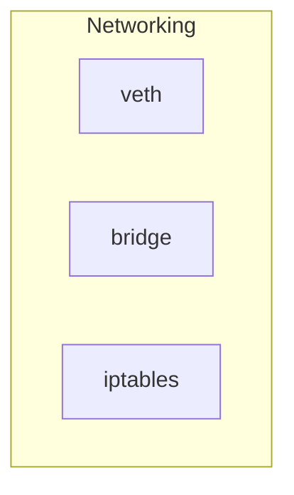
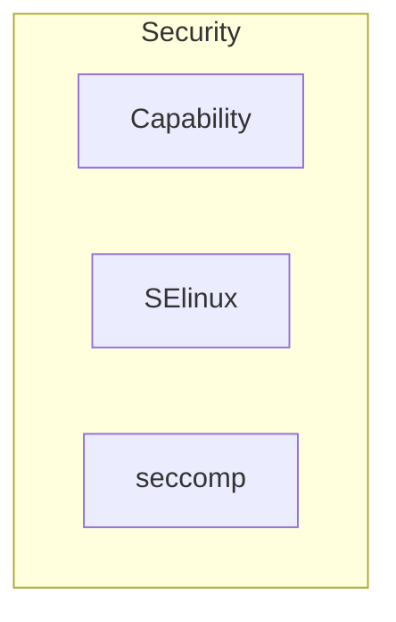

#### Networking

* **veth**: Virtual Ethernet
* **bridge**: Interface Bridge
* **iptables**: Regras de isolamento de redes

#### Security

* **Capability**: Linux Kernel Capabilities
* **SELinux**: 
* **seccomp**: 
