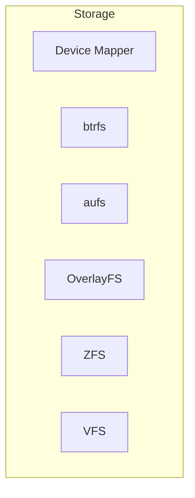
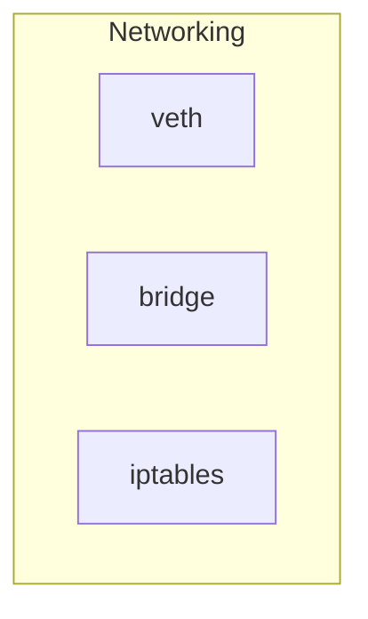
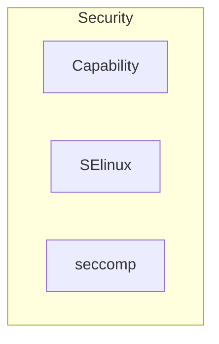

#### Storage

* **Device Mapper**: Framework de gerenciamento de volumes linux
* **btrfs**: CoW (copy-on-write) filesystem, pode ser utilizado para combinar diversos blocos físicos em um único sistema btrfs
* **aufs**: Union Filesystem. Driver antigo, não deve ser utilizado em kernel > 4.0 , overlay2 é superior
* **OverlayFS**: Union Filesystem morderno, também conhecido como overlay2, é o recomendado pelo docker.
* **ZFS**: Next Generation filesystem, suporta gerenciamento de volume, snapshot, checksum, compressão, replicação, etc...
* **VFS**: cada camada é diretamente um diretório no disco, sem suporte ao CoW (copy-on-write)

> **CoW** ou **copy-on-write** é uma tecnica de gestão de recursos criada para duplicar ou copiar em recursos modificáveis. Se um recurso é duplicado mas não modificado, não é preciso criar um novo recurso, é feito o compartilhamento do recurso atual.
#### Networking

* **veth**: Virtual Ethernet
* **bridge**: Interface Bridge
* **iptables**: Regras de isolamento de redes

#### Security

* **Capability**: Linux Kernel Capabilities
* **SELinux**: 
* **seccomp**: 
