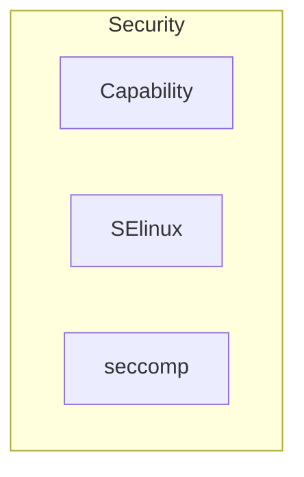

## ESCREVER

* HORIZONTAL SCALING / VERTICAL SCALING
* --constraint node.role==manager

#### Security


* **Capability**: Linux Kernel Capabilities
* **SELinux**: 
* **seccomp**: 


## Network Plugins

> Lista completa com definições [Network Plugins](https://docs.docker.com/engine/extend/legacy_plugins/#network-plugins)

Os plugins de rede habilitam com que as redes sejam estendidas para suportar diversas tecnologias de redes.

### Instalando um plugin

Iremos instalar um plugin chamado `Weave Network Plugin` que trata-se de um plugin que conecta containers dockers através de multiplas clouds ou hosts e habilita o service discovery de aplicações


1. Instale o plugin `weaveworks/net-plugin`
```bash
$ docker plugin install weaveworks/net-plugin
```

2. Crie uma rede com o `net-plugin`
```bash
$ docker network create -d weaveworks/net-plugin:latest rede-weaveworks
```
 DOC:    https://www.weave.works/docs/net/latest/install/plugin/plugin-v2/