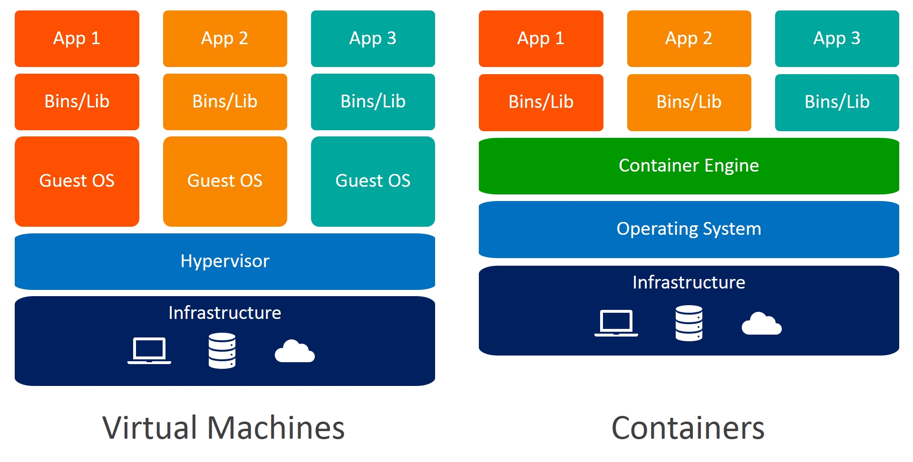
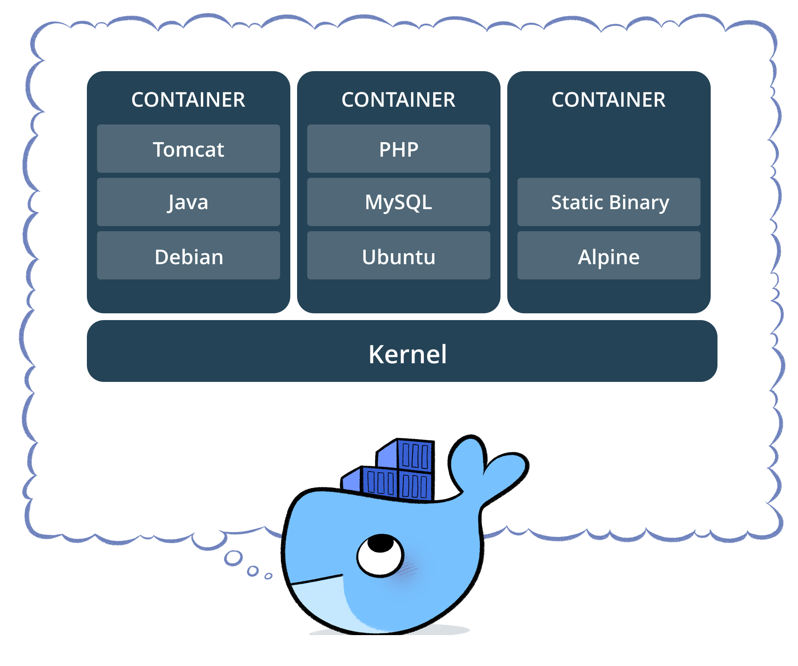
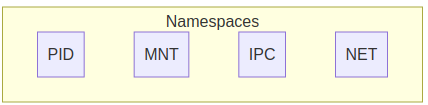
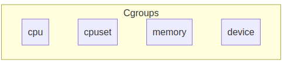
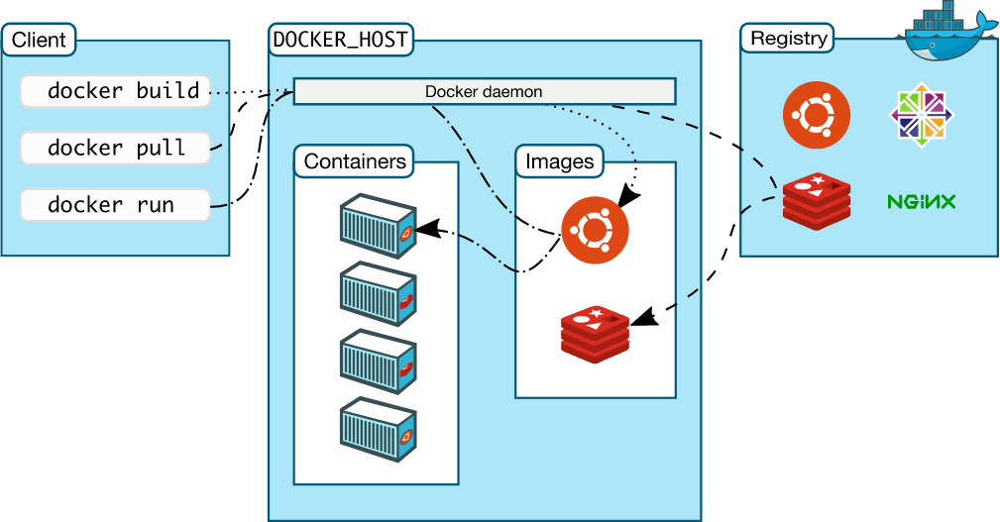

# Capítulo 01 - Fundamentos

## O que é o Docker

Docker é uma plataforma Open Source escrita em Go (Linguagem de programação em alta performance desenvolvida pela Google)  que ajuda a criação e a administração de ambientes isolados.

Com a utilização do Docker podemos gerenciar toda a infraestutura de uma aplicação, bem como garantir que ambientes de desenvolvimento, homologação e produção contenham os mesmos componentes e versões de aplicações, a fim de minimizar impactos no processo de desenvolvimento e entrega de software.

O Docker trabalha com uma virtualização a nível do sistema operacional, onde o mesmo utiliza de recursos como o kernel do sistema hospedeiro para executar seus containers. Diferente do modelo tradicional de Máquinas Virtuais, o Docker não necessita da instalação de um sistema operacional por completo, e sim apenas dos arquivos necessários para a aplicação ser executada.



## Por que usar Docker

Em 2013, Docker introduziu o que se tornou o padrão da indústria para containers, trouxe uma maneira simples, rápida e eficiente de executar aplicações sem a complexidade de uma máquina virtual.

Docker garante um ecossistema consistente, fazendo com que o desenvolvedor possa trabalhar sem se preocupar, por exemplo, com a abertura de tickets para uma equipe de infraestrutura provisionar um ambiente por completo, atrasando o trabalho de entrega de software.

Existem diversas engines e runtimes de containers e até é possível utilizar containers sem Docker, mas atualmente o Docker é a engine/runtime de container mais utilizada no mercado, o que torna o conhecimento do mesmo um **"Must have"** e dificilmente encontramos vagas na área de tecnologia que não pedem um conhecimento, mesmo que básico, de containers ou Docker.

## O que é um container

Um container consiste de um ambiente completo (uma aplicação e todas suas dependências, bibliotecas, binários, arquivos de configuração) em um único pacote. Ao containerizar uma plataforma de aplicação e suas dependências as diferenças em distribuições de sistemas operacionais e camadas inferiores da infraestrutura são abstraídas.

> Imagine que o container Docker é como se fosse um container real em um navio (servidor), todos os containeres estão lado a lado, porém seu conteúdo (ecossistema) não tem interferência de outros containers.

Podemos dizer também que um container é a unidade mínima computacional do Docker, ou seja, o menor recurso que o Docker pode fornecer.



## Versões

O Docker possui basicamente duas versões, a versão da comunidade (Community Edition) e a versão empresarial (Enterprise Edition).

A versão Community é de uso gratuito e também tem seu código aberto.

A maioria dos sistemas Docker em produção utiliza a versão Docker Community Edition. O licenciamento anual da versão Enterprise custa cerca de US$750 por nó, o que torna o processo inviável para algumas empresas.

> **ATENÇÃO:** Para fins da prova Docker Certified Associate **(Docker DCA)** a versão Community deve ser utilizada apenas em ambientes de desenvolvimento e não deve ser utilizada em produção. Para produção a única versão a ser utilizada é a Enterprise Edition.

A versão Enterprise conta com recursos como o **UCP** (Universal Control Plane) e o **DTR** (Docker Trusted Registry), bem como suporte da Docker Inc.

A recomendação mínima para a versão Enterprise do Docker EE é:
* 8GB de RAM para nós Managers
* 4GB de RAM para nós Workers
* 2vCPUs para nós Managers
* 10GB de espaço em disco livre para a partição `/var` em nós Managers (Minimo de 6GB Recomendado)
* 500MB de espaço em disco livre para a partição `/var` em nós workers

A recomendação para ambientes de produção do Docker EE é:
* 16GB de RAM para nós Managers
* 4vCPUs para nós Managers
* 25 a 100GB de espaço livre em disco.


## Instalação

Iremos instalar o Docker em máquinas virtuais para que possamos facilitar o estudo, para isto utilizaremos uma solução chamada **Vagrant** somado ao **Virtualbox**, você pode utilizar a solução de virtualização que preferir, porém eu indico que você siga exatamente como listado no curso porque caso você precise de suporte eu possa lhe ajudar.

> Lembre-se de habilitar a virtualização Intel VT-x ou AMD SVM na UEFI/BIOS.

### Instalando o Vagrant e Virtualbox 

Para instalar o Virtualbox siga os passos:

1. Acesse a página de [Downloads do Virtualbox](https://www.virtualbox.org/wiki/Downloads) e faça o download da versão coorespondente ao seu sistema operacional.
2. Execute a instalação do pacote do Virtualbox.
2.1. Para Linux execute o programa de instalação de pacotes (`sudo dpkg -i <pacote>.deb` para sistemas debian-like ou `sudo rpm -i <pacote>.rpm`)
2.2. Para Windows, clique sob o instalador e avance até o final da instalação.
2.3. Para MacOS, clique sob o instalador e avance até o final da instalação.


Para Instalar o vagrant siga os passos:

1. Acesse a página de [Downloads do Vagrant](https://www.vagrantup.com/downloads.html) e faça o download da versão correspondente ao seu sistema operacional.
2. Execute a instalação do pacote do vagrant.
2.1. Para Linux execute o programa de instalação de pacotes (`sudo dpkg -i <pacote>.deb` para sistemas debian-like ou `sudo rpm -i <pacote>.rpm`)
2.2. Para Windows, clique sob o instalador e avance até o final da instalação.
2.3. Para MacOS, clique sob o instalador e avance até o final da instalação.
3. Após a instalação abra um terminal ou um prompt de comando e execute o comando `vagrant --version` para verificar se o pacote foi instalado com sucesso.

### Preparando o Ambiente

Após instalar o **Vagrant** e o **Virtualbox**, podemos criar um diretório com um arquivo Vagrantfile.

> O Vagrantfile é o arquivo do **Vagrant** responsável por criar nossa infraestrutura.

Caso queira utilizar os arquivos mais atualizados, basta clonar o repositório: https://github.com/caiodelgadonew/docker-dca


```bash
$ mkdir ~/docker 
$ cd docker
$ vim Vagrantfile
```

Adicione o conteúdo ao arquivo Vagrantfile

```ruby
# -*- mode: ruby -*-
# vi: set ft=ruby  :

machines = {
  "master"   => {"memory" => "2048", "cpu" => "2", "ip" => "100", "image" => "ubuntu/bionic64"},
  "node01"   => {"memory" => "1024", "cpu" => "2", "ip" => "110", "image" => "ubuntu/bionic64"},
  "node02"   => {"memory" => "1024", "cpu" => "2", "ip" => "120", "image" => "centos/7"},
  "registry" => {"memory" => "2048", "cpu" => "2", "ip" => "200", "image" => "ubuntu/bionic64"}
}

Vagrant.configure("2") do |config|

  machines.each do |name, conf|
    config.vm.define "#{name}" do |machine|
      machine.vm.box = "#{conf["image"]}"
      machine.vm.hostname = "#{name}.docker-dca.example"
      machine.vm.network "private_network", ip: "10.20.20.#{conf["ip"]}"
      machine.vm.provider "virtualbox" do |vb|
        vb.name = "#{name}"
        vb.memory = conf["memory"]
        vb.cpus = conf["cpu"]
        vb.customize ["modifyvm", :id, "--groups", "/Docker-DCA"]
      end
      machine.vm.provision "shell", inline: "hostnamectl set-hostname #{name}.docker-dca.example"
      config.vm.provision "shell", inline: <<-SHELL
        HOSTS=$(head -n7 /etc/hosts)
        echo -e "$HOSTS" > /etc/hosts
        echo '192.168.200.10  master.docker.example' >> /etc/hosts
        echo '192.168.200.21  node01.docker.example' >> /etc/hosts
        echo '192.168.200.22  node02.docker.example' >> /etc/hosts
        echo '192.168.200.50  registry.docker.example' >> /etc/hosts
        SHELL
    end
  end
end
```

Para criar o ambiente do laboratório, execute o comando `vagrant up`, e o vagrant irá criar todas as máquinas virtuais bem como configurar os hostnames e endereços IP's
Para se conectar as máquinas utilize o comando `vagrant ssh <host>` informando o nome do host a ser conectado, lembre-se de estar dentro da pasta com o Vagrantfile.
Para desligar as máquinas execute o comando `vagrant halt`.
Para destruir o ambiente execute o comando `vagrant destroy`.

Execute o comando `vagrant up` para criar nossa infraestrutura.

```bash
$ cd ~/docker
$ vagrant up
``` 

> Caso você queira saber mais sobre Vagrant eu tenho um post no meu blog onde ensino como utilizar o Vagrant para subir os laboratórios de estudo, para acessar basta clicar em [Vagrant-101](https://caiodelgado.dev/vagrant-101)

Adicione também as seguintes entradas ao arquivo `hosts` da sua máquina.

```bash
# Docker
192.168.200.10  master.docker.example
192.168.200.21  node01.docker.example
192.168.200.22  node02.docker.example
192.168.200.50  registry.docker.example
```

> Em máquinas **Linux** e **MacOS** o arquivo fica localizado em `/etc/hosts`
> Em máquinas **Windows** o arquivo fica localizado em `C:\Windows\System32\drivers\etc\hosts`

## Namespaces e Cgroups

O Docker utiliza de recursos do linux como por exemplo namespaces, cgroups dentre vários outros que iremos falar futuramente para isolar os containers que serão executados.

### Namespaces 


* **PID**: Process ID
* **MNT**: Mount Points
* **IPC**: Comunicação Inter Processos
* **UTS**: Unix Timesharing System (Kernel e Identificadores)
* **NET**: Networking

Os Namespaces fornecem isolamento para os containers, limitando seu acesso aos recursos do sistema e a outros namespaces. Isto significa, por exemplo, que um usuário root dentro de um container é diferente de um usuário root da máquina hospedeira.

Com o isolamento, os sistemas em execução nos containers tem suas próprias árvores de processo, sistemas de arquivos, conexões de rede e muito mais.


### cgroups




* **cpu**: Divisão de CPU por containers.
* **cpuset**: CPU Masks, para limitar threads
* **memory**: Memória
* **device**: Dispositivos 

Os containers trabalham com cgroups (Control Groups) que fazem isolamento dos recursos físicos da máquina. Em geral os cgroups podem ser utilizados para controlar estes recursos tais como limites e reserva de CPU, limites e reserva de memória, dispositivos, etc…

## Instalação do Docker 

Existem duas maneiras de instalar o Docker
* Script de Conveniência
* Maneira Tradicional

Iremos efetuar a instalação da maneira tradicional nas máquinas `master` e `node02` e com o script de conveniência nas máquinas `node01` e `registry`.

### Instalando Docker no Ubuntu

Primeiramente vamos acessar a máquina `master`

```bash
$ cd ~/docker
$ vagrant ssh master
```

Uma vez conectado na máquina docker, execute os seguintes comandos:

```bash
$ sudo apt update
$ sudo apt install \
    apt-transport-https \
    ca-certificates \
    curl \
    gnupg2 \
    software-properties-common \
    bash-completion -y
$ curl -fsSL https://download.docker.com/linux/ubuntu/gpg | sudo apt-key add -
$ sudo add-apt-repository \
   "deb [arch=amd64] https://download.docker.com/linux/ubuntu \
   $(lsb_release -cs) \
   stable"
$ sudo apt update
$ sudo apt-get install docker-ce docker-ce-cli containerd.io
```

Após a conclusão da instalação, podemos configurar agora nosso usuário para fazer parte do grupo `docker`, isso garantirá que possamos executar os comandos do docker sem a necessidade de elevar os privilégios.

```bash
$ sudo usermod -aG docker $USER
```

Vamos também instalar o recurso de `Bash Completion` através do comando:

```bash
$ sudo curl https://raw.githubusercontent.com/docker/machine/v0.16.0/contrib/completion/bash/docker-machine.bash -o /etc/bash_completion.d/docker-machine
```

Saia do terminal e inicie uma nova sessão e o usuário já poderá executar o comando como super user.
```bash
$ exit
$ vagrant ssh master
```

### Instalando Docker no CentOS

Abra um novo terminal e acesse a máquina `node02`

```bash
$ cd ~/docker
$ vagrant ssh node02
```

Uma vez conectado na máquina docker, execute os seguintes comandos:

```bash
$ sudo yum install -y yum-utils curl vim bash-completion
$ sudo yum-config-manager \
    --add-repo \
    https://download.docker.com/linux/centos/docker-ce.repo
$ sudo yum install docker-ce docker-ce-cli containerd.io
```

Nos sistemas RHEL like, precisamos habilitar e iniciar o serviço após a instalação do mesmo

```bash
$ sudo systemctl enable docker
$ sudo systemctl start docker
```

Após a conclusão da instalação, podemos configurar agora nosso usuário para fazer parte do grupo `docker`, isso garantirá que possamos executar os comandos do docker sem a necessidade de elevar os privilégios.

```bash
$ sudo usermod -aG docker $USER
```

Vamos também instalar o recurso de `Bash Completion` através do comando:

```bash
$ sudo curl https://raw.githubusercontent.com/docker/machine/v0.16.0/contrib/completion/bash/docker-machine.bash -o /etc/bash_completion.d/docker-machine
```

Saia do terminal e inicie uma nova sessão e o usuário já poderá executar o comando como super user.
```bash
$ exit
$ vagrant ssh node02
```

### Instalando Docker através do script de Conveniência.

Os passos a seguir devem ser executados nas máquinas `node01` e `registry`, não esqueça de abrir um terminal novo para cada máquina e executar o comando `vagrant ssh <host>`

A Docker disponibiliza um script de conveniência, que trata-se de uma maneira simples e rápida para instalar o Docker para ambientes de desenvolvimento, este script faz a validação da distribuição Linux bem como instala os pacotes necessários para o funcionamento do Docker. 

Para instalar o Docker através do script de conveniência basta executar o comando:

```bash
$ sudo curl -fsSL https://get.docker.com | bash
```

Nos sistemas RHEL like, precisamos habilitar e iniciar o serviço após a instalação do mesmo

```bash
$ sudo systemctl enable docker
$ sudo systemctl start docker
```

Após a conclusão da instalação, podemos configurar agora nosso usuário para fazer parte do grupo `docker`, isso garantirá que possamos executar os comandos do docker sem a necessidade de elevar os privilégios.

```bash
$ sudo usermod -aG docker $USER
```

Vamos também instalar o recurso de `Bash Completion` através do comando:

```bash
$ sudo curl https://raw.githubusercontent.com/docker/machine/v0.16.0/contrib/completion/bash/docker-machine.bash -o /etc/bash_completion.d/docker-machine
```

### Teste de Execução

Para garantirmos que o docker foi instalado corretamente e está funcional, podemos rodar nosso primeiro container e verificar o retorno na tela.

```bash
$ docker container run --rm -it hello-world
```

## Componentes

Agora que rodamos nosso primeiro container, precisamos entender alguns componentes básicos da sua arquitetura e seu funcionamento.

Ao executar o container com a imagem `hello-world` o Docker fez os seguintes passos:
1. O `Docker Client` se comunicou com o `Docker Daemon`.
2. O `Docker Daemon` fez o download da imagem `hello-world` no Docker Hub.
3. O `Docker Daemon` criou um novo container, através da imagem que rodou o executável que produz o texto que vimos no terminal.
4. O `Docker Daemon` enviou o texto diretamente para o `Docker Client` que enviou para nosso terminal.




### Docker Client

O Docker Client é o pacote `docker-ce-cli` ele fornece os comandos do lado do cliente, como por exemplo o comando `docker container run`, que irá interagir com o Docker Daemon


### Docker Daemon 

O Docker Daemon é o pacote `docker-ce` ele é o servidor propriamente dito, que receberá os comandos através do Docker Client e fornecerá os recursos de virtualização a nível de sistema operacional.


### Docker Registry

O Docker Registry é o local de armazenamento de imagens Docker, normalmente o Docker hub, de onde o Docker Daemon receberá as imagens a serem executadas no processo de criação de um container.

## Comandos Essenciais

Iremos agora aprender alguns comandos essenciais do Docker.

```bash
docker --help
```

O primeiro passo para entendermos os comandos do docker é visualizar sua lista de comandos, iremos falar dos seguintes comandos de gerenciamento:

* `docker container`
* `docker image`
* `docker network`
* `docker system`
* `docker volume`

Para cada comando de gerenciamento acima, temos diversos subcomandos a serem executados, muitos deles são parecidos com comandos Linux como por exemplo `ls`, `rm`, dentre outros.

Antigamente o comando utilizado para listar containers era o comando `docker ps` que ainda existe na documentação, porém é indicado que seja utilizado o novo comando `docker container ls`.

> PS é o abreviamento de Process Status enquanto LS é o abreviamento de LIST 


Existem diversos outros comandos que iremos ver ao longo do curso.

### Executando comandos

Antes de executar os comandos do docker, vamos conectar na máquina `node01`.

```bash
vagrant ssh node01
``` 


Para visualizar informações do ambiente, podemos utilizar o comando **docker system info** o qual exibirá informações do Docker como versão, quantidade de containers em execução, storage drivers, entre outros.
```bash
docker system info
docker info
```
_Os comandos listados acima são equivalentes._

Para listar containers, imagens, redes e volumes no docker, utilizamos o comando **docker** \<comando\> **ls**
```bash
docker container ls
docker image ls
docker network ls
docker volume ls
```
* **docker container ls** - lista os containers
* **docker image ls** - lista as imagens
* **docker network ls** - lista as redes
* **docker volume ls** - lista os volumes

Para pesquisar por uma imagem, utilizamos o comando **docker search**
```bash
docker search debian
```

Para efetuar o download da imagem utilizamos o comando **docker image pull**
```bash
docker image pull debian
```

Para executar um container, utilizamos o comando **docker container run**
```bash
docker container run -dit --name debian1 --hostname c1 debian
```
**Descrição do comando:**
* **docker container run  (...) debian** - Executa um container, sendo o último parâmetro o nome da imagem a ser utilizada  
* **-dit** - Executa um container como processo (**d** = Detached), habilitando a interação com o container (**i** = Interactive) e disponibiliza um pseudo-TTY(**t** = TTY)
* **--name** - Define o nome do container
* **--hostname** - Define o hostname do container

Agora que temos nosso primeiro container em execução, podemos listar os containers (**docker container ls**) e conectar ao mesmo através do comando **docker container attach**
```bash
docker container ls
docker container attach debian1
```
_Note que ao se conectar ao container a PS1 será modificada para `root@c1:/#` ._

Execute alguns comandos no container:
```bash
ip -c a
hostname
cat /etc/hosts
exit
```

Liste novamente os containers
```bash
docker container ls -a
```
_Note que agora o container está parado, isto aconteceu pois o processo principal do container recebeu um return code diferente de 0_

Inicie novamente o container e conecte-se ao mesmo
```bash
docker container start debian1
docker container attach debian1
```
_O comando **docker container start** inicia um container parado, o comando **docker container stop** para um container que esteja em execução_

Utilize a sequencia de teclas **_\<CTRL\> + \<P\> + \<Q\>_** para se desconectar do container sem que ele seja parado. Este comando é chamado de _Read escape sequence_.
```bash
<CTRL> + <P> + <Q>
docker container ls
```
_Note que agora o container ainda está em execução._

Para verificar os logs do container utilizamos o comando **docker container logs**
```bash
docker container logs debian1
```

Pare e remova o container, após isto verifique os containers existentes
```bash
docker container stop debian1
docker container rm debian1
docker container ls -a
```
_Podemos utilizar o parâmetro **-f** no comando **docker container rm** para que o container seja removido mesmo que esteja sendo executado_

Execute um novo container
```bash
docker container run -dit --name c1 --hostname server debian
docker container ls
```

Crie um arquivo de teste na pasta atual para enviar ao container c1
```bash
echo "Arquivo de teste" > /tmp/arquivo
docker container cp /tmp/arquivo c1:/tmp
```
_O comando **docker container cp** copia um arquivo da maquina host para o container ou vice-versa._

Verifique se o arquivo existe dentro do container através do comando **exec**
```bash
docker container exec c1 ls -l /tmp
docker container exec c1 cat /tmp/arquivo
```
_O comando **docker container exec** executa um comando no container e envia o retorno na saída padrão(STDOUT) da máquina, caso o container não tenha sido iniciado com a opção **-i** o retorno não será mostrado no STDOUT_

Remova o container criado anteriormente
```bash
docker container rm -f c1
``` 
