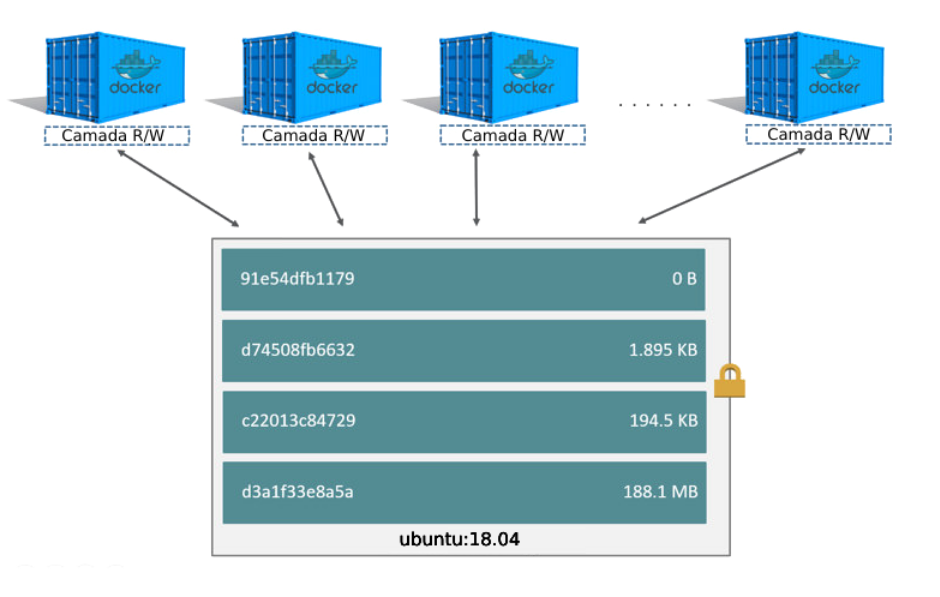

# Capítulo 02 - Imagens

## Dockerhub

Estas imagens ficam armazenadas em repositórios locais e/ou remotos, um exemplo de repositório remoto é o DockerHub que é um repositório publico de imagens docker onde podemos escolher e utilizar as imagens para subir nossos containers. 


Serviços Fornecidos pelo **Dockerhub**:
* Hospedagem de Imagens Docker;
* Autenticação de usuário
* Automatização do processo de construção de imagens através de triggers (webhooks)
* Integração com o Github e Bitbucket

### Criando uma conta no Dockerhub

Acesse o endereço https://hub.docker.com e clique em **Sign Up** para criar uma conta, preencha com os seus dados e clique em **Continue**


Confirme o cadastro em seu e-mail e logue no **Docker Hub** através do link **Sign In**


Logue no terminal com o usuário criado através do comando **docker login** e digite sua senha
```bash
docker login -u <usuario_dockerhub>
```

Verifique se um arquivo de autorização foi criado
```bash
cat ~/.docker/config.json
```

Encerre o login na conta do Dockerhub no terminal
```bash
docker logout
```


## Docker Image

Uma imagem Docker é um pacote executável que inclui tudo o que é necessário para executar um aplicativo, incluindo o código, bibliotecas, variáveis de ambientes e arquivos de configuração.

As imagens do Docker possuem camadas intermediárias que aumentam a capacidade de reutilização, diminuem o uso do disco e aceleram a construção do docker, permitindo que cada etapa seja armazenada em cache. Essas camadas intermediárias não são mostradas por padrão.


A principal diferença entre um container e uma imagem é a camada gravável superior. Todas as gravações no container que adicionam novos dados ou modificam dados existentes são armazenados nessa camada gravável. Quando o container é excluido, a camada gravável também é excluida. A imagem subjacente permanece inalterada.



Um ponto interessante é que em um cenário onde temos 1 container com a imagem `ubuntu:18.04` por exemplo, ocuparia `200MB` ( estamos considerando este tamanho para a imagem citada) somados a quantidade de dados específicos deste container ( vamos considerar `50MB` para este exemplo) totalizando `250MB`. o mesmo caso com 10 containers serão utilizados os `200MB` da imagem somados aos 50MB de cada container em execução, pois suas camadas readonly é compartilhada, totalizando assim `750MB` no total. 

> O mesmo cenário em máquinas virtuais seria exponencialmente maior, uma vez que precisamos instalar todo o sistema operacional e parametrizar cada máquina individualmente.


## Gerenciar Imagens no Docker

Liste as imagens e verifique o histórico de comandos utilizados para sua construção
```bash
docker image ls
docker image history debian
```
_O comando **docker image history** mostra as camadas que compoem uma imagem_

Para inspecionar uma imagem utilizamos o comando **docker image inspect**
```bash
docker image inspect debian
```
_O comando **docker image inspect** exibe informações detalhadas de uma imagem_

Vamos criar uma nova imagem a partir de um container existente, para vamos criar um container e instalar alguns pacotes
```bash
docker container run -dit --name servidor-debian debian
docker container exec servidor-debian apt-get update
docker container exec servidor-debian apt-get install nginx -y
```

Para criar uma nova imagem a partir das alterações feitas em um container podemos utilizar o parametro **commit**
```bash
docker container commit servidor-debian webserver-nginx
docker image ls
```
_O comando **docker container commit \<container\> \<imagem\>** cria uma imagem a partir de alterações realizadas em um container, este procedimento não é o recomendado para este fim, mais a frente veremos outras soluções_

Para salvar a imagem podemos utilizar o parâmetro **save**
```bash
docker image save webserver-nginx -o imagem-webserver-nginx.tar
du -sh imagem-webserver-nginx.tar
```

Remova o container e a imagem servidor web
```bash
docker container rm -f servidor-debian
docker image rm webserver-nginx
docker image ls
```

Para carregar uma imagem salva a partir de um arquivo, podemos utilizar o parâmetro **load**
```bash
docker image load -i imagem-webserver-nginx.tar
docker image ls
```

Para testar o funcionamento da imagem, podemos criar um container utilizando a mesma
```bash
docker container run -dit --name webserver webserver-nginx
docker container ls
```

Remova todos os containers
```bash
docker container rm -f $(docker container ls -aq)
docker container ls
```
_No comando acima, estamos passando através de um subshell o comando **docker container ls -aq** que lista todos os containers por **id**, sendo assim, será feita a remoção de todos os containers_


## Dockerfile

O Dockerfile é um arquivo de instruções de como deve ser gerada a imagem Docker, através deste arquivo podemos criar novas imagens para serem utilizadas.


O Docker pode criar imagens automaticamente, lendo as instruções de um **Dockerfile**, que é um documento de texto que contém as instruções para a criação de uma imagem docker através docomando **docker build**.

### Sintaxe

| Parâmetro  | Valor                                       |
|------------|---------------------------------------------|
| **FROM**   | Distribuição:Versão                         |
| **COPY**   | Arquivo_Local Caminho_Absoluto_no_Container |
| **RUN**    | Comando                                     |
| **EXPOSE** | Porta do serviço                            |
| **CMD**    | Comando executado ao iniciar o Container    |

O arquivo de Dockerfile não é case-sensitive, no entanto por convenção utilizamos os parâmetros em maiúsculo para que sua leitura seja mais agradável e de fácil compreensão. O nome do arquivo deve se chamar **Dockerfile** apenas com a letra inicial **D** em maiúsculo.

O Docker executará as instruções do Dockerfile em ordem (Top-down) e deverá sempre iniciar com a instrução **FROM**, as linhas que começam com **#** são tratadas como comentário a menos que a linha seja uma diretiva de analisador válida, o caractere **#** em qualquer outro lugar em uma linha é tratado como um argumento.

**Definições**

* **FROM** - Inicializa um novo estágio de compilação e define a imagem de base para instruções subsequentes;
* **COPY** - Copia arquivos ou diretórios de origem local adicionando-os a imagem do container;
* **ADD** - Similar ao parâmetro **COPY** porém possibilita que a origem seja uma URL bem como a alteração de permissionamento ao adicionar os arquivos a imagem do container;
* **RUN** - Executa os comandos em uma nova camada na parte superior a imagem atual, é uma boa prática combinar diversos comandos em um unico **RUN** utilizando de **;** e **&&** para a combinação, assim criando apenas uma camada;
* **EXPOSE** - Informa ao docker a porta na qual o container estará escutando enquanto estiver sendo executado, é possível especificar portas TCP e UDP, caso não seja declarado o tipo de porta, o padrão (TCP) é assumido.
* **CMD** - Só pode existir uma unica instrução deste tipo em um arquivo, o propósito desta instrução é prover os padrões para a execução do container, podendo ser um executável ou até mesmo opções para o executável definido na instrução **ENTRYPOINT**
* **ENTRYPOINT** - Possibilita configurar o container para rodar como um executável, o comando **docker run \<image\>** inicializará o container em seu entrypoint somado ao **CMD** se existente.


### Criando Dockerfiles

Vamos criar um diretório para armazenar os dockerfiles e criar nosso primeiro Dockerfile
```bash
mkdir -p ~/dockerfiles/echo-container
cd ~/dockerfiles/echo-container
vim Dockerfile
```
```dockerfile
FROM         alpine
ENTRYPOINT   ["echo"]
CMD          ["--help"]
```

Para criar a imagem a partir do Dockerfile, utilizamos o comando **docker image build**
```bash
docker image build -t echo-container .
docker image ls
```
_A opção **-t** significa TAG, após o nome da imagem:tag informamos qual o diretório em que o Dockerfile se encontra, utilizamos o ponto **( . )** para dizer que o Dockerfile está no diretório atual **(PWD)**_

Execute o container com a imagem criada
```bash
docker container run --rm -it echo-container
```
_A opção **--rm** informa que o container será apagado após cumprir seu papel_

Execute o container com a imagem criada alterando seu CMD
```bash
docker container run --rm -it echo-container Se inscreva no canal https://youtube.com/caiodelgadonew
```
_Ao passar um parâmetro após o nome da imagem estamos alterando o CMD do container, anteriormente **echo --help** para **echo Container DevOps**_


### Dockerfile Servidor WEB

Vamos criar um diretório para armazenar o dockerfile para nosso servidor WEB e criar o Dockerfile
```bash
mkdir  ~/dockerfiles/webserver
cd ~/dockerfiles/webserver
vim Dockerfile
```
```dockerfile
FROM    debian
RUN     apt-get update; \
        apt-get install wget git apache2 -yq
EXPOSE  80          
CMD     ["apachectl", "-D", "FOREGROUND"]
```

Crie a imagem
```bash
docker image build -t webserver .
docker image ls
```

## Enviando a imagem para o Dockerhub

Para enviar uma imagem para o dockerhub é necessário que sejam feitos 3 passos:

1. docker login
2. docker image tag
3. docker push

Vamos efetuar o login com nossa conta no dockerhub
```bash
docker login -u <usuario_dockerhub>
```

Agora precisamos criar a tag da imagem, que deve seguir o padrão **usuario/imagem:versao**
```bash
docker image tag echo-container <usuario_dockerhub>/echo-container:latest
docker image tag webserver <usuario_dockerhub>/webserver
```
_Caso não seja informada uma versão, o docker entende que a versão trata-se da **latest**_

Agora podemos enviar as imagens para o dockerhub
```bash
docker image push <usuario_dockerhub>/echo-container
docker image push <usuario_dockerhub>/webserver
```

Ao finalizar, lembre-se de efetuar o logout em sua conta do dockerhub
```bash
docker logout
```

As imagens enviadas podem ser visualizadas na sua página do dockerhub e todos os usuários podem efetuar o download da mesma com o comando **docker image pull usuario/imagem:versao** desde que o repositório seja público


## Melhores práticas com o Dockerfile 

Quando criamos uma imagem, através do comando `docker image build` , a imagem definida pelo `Dockerfile` deve gerar containers que são tão efêmeros quanto possível, isso quer dizer que o container deve poder ser parado e/ou destruido a qualquer momento, e reconstruido ou substituido com o mínimo de configuração ou atualização.

Uma boa metodologia para conseguir chegar neste ponto é a do **Twelve-factor App**, ou Aplicação de Doze-fatores, e em sua seção de [processos](https://12factor.net/pt_br/processes) podemos verificar algumas das motivações para subir containers maneira stateless (não armazenam estado).

### Entendendo o contexto de Build

Quando executamos o comando `docker image build` , o diretório no qual apontamos (muitas das vezes como `.` para referir o diretório atual) é chamado de `build context`. Por padrão o Docker espera que o `Dockerfile` esteja localizado nesta pasta, mas também podemos especificar uma nova localização através da flag `-f`. Independentemente de onde o Dockerfile esteja, todo o conteúdo dos diretórios recursivamente e arquivos é enviado para o Docker daemon como build context.

> Por isto não devemos, por exemplo, criar um `Dockerfile` diretamente em nossa home  `~/Dockerfile` , uma vez que todo o conteúdo, inclusive o cache de navegadores web e todas aplicações `~/.cache` será enviado para o Docker daemon, muitas das vezes falhando a build ou até mesmo fazendo com que ela demore muito tempo.

Primeiramente vamos criar um diretório para guardar nosso dockerfile e criar um arquivo com um conteúdo estático

```bash
mkdir -p ~/dockerfiles/exemplo1
cd ~/dockerfiles/exemplo1
echo "Dockerfile Melhores Práticas" > conteudo.txt
``` 

Agora podemos criar nosso Dockerfile:

```bash
vim Dockerfile
``` 

```dockerfile
FROM  busybox
COPY  conteudo.txt /
RUN   cat /conteudo.txt
``` 

Agora vamos criar a imagem.

```bash
docker image build -t exemplo:v1 . 
``` 
Agora vamos criar novos diretórios e mover o arquivo conteudo.txt para um diretório diferente do dockerfile para construir uma segunda imagem.

```bash
mkdir -p image context
mv Dockerfile image
mv conteudo.txt context
docker image build --no-cache -t exemplo:v2 -f image/Dockerfile context
``` 

As duas imagens tem o mesmo tamanho e o mesmo conteúdo, porém note que as imagens tem o `ID` diferente porque criamos a imagem sem utilizar o cache `--no-cache`, ou seja, criamos uma imagem totalmente nova.


```bash
$ docker image ls 

REPOSITORY        TAG           IMAGE ID       CREATED          SIZE
exemplo           v2            589078e3e007   2 seconds ago    1.24MB
exemplo           v1            de0bdd45cb9a   3 minutes ago    1.24MB
```

Caso sejam incluidos arquivos que não são necesssários para a construção da imagem o `build context` se tornará maior e consequentemente uma imagem maior. Isso pode aumentar o tempo de construção, envio e download da imagem e do `container runtime`. Para ver o tamanho do build context basta verificar a mensagem exibida quando executar o build do seu `Dockerfile`.

Vamos copiar todo o conteúdo do diretório /var/log para o context e construir a imagem.
```bash
sudo cp -r /var/log/ ~/dockerfiles/exemplo1/context/
sudo chown -R vagrant:vagrant ~/dockerfiles/exemplo1/context/log
docker image build --no-cache -t exemplo:v3 -f image/Dockerfile context
``` 

Veja que o context que anteriormente era de apenas `2.6KB` desta vez foi de `26,62MB`, o que resulta em um tempo de build maior porém sua imagem continua do mesmo tamanho das outras já que o arquivo foi enviado para o context e não foi utilizado.

```bash
Sending build context to Docker daemon  2.607kB
Sending build context to Docker daemon  26.62MB
``` 
Tratando de poucos `MB` o tempo de construção pode não ser muito expressivo, porém imagine em uma grande aplicação com diversos arquivos. Utilizando o comando time fiz a medição no caso de `2.6KB` que gerou a build em `0m0.910s` contra `0m1.368s` do arquivo de `26,62MB`. esse tempo pode ser superior caso a imagem execute diversos comandos em diversas camadas.

### Excluindo arquivos do build

Para excluir arquivos que não são relevantes a build, podemos criar um arquivo `.dockerignore` contendo os padrões de exclusão similares aos do `.gitignore` possibilitando que ignoremos arquivos no build sem ter que modificar nosso repositório.

> Para a referência do Docker Ignore veja a [Documentação Oficial](https://docs.docker.com/engine/reference/builder/#dockerignore-file)


Vamos criar agora um arquivo `.dockerignore` para que o diretório `log` não seja enviado para a build.

```bash
vim context/.dockerignore
``` 

```gitignore
# Comentario: Ignorando arquivos do diretorio log
log
``` 

```bash
docker image build --no-cache -t exemplo:v4 -f image/Dockerfile context
``` 

Veja que o diretório `log` foi ignorado, uma vez que o `build context` ficou em `2.6kB` (agora um pouco maior que a primeira por possuir o arquivo `.dockerignore`) ao invés dos `26MB` anteriores.


### Dicas

Vamos criar um diretório para o exemplo a seguir para guardar nosso Dockerfile e fazer o download de uma aplicação exemplo em java que conta o numero de caracteres de um texto.

``` 
mkdir -p ~/dockerfiles/dicas
cd ~/dockerfiles/dicas
git clone https://github.com/caiodelgadonew/java-wc-app.git app
``` 

#### Dica #1: A ordem importa para o cache

A ordem dos passos de build é importante, se o cache de um primeiro passo é invalidado pela modificação de arquivos ou linhas do Dockerfile, os arquivos subsequentes do build quebrarão. Sempre faça a ordenação dos passos do que sofrerá menos mudanças para o que sofrerá mais mudança.


```bash
vim Dockerfile
```

```dockerfile
FROM        debian:9
RUN         apt-get update
RUN         apt-get install -y openjdk-8-jdk wget ssh vim
COPY        app /app
ENTRYPOINT  ["java", "-jar", "/app/target/app.jar"]
``` 

```bash
docker image build -t dicas:v1 .
```

#### Dica #2:  COPY mais específico para limitar a quebra de cache

Só copie o necessário. Se possível evite o `COPY`. Quando copiamos arquivos para nossa imagem, tenha certeza que você está sendo bem específico sob o que quer copiar, qualquer mudança no arquivo copiado quebrará o cache. Copiaremos então apenas a aplicação para a imagem, desta maneira as mudanças nos arquivos não afetarão o cache.


```bash
vim Dockerfile
```

```dockerfile
FROM        debian:9
RUN         apt-get update
RUN         apt-get install -y openjdk-8-jdk wget ssh vim
COPY        app/target/app.jar /app/app.jar
COPY        app/samples /samples
ENTRYPOINT  ["java", "-jar", "/app/app.jar"]
``` 

```bash
docker image build -t dicas:v2 .
``` 

#### Dica #3: Identifique as instruções que podem ser agrupadas

Cada instrução `RUN` cria uma unidade de cache e uma nova camada de imagem, agrupar todos os comandos `RUN` em uma única instrução pode melhorar o desempenho e diminuir a quantidade de camadas uma vez que eles se tornarão uma unidade única cacheavel.


```bash
vim Dockerfile
```

```dockerfile
FROM       debian:9
RUN        apt-get update \
        && apt-get install -y \
            openjdk-8-jdk wget \
            ssh vim   
COPY        app/target/app.jar /app/app.jar
COPY        app/samples /samples
ENTRYPOINT  ["java", "-jar", "/app/app.jar"]
``` 

```bash
docker image build -t dicas:v3 .
``` 

#### Dica #4: Remova as dependências desnecessárias

Remover as dependencias desnecessárias e não instalar pacotes de debug é uma boa prática, como por exemplo trocar o `jdk` (Java Development Kit) pelo `jre` (Java Runtime Environment) que é um pacote relativamente menor e contém apenas o necessário para execução. Você pode instalar as ferramentas de debug posteriormente caso necessite. O instalador de pacotes `apt` possui uma flag `--no-install-recommends` que garante que dependencias que não são necessárias não sejam instaladas. Caso precise, adicione elas explicitamente.


```bash
vim Dockerfile
```

```dockerfile
FROM        debian:9
RUN         apt-get update \
         && apt-get install -y --no-install-recommends \
            openjdk-8-jre 
COPY        app/target/app.jar /app/app.jar
COPY        app/samples /samples
ENTRYPOINT  ["java", "-jar", "/app/app.jar"]
``` 

```bash
docker image build -t dicas:v4 .
``` 

Com a **Dica #4** podemos notar uma diminuição consideravel no tamanho de nossa imagem.


#### Dica #5: Remover o cache do gerenciador de pacotes

 O gerenciador de pacotes mantem seu próprio cache, o  apt por exemplo guarda seu cache no diretório `/var/lib/apt/lists` e `/var/cache/apt/`. Uma das maneiras de lidar com este problema é remover o cache na mesma instrução que o pacote foi instalado. Remover este cache em outra instrução não irá diminuir o tamanho da imagem.


```bash
vim Dockerfile
```

```dockerfile
FROM        debian:9
RUN         apt-get update \
         && apt-get install -y --no-install-recommends \
            openjdk-8-jre \
         && rm -rf /var/lib/apt/lists \
         && rm -rf /var/cache/apt
COPY        app/target/app.jar /app/app.jar
COPY        app/samples /samples
ENTRYPOINT  ["java", "-jar", "/app/app.jar"]
``` 

```bash
docker image build -t dicas:v5 .
``` 

Agora com a **Dica #5** nossa imagem ficou relativamente menor.


#### Dica #6: Utilize imagens oficiais quando possível

Imagens oficiais podem ajudar muito e reduzir bastante o tempo preparando a imagem, isto porque os passos de instalação já vem prontos e normalmente com as melhores praticas aplicadas, isto também fará você ganhar tempo caso tenha multiplos projetos, eles compartilham as mesmas camadas e utilizam a mesma imagem base.


```bash
vim Dockerfile
```

```dockerfile
FROM       openjdk
COPY       app/target/app.jar /app/app.jar
COPY       app/samples /samples
ENTRYPOINT  ["java", "-jar", "/app/app.jar"]
``` 

```bash
docker image build -t dicas:v6 .
``` 

#### Dica #7:  Utilize Tags mais específicas

Nunca utilize a tag `latest`. Ela pode receber alguma atualização e em um momento de update sua aplicação pode quebrar, dependendo de quanto tempo passou do seu último build. Ao invés disso, utilize tags mais específicas.


```bash
vim Dockerfile
```

```dockerfile
FROM       openjdk:8
COPY       app/target/app.jar /app/app.jar
COPY       app/samples /samples
ENTRYPOINT  ["java", "-jar", "/app/app.jar"]
``` 

```bash
docker image build -t dicas:v7 .
``` 

#### Dica #8: Procure por flavors mínimos

Existem diversos flavors linux que fazem com que nossa imagem se torne cada vez menor, um bom exemplo são as imagens `slim` e `alpine` as quais são as menores encontradas. A imagem `slim` é baseada no Debian, enquanto a `alpine` é baseada em uma distribuição linux muito menor chamada Alpine. A diferença básica entre elas é que o debian utiliza a biblioteca `GNU libc` enquanto o alpine utiliza `musl lbc`, que apesar de muito menor, pode ter problemas de compatibilidade.

```bash
docker image pull openjdk:8
docker image pull openjdk:8-jre
docker image pull openjdk:8-jre-slim
docker image pull openjdk:8-jre-alpine
docker image ls | egrep "REPOSITORY|openjdk"
```

```bash
REPOSITORY          TAG         	SIZE
openjdk             8           	510MB
openjdk             8-jre       	265MB
openjdk             8-jre-slim  	184MB
openjdk             8-jre-alpine	84.9MB
``` 

```bash
vim Dockerfile
```

```dockerfile
FROM       openjdk:8-jre-alpine
COPY       app/target/app.jar /app/app.jar
COPY       app/samples /samples
ENTRYPOINT  ["java", "-jar", "/app/app.jar"]
```

```bash
docker image build -t dicas:v8 .
```

Agora temos uma diminuição enorme em nossa imagem pois estamos utilizando uma imagem base bem menor.


#### Dica #9: Multi-stage build

Multi-stage build é um recurso muito poderoso que apareceu a partir do docker 17.05. Multi-stage builds são uteis para quem quer otimizar Dockerfiles enquanto mantém eles fáceis de ler e manter.

Antes do Multi-stage build o maior desafio das imagens é de fato manter as imagens pequenas, vimos nos exemplos anteriores que conseguimos, ao utilizar algumas das melhores práticas, diminuir bastante o tamanho da imagem. Utilizando imagens slim ou alpine resolvem boa parte dos nossos problemas mas quando precisamos resolver algo mais  complexo podemos utilizar elas somadas ao multi-stage build.

O `multi-stage build` faz com que possamos utilizar diversas instruções `FROM` em um Dockerfile, e cada instrução pode utilizar uma imagem diferente, fazemos isto por exemplo para subir uma imagem, dentro desta imagem instalar os pacotes e coletar apenas os arquivos necessários diretamente para a imagem subsequente. Com isso temos uma imagem muito mais enxuta e otimizada.

Por exemplo vamos criar esta imagem em GO pelo processo normal:

```bash
git clone https://github.com/alexellis/href-counter.git ~/dockerfiles/multistage
cd ~/dockerfiles/multistage
rm Docker*
vim Dockerfile
```

```dockerfile
FROM     golang:1.7.3
WORKDIR  go/src/github.com/alexellis/href-counter/
RUN      go get -d -v golang.org/x/net/html  
COPY     app.go .
RUN      CGO_ENABLED=0 GOOS=linux go build -a -installsuffix cgo -o app .
CMD      ["./app"]
``` 

```bash
docker  image build -t multistage:v1 . 
``` 

Esta imagem ficou com o tamanho de `700MB`, porém o que precisamos nela é apenas o diretório `/go/src/github.com/alexellis/href-counter/app`, podemos então utilizar o multistage build para recolher estes arquivos, chamando a primeira imagem de builder através do parâmetro `AS <nome>` e depois invocar a imagem em um segundo estágio através do parâmetro `--from=<nome>`.

```bash
vim Dockerfile
```

```dockerfile
FROM     golang:1.7.3 AS builder
WORKDIR  /go/src/github.com/alexellis/href-counter/
RUN      go get -d -v golang.org/x/net/html
COPY     app.go    .
RUN      CGO_ENABLED=0 GOOS=linux go build -a -installsuffix cgo -o app .

FROM     alpine:latest
RUN      apk --no-cache add ca-certificates
WORKDIR  /root/
COPY     --from=builder /go/src/github.com/alexellis/href-counter/app .
CMD      ["./app"]
``` 


```bash
docker  image build -t multistage:v2 . 
``` 

Agora tivemos uma "pequena" redução de `700MB` para `12MB`
```bash
docker image ls | egrep "REPOSITORY|multistage"
``` 
```bash
REPOSITORY        TAG            IMAGE ID       CREATED          SIZE
multistage        v1             dae3f0761024   28 minutes ago   700MB
multistage        v2             a1108a2b5102   33 minutes ago   11.7MB
``` 

Caso deseje testar a imagem basta executar o comando
```bash
docker container run --rm -it -e url=https://youtube.com/caiodelgadonew multistage:v1
docker container run --rm -it -e url=https://youtube.com/caiodelgadonew multistage:v2
``` 

Outra coisa interessante é que ao invés de utilizar uma imagem completa podemos puxar um arquivo de uma imagem já criada anteriormente através da flag `--from=<image>:<tag>`, vamos fazer a cópia de um arquivo da imagem da dica 7 para a imagem do multistage, para isto criaremos um diretório chamado multistage2.

```bash
mkdir -p ~/dockerfiles/multistage2
cd ~/dockerfiles/multistage2
vim Dockerfile
```

```dockerfile
FROM     alpine:latest
WORKDIR  /root/
COPY     --from=dicas:v7 /samples/1.txt .
CMD      ["cat", "1.txt"]
``` 


```bash
docker image build -t multistage:v3 .
``` 

Podemos agora executar nosso container para verificar se o `arquivo 1.txt` é de fato o  arquivo extraido da imagem `dica:v7`

```bash
docker container run --rm -it multistage:v3
```

É sempre bom tentar diminuir as imagens de docker e seguir as melhores práticas, isso faz com que nosso tempo de deploy ou scale da aplicação seja menor, bem como a necessidade de um armazenamento maior e diversos outros fatores.

### Removendo todas as imagens

```bash
docker image prune -a
``` 
