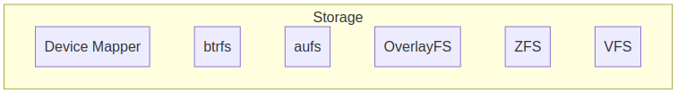
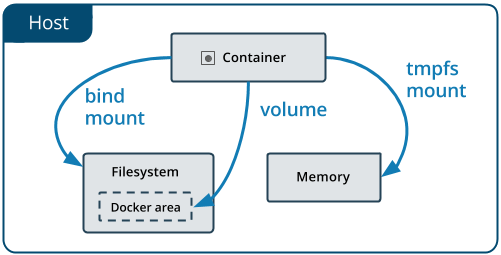

# Capítulo 03 - Storage Drivers

Storage Drivers possibilitam a criação de dados em uma camada gravável do container. Os arquivos não serão persistidos após o container ser deletado, ambas velocidades de leitura e escrita tem performance mais lentas que um sistema de arquivos.




* **Device Mapper**: Framework de gerenciamento de volumes linux
* **btrfs**: CoW (copy-on-write) filesystem, pode ser utilizado para combinar diversos blocos físicos em um único sistema btrfs
* **aufs**: Union Filesystem. Driver antigo, não deve ser utilizado em kernel > 4.0 , overlay2 é superior
* **OverlayFS**: Union Filesystem morderno, também conhecido como overlay2, é o recomendado pelo docker.
* **ZFS**: Next Generation filesystem, suporta gerenciamento de volume, snapshot, checksum, compressão, replicação, etc...
* **VFS**: cada camada é diretamente um diretório no disco, sem suporte ao CoW (copy-on-write)

> **CoW** ou **copy-on-write** é uma tecnica de gestão de recursos criada para duplicar ou copiar em recursos modificáveis. Se um recurso é duplicado mas não modificado, não é preciso criar um novo recurso, é feito o compartilhamento do recurso atual.

Para visualizar o storage driver em uso basta executar o comando
```bash
docker system info | grep Storage
```

A alteração do storage driver padrão deve ser feita através do arquivo de parametrização `daemon.json` no qual falaremos mais adiante

```json
{
    "storage-driver": "overlay2"
}
```

## Docker Volumes

Volume é um diretório especialmente designado, seja em um ou mais containers que compartilham o sistema de arquivos UnionFS

Os volumes são projetados para manter os dados, independentemente do ciclo de vida do container. O Docker nunca exclui um volume automaticamente quando você remove um container.

Existem 3 tipos de Volumes:

* **host** - Reside no sistema de arquivos do host do docker e pode ser acessado dentro de um container;
* **nomeado** - Volume gerenciado e criado pelo Docker, na criação do volume é dado um nome para o mesmo.
* **anônimo** - Volume gerenciado e criado pelo Docker, na criação do volume não é informado o nome para o mesmo e o Docker se encarrega de nomeá-lo com um hash de 64 caracteres.

Existem alguns tipos de montagem para os volumes. O volume do tipo **host** tem sua montagem realizada como um **bind mount** e existe ainda um volume do tipo **tmpfs mount** o qual reside na memória do sistema (volátil)



Existem algumas vantagens ao se utilizar volumes do Docker ao invés de **bind mounts**

* Volumes são mais fáceis de efetuar o backup ou migração que bind mounts;
* É possível efetuar a gerência de volumes utilizando o Docker CLI ou o Docker API;
* Volumes podem ser compartilhados de maneira mais segura entre múltiplos containers;
* Drivers de Volumes podem habilitar o armazenamento em hosts remotos ou provedores de cloud, criptografar o conteúdo ou adicionar novas funcionalidades;
* Novos volumes podem ter seu conteúdo pré-populados por um container.

## Gerenciar Volumes

Para utilizar volumes no docker utilizamos a opção **-v** ou **--volume** para indicar qual volume deve ser montado no container.

Também podemos montar um volume utilizando a opção `--mount` que é mais explicita e verbosa. 

A maior diferença é que a sintaxe do `-v` combina todas as opções no mesmo campo, enquanto a `--mount` separa elas. Contrário a bind mounts, todas as opções para volumes são disponíveis para ambas flags `-v` e `--mount`. 

Quando usamos volumes com serviços, somente a opção `--mount` é suportada.


Primeiramente vamos montar um volume do tipo host através de um **bind mount**
```bash
docker container run -dit --name servidor -v /srv:/srv debian
docker container exec servidor df -Th
```

O parâmetro **-v** seguido de um diretório em caminho absoluto ou relativo separado por **:** a um caminho absoluto faz com que o diretório **/srv** da máquina hospedeira seja montado dentro do container gerado.

Vamos efetuar a cópia de alguns arquivos para o volume, verificando o conteúdo da pasta antes e após a execução
```bash
docker container exec servidor ls -lR /srv
sudo cp -r ~/dockerfiles /srv
docker container exec servidor ls -lR /srv
```
_Note que os arquivos copiados para a pasta **/srv** do host estão sendo exibidos também na pasta **/srv** do container_

Vamos remover o container e criá-lo novamente utilizando um **volume anônimo**
```bash
docker container rm -f servidor
docker container run -dit --name servidor -v /volume debian
```

Podemos utilizar o comando **docker container inspect** para verificar o local e nome do volume criado
```bash
docker container inspect servidor | grep volume
```
_Por padrão, os volumes criados e gerenciados pelo docker se localizam no diretório **/var/lib/docker/volumes**_

Podemos também visualizar informações do volume através do comando **docker volume inspect**
```bash
docker volume ls
docker volume inspect <hash>
```

Visualize o volume criado no container
```bash
docker container exec servidor df -Th
docker container exec servidor ls -lR /volume
```

Copie os arquivos no host hospedeiro e verifique o conteúdo no container
```bash
sudo cp -r ~/dockerfiles /var/lib/docker/volumes/<hash>/_data
docker container exec servidor ls -lR /volume
```

Vamos remover o container e criá-lo novamente utilizando um **volume nomeado**
```bash
docker container rm -f servidor
docker container run -dit --name servidor -v volume:/volume debian
docker volume ls
```

Perceba que a diferença de um volume **nomeado** para um **anônimo** é apenas o nome do volume

Para criar o mesmo container utilizando a flag `--mount` precisamos passar o `source` e o `target`

```bash
docker container run -dit --name servidor2 --mount source=volume2,target=/volume2  debian
``` 

Podemos inspecionar o container filtrando o volume com a opção `-f` ou `--format` 
```bash
docker container inspect servidor --format '{{json .Mounts }}' 
docker container inspect servidor2 -f '{{json .Mounts }}'
```

Podemos também visualizar de uma maneira mais agradável ao instalar o `jq` e passar a saída dos comandos acima para o jq
```bash
sudo apt-get update && sudo apt-get install jq -y
docker container inspect servidor --format '{{json .Mounts }}' | jq 
docker container inspect servidor2 -f '{{json .Mounts }}' | jq
```

## Selinux Labels

O mode `:z` indica que o conteúdo do bind mount é compartilhado entre múltiplos containers

O mode `:Z` indica que o conteúdo do bind mount é privado e não compartilhado

Para remover um volume no docker podemos utilizar a opção **rm**
```bash
docker volume ls
docker volume rm <hash>
docker volume rm $(docker volume ls -q)
```
_O comando **docker volume ls -q** lista os volumes por **id**_
> **ATENÇÃO:** a remoção do volume através do comando **_docker volume rm_** faz com que o volume seja excluído, não sendo possível a recuperação dos dados.


## tmpfs mounts

Volume e bind mounts permitem que compartilhemos arquivos entre a máquina hospedeira e o container, de maneira a persistir os dados após o container ser parado.

Outro tipo de volume é o `tmpfs`. quando criamos um container com `tmpfs` mount, o container pode criar arquivos fora da camada de escrita do container.

Diferente de volumes e bind mounts, um `tmpfs` é uma montagem temporária, e só persiste na memória do host. Quando o container para, o `tmpfs` mount é removido e os arquivos que foram criados lá não persistem em disco.

`tmpfs` mounts são úteis para armazenar temporariamente informação sensível das quais não gostaríamos de persistir no host ou na camada de escrita.

Para criar uma montagem `tmpfs` utilizamos o comando `--tmpfs`

Existem algumas diferenças que precisamos saber entre `tmpfs` e `bind` mounts.

- a flag `--tmpfs` não possibilita o uso de opções configuráveis.
- a flag `--tmpfs` não pode ser utilizada com serviços swarm. (Apenas `--mount`)

Utilizando uma montagem do tipo `tmpfs`


```bash
docker container run -dit --name tmpfstest1 --mount type=tmpfs,destination=/app debian
docker container run -dit --name tmpfstest2 --tmpfs /app debian
```

Vamos inspecionar os containers

```bash
docker container inspect tmpfstest1 --format '{{json .Mounts }}' | jq
docker container inspect tmpfstest2 -f '{{json .HostConfig.Tmpfs }}' | jq
```

> A diferença entre os modos de montagem é vista através do `docker container inspect` e a seção de mounts e host config.

Vamos remover os containers

```bash
docker container rm -f tmpfstest1 tmpfstest2
``` 

O `tmpfs` mount possibilita duas opções de configuração (Não obrigatórias), que apenas funcionam através da opção `--mount`


| Opção        | Descrição                                                             |
| ------------ | --------------------------------------------------------------------- |
| `tmpfs-size` | Tamanho em bytes, por padrão não existe limite                        |
| `tmpfs-mode` | Permissionamento do tmpfs em octal. Ex: `700` ou `0770`. Padrão `1777`|    

Exemplo:

```bash
docker container run -dit --name tmpfstest --mount type=tmpfs,destination=/app,tmpfs-size=100M debian
docker container inspect tmpfstest --format '{{json .HostConfig.Mounts }}' | jq
docker container exec tmpfstest df -Th
docker container rm -f $(docker container ls -aq)
```

## Backup & Restore

Podemos utilizar volumes para fazer backups, restaurações ou migrações de sistemas, para isto utilizamos a flag `--volumes-from` para criar um novo container que utilize o mesmo volume utilizado anteriormente.

### Backup

Vamos criar um container básico com o nome de `webserver` e copiar alguns arquivos para o mesmo

```bash
docker container run -dit -v /webdata --name webserver debian
docker container cp ~/dockerfiles webserver:/webdata
docker container exec webserver ls -lR /webdata
docker container exec webserver df -Th
docker volume ls
```

> Veja que foi criado um volume do tipo anônimo. 

Para entender como isto funciona, podemos subir um novo container utilizando este volume do container `webserver`

```bash
docker container run -dit --volumes-from webserver --name volumetest debian
docker container exec volumetest df -Th
docker container exec volumetest ls -lR /webdata
docker container inspect webserver --format '{{json .Mounts }}' | jq
docker container inspect volumetest --format '{{json .Mounts }}' | jq
docker container rm -f volumetest
```

Note que os volumes são os mesmos, com isso podemos efetuar o backup dos arquivos do container subindo um container extra com o propósito de empacotar os arquivos.

```bash
mkdir ~/backup
cd ~/backup
docker container run --rm --volumes-from webserver -v $(pwd):/backup alpine tar cvf /backup/backup.tar /webdata
tar -tvf backup.tar
```

O container com a imagem do alpine foi executado com a finalidade única de empacotar o conteúdo do diretório `/webdata` em um novo arquivo `backup.tar`

```bash
drwxr-xr-x root/root         0 2021-06-24 07:05 webdata/
drwxrwxr-x 1000/1000         0 2021-06-24 07:05 webdata/dockerfiles/
-rw-rw-r-- 1000/1000         0 2021-06-24 07:05 webdata/dockerfiles/arquivo2.txt
-rw-rw-r-- 1000/1000         0 2021-06-24 07:05 webdata/dockerfiles/arquivo3.txt
-rw-rw-r-- 1000/1000         0 2021-06-24 07:05 webdata/dockerfiles/arquivo1.txt
````

Vamos agora remover todos os containers e volumes criados
```bash
docker container rm -f $(docker container ls -aq)
docker volume rm -f $(docker volume ls -q)
```

### Restore 

Para restaurar o volume para um novo container primeiramente iremos criar o novo container com um novo volume.

```bash
docker container run -dit -v /webdata --name webserver2 debian
docker container exec webserver2 ls -lR /webdata
```

Agora podemos subir um novo container com o novo volume e restaurar o backup

```bash
docker container run --rm --volumes-from webserver2 -v $(pwd):/backup alpine ash -c "cd /webdata && tar xvf /backup/backup.tar --strip 1"

docker container exec webserver2 ls -lR /webdata
```

## Plugins

Plugins são utilizados para extender as funcionalidades do Docker. 
Atualmente o Docker suporta os plugins de Autorização, Redes e Volumes. 

Plugins são distribuidos como imagens docker e podem ser armazenados no Docker Hub ou em um private registry.

Para gerenciamento de plugins, utilizamos o comando `docker plugin`

> Para uma lista completa dos plugins veja [Docker Engine Plugins](https://docs.docker.com/engine/extend/legacy_plugins/)


### Volume Plugins

> Lista completa com definições [Volume Plugins](https://docs.docker.com/engine/extend/legacy_plugins/#volume-plugins)

Os plugins de volumes habilitam com que os volumes docker persistam através de diversos docker hosts.

#### Instalando um plugin

Iremos instalar um plugin chamado `sshfs` que trata-se de um plugin para sistema de arquivos baseado em SSH.

> O exemplo utilizado deve ser utilizado apenas para fins de estudo, uma vez que o volume seja criado, sua senha ssh para o host remoto será exposta como texto plano quando inspecionar o volume. 

1. Instale o plugin `sshfs`
```bash
docker plugin install vieux/sshfs
```

O plugin irá solicitar acesso a alguns privilégios.
- Acesso a rede `host`
- Acesso a capability `CAP_SYS_ADMIN` que habilita o plugin a executar o comando mount.
- Acesso ao ponto de montagem
- acesso ao dispositivo `/dev/fuse` ou Filesystem in Userspace

2. Verifique se o plugin foi instalado e está habilitado
```bash
docker plugin ls
```

3. Na máquina destino, garanta que o ssh está habilitado com usuário e senha. Em um novo terminal
```bash
$ vagrant ssh node02
$ sudo yum install vim -y
$ sudo vim /etc/ssh/sshd_config
                    
                    PasswordAuthentication yes

$ sudo systemctl restart sshd
```

4. Crie um volume utilizando o plugin.
```bash
$ docker volume create -d vieux/sshfs --name sshvolume -o sshcmd=vagrant@10.20.20.120:/vagrant -o password=vagrant
$ docker volume ls
$ docker volume inspect sshvolume | jq
``` 

5. Inicie um container com o volume
```bash
$ docker container run --rm -v sshvolume:/data alpine ls /data
```

#### Volume NFS


Na máquina master vamos instalar um servidor NFS e mapear um diretório
```bash
$ vagrant ssh master
$ sudo apt-get update
$ sudo apt-get install nfs-server -y
$ mkdir -p /home/vagrant/storage
$ echo "/home/vagrant/storage/ 10.20.20.0/24(rw)" | sudo tee -a /etc/exports
$ echo "<h1> Volume NFS master.docker-dca.example</h1>" | tee  /home/vagrant/storage/index.html
$ sudo systemctl restart nfs-server
$ showmount -e
```

Na máquina node01 vamos instalar o client nfs 
```bash
$ vagrant ssh node01
$ sudo apt-get install nfs-common -y
$ sudo showmount -e master.docker-dca.example
```

Na máquina node02 vamos instalar o client nfs
```bash
$ vagrant ssh node02
$ sudo yum install nfs-utils -y
$ sudo showmount -e master.docker-dca.example
```

Instale o plugin NFS na máquina node01 e node02
```bash
$ docker plugin install trajano/nfs-volume-plugin --grant-all-permissions
``` 

O plugin irá solicitar acesso a alguns privilégios.
- Acesso a rede `host`
- Acesso a capability `CAP_SYS_ADMIN` que habilita o plugin a executar o comando mount.
- Acesso ao ponto de montagem `/sys/fs/cgroup`


Crie o volume na máquina node01
```bash
$ docker volume create -d trajano/nfs-volume-plugin \
--opt device=master.docker-dca.example:/home/vagrant/storage \
--opt  nfsopts=hard,proto=tcp,nfsvers=3,intr,nolock volume_nfs

$ docker volume inspect volume_nfs | jq
```

Execute um container com o volume nfs
```bash
$ docker container run -dit --name webserver -v volume_nfs:/usr/share/nginx/html/ -p 80:80 nginx
$ docker volume inspect volume_nfs | jq
``` 

Verifique nas máquinas o conteudo
```bash
$ watch curl -s localhost
```

Altere o conteudo do index.html na máquina master e verifique o conteudo em tempo real nas máquinas node01 e node02

```bash
$ echo "<h2> Novo conteudo para o volume compartilhado</h2>" | tee -a /home/vagrant/storage/index.html
$ echo "<marquee> Se inscreva no canal https://youtube.com/caiodelgadonew</marquee>" | tee -a /home/vagrant/storage/index.html
```

Remova os containers dos nodes
```bash
$ docker container rm -f webserver
```
