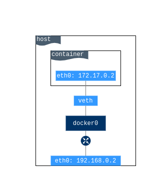
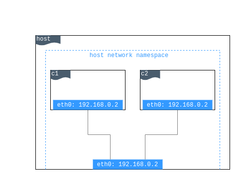
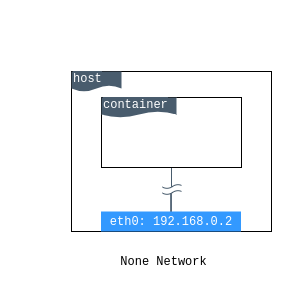
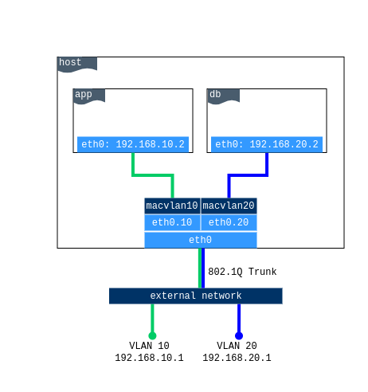
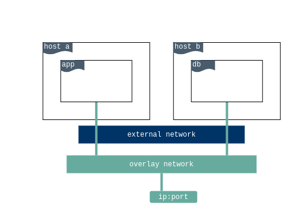

# Capítulo 04 - Networking

Um dos motivos pelos quais os contêineres e serviços do Docker são tão poderosos é que você pode conecta-los entre si ou a outros serviços. Para isso, utilizamos as redes docker.

Recursos de Network utilizados pelo docker:


* **veth**: Virtual Ethernet
* **bridge**: Interface Bridge
* **iptables**: Regras de isolamento de redes


## Administrando Redes

Por padrão quando um container é criado ele não publica nenhuma de suas portas para o mundo externo. Para disponibilizar uma porta para serviços fora do ambiente Docker ou para containers que não estejam conectados a mesma rede, utilizamos a flag **--publish** ou **-p**. Isso cria uma regra de firewall que mapeia uma porta de container para uma porta do host.

Quando executamos um container, podemos definir a publicação de uma ou mais portas através da opção -p hostaddress:hostport:containerport. Para expor as portas em qualquer endereço utilizamos o hostaddress 0.0.0.0.

Vamos subir nosso container webserver expondo a porta para a nossa rede

```bash
$ docker container run -dit --name webserver -p 80:80 webserver
```

Podemos acessar a aplicação no navegador pelo endereço http://node01.docker-dca.example

Remova o container webserver

```bash
$ docker container rm -f webserver
```

## Network Drivers

O sistema de redes do docker é "plugável" com a utilização de drivers. Existem diversos drivers para fornecer recursos e funcionalidades de rede:

* `bridge`: Driver de rede padrão. Se não especificarmos um driver, é o tipo de rede que o docker irá utilizar. Geralmente utilizamos redes bridge quando a aplicação será executada em containers isolados que precisam de comunicação.
* `host`: Para containers isolados, remove o isolamento de rede entre o container e o host Docker e utiliza a rede diretamente.
* `overlay`: Redes utilizadas para conectar multiplos Docker Daemons e habilitar os serviços de swarm (cluster) para se comunicarem entre si. 
* `macvlan`: Redes Macvlan possibilitam que configuremos um endereço MAC a um container, fazendo com que ele apareça como um dispositivo físico na rede. O docker daemon faz o roteamento do trafégo entre containers pelo MAC Address.
* `none`: Redes do tipo none disabilitam toda parte de redes do container, não pode ser utilizada com swarm (cluster).
* `plugins`: Utilizados para extender a funcionalidade de redes docker

## Redes Básico

Para gerenciar as redes do docker, utilizamos o comando `docker network`

Liste as redes disponiveis

```bash
$ docker network ls 
``` 

### Bridge

É a rede padrão do Docker, caso o container seja criado sem especificar um driver de rede a rede do tipo bridge é utilizada. Esta rede é criada utilizando um driver de rede de ponte que instancia uma interface de rede no linux chamada de dockerX sendo X um numero. Por padrão a rede bridge conta com um serviço interno de DNS, ou seja, os containers respondem internamente através de seu nome. Também é possivel conectar e desconectar containers on-the-fly.




Para executar um container com a rede bridge podemos passar a flag `--network bridge` como parametro do comando `docker container run`

```bash
$ docker container run -dit --name webserver --network bridge -p 80:80 webserver
```

Verifique o serviço na porta 80 do host
```bash
$ sudo ss -ntpl | grep 80
```
_O processo que é executado na porta através da rede bridge é o docker-proxy_

O que o docker faz por trás dos panos é a criação de uma série de regras do iptables para criar o isolamento dos processos de rede.

Podemos verificar isto através do comando
```bash
$ sudo iptables -nL
```


Remova o container webserver
```bash
$ docker container rm -f webserver
``` 

### Host

É a rede onde o IP da máquina é compartilhado com o container, nesta rede não é possível existir dois containers utilizando a mesma porta de rede.





Para executar um container com a rede host podemos passar a flag `--network host` no comando docker run
```bash
$ docker container run -dit --name webserver --network host  webserver
```
_Note que ao utilizar o drive de rede host não é necessário publicar a porta uma vez que não existe uma ponte de conexão_ 

Verifique o serviço na porta 80 do host
```bash
$ sudo ss -ntpl | grep 80
```
_O processo que é executado na porta através da rede host é o próprio processo interno do container, neste caso o apache2. Mesmo com a utilização da rede host ainda ocorre o isolamento de namespace a nível de processos e usuários_

Remova o container webserver
```bash
$ docker container rm -f webserver
```

### None

É a ausência de rede, utilizamos este driver para criar um container que será inacessível por rede, sendo assim completamente isolado.




Para executar um container com a rede host podemos passar a flag `--network host` no comando docker run
```bash
$ docker container run -dit --name sem-rede --network none  alpine ash
```

Verifique a stack de rede do container executando algum comando de verificação de rede.
```bash
$ docker container exec sem-rede ip link show 
$ docker container exec sem-rede ip route 
```
_O processo que é executado na porta através da rede host é o próprio processo interno do container, neste caso o apache2. Mesmo com a utilização da rede host ainda ocorre o isolamento de namespace a nível de processos e usuários_

Remova o container `sem-rede`
```bash
$ docker container rm -f sem-rede
```


### Macvlan

É a rede onde utilizamos os recursos de VLAN para fazer a separação lógica da rede, através dela podemos fornecer endereços IP para os containers que serão roteáveis para a rede física.



### Overlay

É a rede de sobreposição, na qual é criada uma rede lógica onde são suportados diversas redes hosts. Este tipo de recurso é utilizado ao se trabalhar com Docker Swarm (clusters)



_Falaremos de redes overlay no assunto Docker Swarm Cluster_ 


## Conectando Containers

Para conectarmos os containers e os serviços utilizamos os recursos de redes.

Vamos criar dois containers para entender o funcionamento das conexões de rede

```bash
$ docker container run -dit --name container1 -h servidor debian
$ docker container run -dit --name container2 -h cliente debian
```

Verifique o endereço IP dos containers
```bash
$ docker container exec container1 ip -c a show eth0
$ docker container exec container2 ip -c a show eth0
```
Faça um teste de conectividade entre os containers através do comando ping 
```bash
$ docker container exec container1 ping -c4 172.17.0.3
$ docker container exec container2 ping -c4 172.17.0.2
```

Veja que os containers não conseguem se comunicar por nome, a conexão por nome é possível apenas para o container interno
```bash
$ docker container exec container1 ping -c4 cliente
$ docker container exec container1 ping -c4 servidor
```

Isto se dá porque uma rede bridge por padrão não possui serviço interno de DNS. Com isso temos dois termos muito importantes relacionados a redes bridge

`Default Bridge Network` e `User-defined Bridge`

A `Default Bridge Network` é a rede padrão que vemos ao executar o comando `docker network ls` em uma máquina com o docker instalado e não customizado.
```bash
$ docker network ls 
``` 

A rede padrão tem uma característica muito importante que precisamos entender
* Containers na rede padrão podem acessar outros containers apenas por endereço IP, a menos que utilizemos a opção `--link` (considerado legado)

```bash
$ docker container rm -f container1 container2

$ docker container run -dit --name container1 -h servidor debian
$ docker container run -dit --name container2 --link container1:servidor -h cliente debian
$ docker container exec container2 ping -c4 container1

$ docker container rm -f container1 container2
```

A `User-defined Bridge` é um tipo de rede superior a rede `default bridge network`

Este tipo de rede tem as seguintes características
* Fornecem resolução de DNS automática entre containers da mesma rede
* Fornecem melhor isolamento pois precisamos indicar qual rede vamos nos conectar
* Containers podem ser conectados e desconectados 'on the fly' 
* São configuráveis e personalizáveis

Para criar uma rede bridge podemos executar o comando `docker network create --driver bridge`

Vamos criar uma rede e personalizar a mesma
```bash
$ docker network create --driver bridge --subnet 172.20.0.0/16 dca-lan
$ docker network ls 
``` 

Podemos inspecionar a rede através do parâmetro `inspect`
```bash
$ docker network inspect dca-lan
```

Agora que criamos nossa rede, vamos criar dois containers que estarão utilizando esta rede
```bash
$ docker container run -dit --name container1 -h servidor --network dca-lan debian
$ docker container run -dit --name container2 -h cliente --network dca-lan debian
``` 

Podemos verificar agora a rede através do `inspect` e verificar os endereços IP dos containers
```bash
$ docker network inspect dca-lan
```

Podemos também testar a conectividade entre os containers através do comando ping
```bash
$ docker container exec container1 ping -c4 cliente
$ docker container exec container1 ping -c4 container2

$ docker container exec container2 ping -c4 servidor
$ docker container exec container2 ping -c4 container1
```

Com isso podemos ver que a rede bridge fornece dns tanto para o hostname quanto para o nome do container.

Podemos também conectar e desconectar containers através do parâmetro `disconnect`
```bash
$ docker network disconnect dca-lan container2
$ docker network inspect dca-lan
$ docker container exec container1 ping -c4 container2
``` 

E também podemos conectar novamente através do parâmetro `connect` e inclusive indicando o endereço IP que desejamos através do parâmetro `--ip`
```bash
$ docker network connect --ip 172.20.0.200 dca-lan container2
$ docker network inspect dca-lan
$ docker container exec container1 ping -c4 container2
``` 

Remova os containers
```bash
$ docker container rm -f container1 container2
```


### DNS

Podemos configurar o servidor DNS no qual o container utilizará através do parâmetro `--dns`

```bash
$ docker container run -dit --name container1 debian
$ docker container exec -it container1 cat /etc/resolv.conf

$ docker container run -dit --name container2 --dns 8.8.8.8 debian
$ docker container exec -it container2 cat /etc/resolv.conf

$ docker container rm -f container1 container2
``` 

Podemos também configurar estas opções como padrão no arquivo `/etc/docker/daemon.json`
```json
{
    "dns": ["8.8.8.8", "8.8.4.4"]
}
```
 