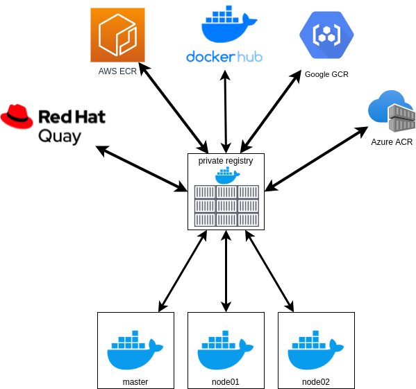

# Capítulo 06 - Docker Swarm

Docker Swarm é uma ferramenta de orquestração de containers, que possibilita o usuário a gerenciar multiplos containers distribuidos em diversas máquinas hosts. Habilitando ferramentas para dimensionamento, rede, proteção e manutenção dos containers.

## Conceitos

### Cluster  

Cluster é um conjunto de computadores que trabalham em grupo de modo a ser visto como um sistema único.

Utilizamos clusters para ganhar mais poder computacional e maior confiabilidade orquestrando um número de máquinas de "baixo custo" para obter um maior poder de processamento.


### Node  


Utilizamos o nome Node, ou nó,  quando nos referimos a qualquer elemento computacional que faz parte de um cluster, seja ele um nó do tipo primário (master) ou um do tipo secundário (follower).

Iremos nos referir aos nossos "computadores¨  como Master/Node

Em um passado não tão distante, os termos _Master/Slave_ eram utilizados para se referir aos nós e as ações na qual eles desempenhavam. Em 2020 um forte movimento aconteceu para acabar com essa terminologia, uma vez que ela traz referências a escravidão. Não é sobre aguardar alguem ser ofendido. É sobre remover estes termos com base em coisas terríveis e desumanas.

Algumas alternativas a serem utilizadas para se referir aos nodes:


* Main / Secondary
* Conductor/ Follower
* Leader / Follower
* Host / Client
* Sender / Reciever
* Producer / Consumer
* Primary / Replica
* Primary / Secondary
* Manager / Worker

## Raft Consensus


Quando trabalhamos com sistemas distribuidos, precisamos de algum algorítmo para tratar da confiabilidade do cluster. Um dos algoritmos mais utilizados para este meio é o Raft Consensus.

O Docker Swarm implementa o algorítmo Raft Consensus para gerencia do estado global do cluster.

O nome Raft é uma palavra em inglês que quer dizer Jangada, a referênca é porque para montarmos uma jangada, necessitamos de, ao menos, três toras de madeira.

Consensus é uma palavra em ingles que quer dizer Consenso. É também um dos problemas fundamentais em sistemas distribuidos com tolerância a falhas. Involve multiplos servidores aceitando valores. 

O site [The Secret Lives of Data](http://thesecretlivesofdata.com/raft/) possúi um ótimo guia sobre como ocorre o raft consensus.

Temos também uma página no github dedicado ao [raft](https://raft.github.io/)

Quando temos um sistema composto por um único nó, podemos dizer que este nó armazena um valor único, temos também o cliente que envia este valor para o servidor, neste ponto o cliente e o servidor entram em um "consensus", um valor é simples com um único nó.

Quando temos diversos servidores, como podemos chegar em um consenso ? esse é o problema de sistemas distribuidos.

Como chegamos em um concenso em multiplos nodes? Utilizando algoritmos como o Raft Consensus.

Pensando de uma maneira mais macro, o raft define os nós em três estados básicos:

* Follower
* Candidate
* Leader

Todos os nós começam em um estado de seguidor, se os seguidores não encontrarem um líder, eles se tornam candidatos.

O candidato requisita votos de outros nós e os nós respondem com o voto, o candidato vira um lider se ele tiver os votos de uma maioria dos nodes. Esse processo é chamado de Eleição do Líder


O problema básico evitado ao se utilizar o raft consensus é chamado de `split-brain` ou cérebro dividido, e isto acontece da seguinte maneira:

> Estamos falando apenas de nodes do tipo Master, ou primário.

O Raft Consensus tolera até `(N-1)/2` falhas, e precisa de um quórum de `(N/2)+1` para ser funcional.
> Tratamos apenas numeros inteiros.

Imagine que temos 2 nodes. Caso um dos nodes perca a comunicação (rede), como ele irá saber se: 
* Ele está sem conectividade? 
* O outro nó está sem conectividade? 

Esta ação é chamada de `split-brain`, e o sistema se torna inoperante.

Vamos para o mesmo cenário com 3 nós, onde um node perde a comunicação (rede). O que ocorre neste momento é:
1. Os nodes começam a se perguntar (rede) se os outros nós estão operantes.
2. Os 2 nodes que estão operantes se comunicam e verificam que são a maioria `(N/2)+1` ou seja `(3/2)+1 = 2` e continuam se comunicando.
3. O nó que está inoperante verifica que ele não é a maioria, e para de responder.

Qual seria o problema que poderiamos encontrar caso o nó que ficou sem conectividade continue a operar? Teriamos duas versões das aplicações rodando, uma em cada lado dos servidores, com conteudos diferentes.

| Nós | Tolerância |
| --- | ---------- |
|  1  |      0     |
|  3  |      1     |
|  5  |      2     |
|  7  |      3     |
|  9  |      4     |

Não é comum termos mais de 5 nodes, uma vez que a comunicação entre os nós precisa ser feita de maneira rápida e eficiente, e ao aumentar o número de nodes fazemos com que o volume de replicação de dados aumente, tornando comum a utilização de `3 ou 5` nodes

Mais informações na [Documentação Oficial](https://docs.docker.com/engine/swarm/raft/)

## Criando o Cluster

Trabalharemos com as máquinas `master` `node-01` e `node-02`

Ligue as máquinas
```bash
$ vagrant up master node01 node02
``` 

Acesse a máquina master
```bash
$ vagrant ssh master
```

Para criar o cluster do swarm, precisamos apenas de que o docker esteja instalado na máquina, podemos em seguida executar o comando para verificar seu endereço IP e iniciar o cluster swarm

```bash
$ ip -c -br a show enp0s8
$ docker swarm init --advertise-addr 10.20.20.100
```

Será exibida uma mensagem informando que o swarm foi iniciado e o node é um manager, bem como o token para adicionar mais nós ao swarm.

```bash
Swarm initialized: current node (sqtbdppo34ez4i4wsngbdeply) is now a manager.

To add a worker to this swarm, run the following command:

    docker swarm join --token SWMTKN-1-4n7u9o6cmhoizpx57umbp1g8nkh5zetuimx06k20nme64syy0t-1x0yu5ogxdlu2b0fs7fcnsc91 10.20.20.100:2377

To add a manager to this swarm, run 'docker swarm join-token manager' and follow the instructions.
```

Podemos ver novamente o token para adicionar novos nós ao cluster através do comando `docker swarm join-token <manager/worker>`
```bash
$ docker swarm join-token manager
$ docker swarm join-token worker
```

### Adicionando nós ao cluster.


Na máquina master, copie o token de `worker`

```bash
$ docker swarm join-token worker
```

Em um novo terminal, acesse a máquina `node01` e execute o comando copiado anteriormente
```bash
$ vagrant ssh node01
$ docker swarm join --token SWMTKN-1-4n7u9o6cmhoizpx57umbp1g8nkh5zetuimx06k20nme64syy0t-1x0yu5ogxdlu2b0fs7fcnsc91 10.20.20.100:2377
```

Repita o passo para a máquina `node02`
```bash
$ vagrant ssh node02
$ docker swarm join --token SWMTKN-1-4n7u9o6cmhoizpx57umbp1g8nkh5zetuimx06k20nme64syy0t-1x0yu5ogxdlu2b0fs7fcnsc91 10.20.20.100:2377
```

De volta a máquina master, vamos verificar se os nós foram adicionados corretamente.
```bash
$ docker node ls
```

Verifique que o node que estamos atualmente conectados é informado com um `*` e podemos ver também quais nodes são `manager` ou `lider`

```bash
ID                            HOSTNAME                    STATUS    AVAILABILITY   MANAGER STATUS   ENGINE VERSION
sqtbdppo34ez4i4wsngbdeply *   master                      Ready     Active         Leader           20.10.7
o122d88a3dwxdkw6nyopgmqu7     node01                      Ready     Active                          20.10.7
tj57th3ri0zouv1f8ui90zv0n     node02.docker-dca.example   Ready     Active                          20.10.7
```

> os comandos `docker node` só podem ser executados em nodes do tipo `manager`

Podemos verificar também que uma rede com o driver `overlay` foi criada para comunicação do swarm 

```bash
$ docker network ls
```

### Promovendo um node a Manager ou rebaixando a worker

Podemos promover um node a manager ou rebaixa-lo através do comando `docker node promote` e `docker node demote`

Na máquina master, vamos promover o node01 a manager.
```bash
$ docker node ls
$ docker node promote node01
$ docker node ls
``` 

Note que seu `Manager Status` se tornou `Reachable`, ou seja, ele está disponível, caso a máquina esteja sem comunicação, ela ficará no estado de `Unreachable`

```bash
ID                            HOSTNAME                    STATUS    AVAILABILITY   MANAGER STATUS   ENGINE VERSION
sqtbdppo34ez4i4wsngbdeply *   master                      Ready     Active         Leader           20.10.7
o122d88a3dwxdkw6nyopgmqu7     node01                      Ready     Active         Reachable        20.10.7
tj57th3ri0zouv1f8ui90zv0n     node02.docker-dca.example   Ready     Active                          20.10.7
```

Caso a máquina fique offline veremos o nosso cluster entrar em estado de `split-brain` exibindo a seguinte mensagem ao executar o comando `docker node ls`
```bash
Error response from daemon: rpc error: code = Unknown desc = The swarm does not have a leader. It's possible that too few managers are online. Make sure more than half of the managers are online.
```

Vamos agora rebaixar nosso node a worker.
```bash
$ docker node ls
$ docker node demote node01
$ docker node ls
``` 

> Trabalharemos com apenas um manager pois como falamos na etapa do raft consensus, ter dois managers é pior do que ter apenas um.

## Private Registry



Quando trabalhamos com clusters como o docker swarm, precisamos configurar um private registry, porque fazer isto? temos alguns motivos:

* Docker Hub Rate Limiting
* Segurança 
* Velocidade 

**Docker Hub Rate Limiting**

Quando utilizamos o serviço do dockerhub, temos um limite de requisição de 100 imagens de containers a cada seis horas por utilização anônima que podemos aumentar para 200 caso utilizemos uma conta gratuita.

**Segurança** 

Muitas das vezes não queremos que nossas imagens sejam enviadas para um registry publico por conter algum tipo de informação/tecnologia sensível.

**Velocidade** 

Quando temos um ambiente complexo, com diversos nodes fazendo o download de imagens diariamente, não queremos depender da nossa banda de internet. Um registry privado ganha velocidade neste quesito, uma vez que ele se comunica com o dockerhub

### Preparando nosso Registry

Primeiramente precisamos conectar via SSH e adicionar a máquina registry ao nosso cluster.
Caso precise, execute `docker swarm join-token worker` na máquina manager para copiar o comando de join


```bash
$ vagrant ssh registry
$ docker swarm join --token 
SWMTKN-1-0cfecsrgcdvuncxosbwpgu8yg674b4lur8643tizkeilnplhax-4wow83y7dw51vvy5d281347z1 10.20.20.100:2377
```

O próximo passo é adicionar o bloco de insecure registry a todas máquinas do nosso cluster.

```json
{
  "insecure-registries" : ["registry.docker-dca.example:5000"] 
}
```

Podemos fazer isto executando o seguinte comando em todos os nodes
```bash
$ echo '{ "insecure-registries" : ["registry.docker-dca.example:5000"] }' | sudo tee /etc/docker/daemon.json ; sudo systemctl restart docker
```

> Em ambientes de produção, configuramos nosso registry como seguro e adicionamos a ele um certificado SSL, mais informações podem ser encontradas na [Documentação Oficial](https://docs.docker.com/registry/deploying/)

### Deploy do Registry

Agora que ja configuramos os nodes podemos efetuar o deploy do nosso registry.

Execute o comando na máquina registry

```bash
$ docker container run -dit --name registry -p 5000:5000 registry:2
```
> Utilizamos a tag `registry:2` porque utilizamos o deploy versão `v2` do registry, que é a mais atual.

### Enviando Imagens

Para enviar imagens para nosso registry precisamos criar uma tag da imagem e efetuar o push.
Podemos fazer isto a partir de qualquer máquina que tenha acesso a nosso registry.
```bash
$ docker image pull alpine
$ docker image tag alpine registry.docker-dca.example:5000/alpine
$ docker image push registry.docker-dca.example:5000/alpine
```

### Listando Imagens

O Docker Registry por padrão não possui nenhuma interface para visualizar as imagens, mas podemos através de um simples `curl` verificar os repositórios existentes.

```bash
$ curl http://registry.docker-dca.example:5000/v2/_catalog
``` 

Teremos como resposta um json.
```json
{
  "repositories": ["alpine"]
}
```

Podemos tambem listar as tags acessando o endpoint `v2/<image_name>/tags/list` 

```bash
$ curl http://registry.docker-dca.example:5000/v2/alpine/tags/list
```

```json
{
  "name":"alpine","tags":["latest"]
}
```

### Adicionando as imagens que iremos utilizar nos laboratórios

Agora que ja aprendemos como enviar images para nosso private registry, iremos fazer o download das imagens que utilizaremos nos próximos laboratórios

* `nginx`
* `mysql:5.7`
* `wordpress`
* `caiodelgadonew/docker-supermario`
* `traefik:v2.4`

Para facilitar nosso processo, iremos criar um pequeno script em bash para automatizar este processo.

```bash
$ vim images.sh
```
```shell
for image in 'nginx' 'mysql:5.7' 'wordpress' 'caiodelgadonew/docker-supermario' 'traefik:v2.4'
do
docker image pull $image
docker tag $image registry.docker-dca.example:5000/$image
docker push registry.docker-dca.example:5000/$image
done
```

Vamos executar o script
```bash
$ chmod +x images.sh
$ ./images.sh
``` 

Após a finalização do script podemos visualizar nosso catalogo e verificar as imagens disponíveis
```bash
$ curl http://registry.docker-dca.example:5000/v2/_catalog
```
> Caso você tenha o `jq` instalado em sua máquina podemos visualizar de maneira mais agradável

```bash
$ curl http://registry.docker-dca.example:5000/v2/_catalog | jq
```

```json
{
  "repositories": [
    "alpine",
    "caiodelgadonew/docker-supermario",
    "mysql",
    "nginx",
    "traefik",
    "wordpress"
  ]
}
```

Podemos verificar as tags dos repositórios que não utilizaremos a tag latest como por exemplo o `mysql` e o `traefik`
```bash
$ curl http://registry.docker-dca.example:5000/v2/mysql/tags/list
$ curl http://registry.docker-dca.example:5000/v2/traefik/tags/list
```

## Services e Tasks

Quando falamos de Swarm, precisamos entender dois recursos importantes, os serviços e as tasks

**Services** -> É a definição de um estado desejado.
**Tasks** -> É criada a partir de um serviço que da origem aos containers a serem executados nos nodes.

Quando utilizamos os serviços descrevemos o estado desejado, como por exemplo:


Com isto o swarm manager irá criar as tasks e dividi-las entre os nodes disponíveis, de forma a atender, se possível, o estado desejado.


## Tasks e Agendadores

Uma task é uma unidade atomica agendada em um swarm. Quando declaramos um estado desejado de um serviço criando ou atualizando o serviço, o orquestrador identifica o estado desejado através do agendamento de tasks.

Uma task é um mecanismo uni-direcional, que navega entre uma séria de estados: `assigned`, `prepared`, `running`, etc.. Se uma task falha, o orquestrador remove a task e o container e em seguida cria uma nova task para a substituir de acordo com o estado desejado especificado pelo serviço

| Estado      | Descrição                                                            | 
| ----------- | -------------------------------------------------------------------- |
| `NEW`       | Task foi inicializada .                                              |
| `PENDING`   | Recursos estão sendo alocados                                        |
| `ASIGNED`   | Task foi atribuida a um nó                                           |
| `ACCEPTED`  | Task aceita por um nó worker                                         | 
| `PREPARING` | Docker está preparando a task                                        |
| `STARTING`  | Docker esta iniciando a task                                         |
| `RUNNING`	  | Task em execução                                                     | 
| `COMPLETE`  | Task finalizou sem error code                                        | 
| `FAILED`    | Task finalizou com error code                                        | 
| `SHUTDOWN`  | Docker requisitou o desligamento da task                             |
| `REJECTED`  | O nó worker rejeitou a task                                          |
| `ORPHANED`  | O nó esteve down por muito tempo                                     |
| `REMOVE`    | A task não terminou mas o recurso associado foi removido ou reduzido | 

## Serviços Replicados e Globais

Existem dois tipos de deployment de serviço, o replicated e o global.

Um serviço replicated, é o que informamos a quantidade de tasks identicas que iremos executar, por exemplo quando decidimos fazer um deploy de um webserver com três replicas, servindo o mesmo conteúdo.

O serviço gobal, é o serviço que vai executar em todos os nós, por isso o nome global. Não existe um número de tasks pré-especificadas. Sempre que um novo nó for adicionado ao swarm o orquestrador criará uma task e o agendador (scheduler) atribui a task ao novo nó. Este tipo de serviço é amplamente utilizado quando falamos de agents de monitoramento, scanners anti-virus ou algum serviço que precisa ser executado em cada nó do swarm.

O diagrama abaixo mostra um serviço com três replicas em amarelo e um serviço global em cinza


## Gerenciando Serviços

Para gerenciar os serviços utilizamos o comando `docker service `
```bash
$ docker service --help 
```

Vamos criar um serviço para executar o nginx
```bash
$ docker service create --name webserver registry.docker-dca.example:5000/nginx
```

Podemos listar os serviços através do subcomando `ls` e listar as tasks através do comando `ps`
```bash
$ docker service ls 
$ docker service ps webserver
```

> Através do `docker service ps`  podemos verificar o estado da task, o id da task e em qual nó a task está sendo executada, bem como se houveram erros e quais portas estão publicadas.

Para publicar alguma porta, podemos executar um `update` no service com o parametro `--publish-add`
```bash
$ docker service update --publish-add 80 webserver
$ docker service ls
```
> Por padrão uma porta aleatória é adicionada ao service (30000 +)

Vemos também que o serviço tem uma nova task e sua task anterior entra em estado de `shutdown`
```bash
$ docker service ps webserver
```

No nosso caso o serviço está rodando no `node01` podemos acessar por um navegador ou através do curl e verificar que o serviço está sendo executado.
```bash
$ curl http://node01.docker-dca.example:30000
```

Também é possivel inspecionar o serviço para identificarmos alguns detalhes interessantes
```bash
$ docker service inspect webserver
$ docker service inspect --pretty webserver
```
> A opção `--pretty` exibe a informação de uma maneira mais agradável para humanos.

```bash
Endpoint Mode:  vip
Ports:
 PublishedPort = 30000
  Protocol = tcp
  TargetPort = 80
  PublishMode = ingress 
```

Podemos ver que:
* O endpoint está sendo executado como `vip` ou seja, `virtual ip`.
* A porta de destino é a `80` , `TargetPort`
* A porta publicada é a porta `30000` , `PublishedPort`
* O modo de publicação é o `ingress` ou seja, a rede que gerencia e controla os dados relacionados ao serviço de swarm.

Vamos remover nosso serviço
```bash
$ docker service rm webserver
```

Assim como fazemos com containers, podemos alterar o comando que o container deve executar, basta adicionar o comando ao final.
```bash
$ docker service create --name pingtest registry.docker-dca.example:5000/alpine ping google.com
```
Também podemos verificar os logs do serviço. 
```bash
$ docker service logs pingtest
```

## Escalando Serviços

Agora que temos nosso serviço sendo executado, podemos fazer jus ao benefício da elasticidade e escala-lo, ou seja, aumentar a quantidade de replicas em execução.


```bash
$ docker service scale pingtest=3
$ docker service ls
$ docker service ps pingtest
```
> também podemos executar o comando `$ docker service update --replicas 3 pingtest`

Agora que temos nosso serviço executando um container em cada node, podemos verificar os logs de todos os containers de maneira agregada
```bash
$ docker service logs -f pingtest
```

Podemos também verificar os services que estão rodando em cada container
```bash
$ docker node ps master.docker-dca.example
$ docker node ps node01.docker-dca.example
$ docker node ps node02.docker-dca.example
```

## Disponibilidade dos Nodes

Quando precisamos efetuar algum tipo de manutenção em algum node do cluster, precisamos garantir que a manutenção seja feita de maneira correta.

Para este tipo de situação precisamos fazer o processo de `drain` ou drenagem dos nós.

Isto é possível da seguinte maneira:

Primeiramente vamos aumentar o numero de replicas de nosso `pingtest` para 7

```bash
$ docker service update --replicas 7 pingtest
$ docker service ps pingtest
```

Podemos ver que nosso serviço está sendo executado em diversos nodes. Vamos colocar nosso `node01` em estado de drenagem através do comando:

```bash
$ docker node update node01.docker-dca.example --availability drain 
```

Podemos verificar agora como nosso serviço e nosso node estão trabalhando
```bash
$ docker service ps pingtest
$ docker node ls 
$ docker node inspect --pretty node01.docker-dca.example
```

Vemos que nosso node esta em estado de `Drain` e as tasks foram direcionadas para outros nodes.

Para voltar nosso node para um estado de disponível podemos mudar sua `avaliability` para `active`

```bash
$ docker node update node01.docker-dca.example --availability active
```

Note que as tasks não serão redistribuidas uma vez que estão sendo executadas com sucesso.
```bash
$ docker service ps pingtest
```

> Caso novas tasks sejam requistadas, o nosso node agora é um candidato para recebe-las

Remova o serviço
```bash
$ docker service rm pingtest
$ docker service ls
```

## Secrets 

Em termos de Serviços Swarm, um _secret_ é um `blob data` como senha, chave privada ssh, certificado SSL ou qualquer outro dado que **NÃO** deve ser transmitido pela rede ou armazenado sem criptografia no código fonte da aplicação.

> Um blob (do inglês: Binary Large OBject, basic large object, BLOB ou BLOb, que significa objeto grande binário ou objeto grande básico na tradução literal), é uma coleção de dados binários armazenados como uma única entidade.

Para gerenciar os secrets no swarm, utilizamos o comando `docker secret`

```bash
$ docker secret --help
$ docker secret ls
``` 

Para criar um secret precisamos passa-lo através do _STDIN_, ou através de um arquivo.

```bash
$ echo "caiodelgadonew123" | docker secret create senha_db - 
$ docker secret inspect --pretty senha_db
```
> O secret criado é armazenado no arquivo `/run/secrets/<secret_name>` no container em execução

Vamos executar um container `mysql` passando a senha como um secret
```bash
$ docker service create --name mysql_database \
--publish 3306:3306/tcp \
--secret senha_db \
-e MYSQL_ROOT_PASSWORD_FILE=/run/secrets/senha_db \
registry.docker-dca.example:5000/mysql:5.7
```

Vamos instalar o client do mariadb, verificar em qual servidor está sendo executada a task com o container e vamos conectar passando a senha que configuramos no arquivo.

```bash
$ sudo apt-get install mariadb-client -y
$ docker service ps mysql_database
$ mysql -h node01.docker-dca.example -u root -pcaiodelgadonew123

> CREATE DATABASE caiodelgadonew;
> SHOW DATABASES:
> EXIT
```

Destrua o serviço
```bash
$ docker service rm mysql_database
```

## Network

Vamos criar agora uma rede overlay para suportar um serviço do nginx 

```bash
$ docker network create -d overlay dca-overlay
$ docker network inspect dca-overlay
$ docker service create --name webserver --publish target=80,published=80 --network dca-overlay registry.docker-dca.example:5000/nginx
$ docker node ps
``` 

Verifique na máquina `node01` que não existe a rede `dca-overlay` que criamos
```bash
$ vagrant ssh node01
$ docker network ls
``` 

Na máquina `master` vamos efetuar o scaling para 3 replicas do webserver
```bash
$ docker service scale webserver=3
$ docker service ps webserver
``` 

Na máquina `node01` verifique que agora que o serviço está em execução, a rede foi criada com o mesmo ID da máquina `master`
```bash
$ docker network ls
``` 

Acesse os endereços dos servidores pelo navegador e veja a página do nginx sendo executada

http://master.docker-dca.example/
http://node01.docker-dca.example/
http://node02.docker-dca.example/

Remova o serviço
```bash
$ docker service rm webserver
```

## Volumes

Para esta etapa, precisamos que o plugin `trajano/nfs-volume` esteja instalado em todas as máquinas que fazem parte do swarm, caso não esteja instalado, verifique a aula `03-volumes` na seção `NFS Volume`

Verifique se o plugin esta instalado e se o `exports` é reconhecido em todas as máquinas
```bash
$ docker plugin ls
$ showmount -e master.docker-dca.example 
``` 

Na máquina master, crie o volume
```bash
$ docker volume create -d trajano/nfs-volume-plugin \
--opt device=master.docker-dca.example:/home/vagrant/storage \
--opt  nfsopts=hard,proto=tcp,nfsvers=3,intr,nolock volume_nfs

$ docker volume inspect volume_nfs | jq
```

Crie um serviço do nginx com 3 replicas apontando para o volume
```bash
$ docker service create --name webserver \
--replicas 3 \
--publish 80:80 \
--network dca-overlay \
--mount source=volume_nfs,target=/usr/share/nginx/html/ \
registry.docker-dca.example:5000/nginx

$ docker service ps webserver
```

Verifique o conteudo do nginx
```bash
$ curl master.docker-dca.example
$ curl node01.docker-dca.example
$ curl node02.docker-dca.example
```

Altere o conteúdo da pagina e verifique o conteúdo do nginx
```bash
$ echo "<marquee> VOLUME NFS DOCKER SWARM</marquee>" | tee -a /home/vagrant/storage/index.html
$ curl master.docker-dca.example
$ curl node01.docker-dca.example
$ curl node02.docker-dca.example
```

Remova o serviço
```bash
docker service rm webserver
```

## Stacks

Quando executamos o Docker em modo swarm, podemos utilizar o comando `docker stack deploy` para fazer o deploy de uma aplicação completa no swarm. O comando `deploy` aceita um descritivo de stack no formato de um arquivo compose.

> Para trabalharmos com stacks, precisamos utilizar o arquivo compose com sua versão 3 ou superior. 

Para entender o funcionamento do stack, iremos efetuar o deploy do webserver que anteriormente subimos com o docker-compose.

Vamos começar com o básico. 

Primeiramente crie uma pasta para armazenarmos arquivos do stack e o arquivo webserver.yml onde iremos definir nosso compose
```bash
$ mkdir -p ~/stack
$ cd ~/stack
```

```yml
version: '3.9'

services:
  webserver:
    image: registry.docker-dca.example:5000/nginx
    hostname: webserver
    ports:
      - 80:80
```

Para fazer o deploy podemos utilizar a opção `--compose-file` ou `-c`
```bash
$ docker stack deploy --compose-file webserver.yml nginx-webserver
$ docker stack ls 
```

Verifique os status do stack através do comando `docker stack services`
```bash
$ docker stack services nginx-webserver
``` 

Veja que o serviço foi iniciado com o mode `replicated` com uma replica apenas.

Podemos ver os status das tasks do service através do comando `docker stack ps`
```bash
$ docker stack ps nginx-webserver
```

Agora que sabemos onde nossa task está sendo executada, podemos acessar a mesma através do endereço do servidor .

http://master.docker-dca.example

vamos alterar nosso serviço agora para executar 2 replicas adicionando opções de deploy a mesma.
```bash
$ vim webserver.yml
```

```yml
version: '3.9'

services:
  webserver:
    image: registry.docker-dca.example:5000/nginx
    hostname: webserver
    ports:
      - 80:80
    deploy:
      replicas: 2
      restart_policy:
        condition: on-failure
```

Atualize a stack ae verifique os status:
```bash
$ docker stack deploy -c webserver.yml nginx-webserver
$ docker stack services nginx-webserver
$ docker stack ps nginx-webserver
``` 

Podemos ver que nossa stack está sendo executada agora nos nós node01 e node02.

Vamos explorar agora o deploy do tipo global, para isto vamos alterar nosso arquivo compose
```bash
$ vim webserver.yml
```

```yml
version: '3.9'

services:
  webserver:
    image: registry.docker-dca.example:5000/nginx
    hostname: webserver
    ports:
      - 80:80
    deploy:
      mode: global
      restart_policy:
        condition: on-failure
```

Para alterar nosso serviço para global, precisamos primeiramente destruir o mesmo e subi-lo novamente.

```bash
$ docker stack rm nginx-webserver
$ docker stack deploy -c webserver.yml nginx-webserver
$ docker stack services nginx-webserver
$ docker stack ps nginx-webserver
```

Note que agora ao utilizar o mode como global, temos nossa task executando exatamente 1 container em cada servidor, este tipo de utilização é muito util quando precisamos garantir que todos os containers possuam por exemplo um determinado container de monitoramento.

Vamos remover nosso serviço e alterar alguns outros parâmetros:
```
$ docker stack rm nginx-webserver
$ vim webserver.yml
```

```yml
version: '3.9'

services:
  webserver:
    image: registry.docker-dca.example:5000/nginx
    hostname: webserver
    deploy:
      mode: replicated
      replicas: 4
      placement:
        constraints:
          - node.role==manager 
      restart_policy:
        condition: on-failure
```

Utilizamos as placements constraints para indicar as preferencias de onde queremos executar nossos containers, desta maneira podemos atrelar eles para serem executados apenas em nós do tipo manager, ou até mesmo em nós que estão executando uma determinada versão de sistema operacional

```bash
$ docker stack deploy -c webserver.yml nginx-webserver
$ docker stack services nginx-webserver
$ docker stack ps nginx-webserver
```

Vamos alterar agora para executarmos 5 replicas apenas nos nós que sejam workers e estejam rodando o ubuntu 18.04

Para isto iremos adicionar uma label no node01

```bash
$ docker node update --label-add os=ubuntu18.04 node01.docker-dca.example
$ vim webserver.yml
```

```yml
version: '3.9'

services:
  webserver:
    image: registry.docker-dca.example:5000/nginx
    hostname: webserver
    deploy:
      mode: replicated
      replicas: 4
      placement:
        constraints:
          - node.role==worker
          - node.labels.os==ubuntu18.04 
      restart_policy:
        condition: on-failure
```

```bash
$ docker stack deploy -c webserver.yml nginx-webserver
$ docker stack services nginx-webserver
$ docker stack ps nginx-webserver
```

Existem diversas outras propriedades que podemos utilizar com o compose, podemos verificar todas no [Docker Compose Reference File - Deploy](https://docs.docker.com/compose/compose-file/compose-file-v3/#deploy)

Vamos agora derrubar nosso webserver e criar um compose para subir o wordpress.

```bash
$ docker stack rm webserver
$ vim wordpress.yml
```

```yml
version: "3.9"

volumes:
  mysql_db:
    driver: trajano/nfs-volume-plugin
    driver_opts:
      device: master.docker-dca.example:/home/vagrant/mysql_db
      nfs_opts: hard,proto=tcp,nfsvers=3,intr,nolock 


networks:
  wp_overlay:


services:
  wordpress:
    image: registry.docker-dca.example:5000/wordpress
    ports:
      - 8080:80
    environment:
      WORDPRESS_DB_HOST: db
      WORDPRESS_DB_USER: wpuser
      WORDPRESS_DB_PASSWORD: caiodelgadonew@youtube
      WORDPRESS_DB_NAME: wordpress
    networks:
      - wp_overlay
    deploy:
      mode: replicated
      replicas: 2
      restart_policy:
        condition: on-failure

  db:
    image: registry.docker-dca.example:5000/mysql:5.7
    volumes:
      - mysql_db:/var/lib/mysql
    environment:
      MYSQL_DATABASE: wordpress
      MYSQL_USER: wpuser
      MYSQL_PASSWORD: caiodelgadonew@youtube
      MYSQL_RANDOM_ROOT_PASSWORD: '1'
    networks:
       - wp_overlay
    deploy:
      mode: replicated
      replicas: 1
      restart_policy:
        condition: on-failure
```

Antes de executar os containers, vamos criar o volume_nfs na máquina master
```bash
$ mkdir ~/mysql_db
$ echo "/home/vagrant/mysql_db/ 10.20.20.0/24(no_root_squash,rw)" | sudo tee -a /etc/exports 
$ sudo systemctl restart nfs-server
```

Vamos fazer o deploy da stack:

```bash
$ docker stack deploy -c wordpress.yml wordpress-stack
$ docker stack services wordpress-stack
$ docker stack ps wordpress-stack
```


Acesse o navegador e configure a webpage
> Note que podemos acessar o site de qualquer endereço do cluster, uma vez que temos um vip configurado.

http://master.docker-dca.example:8080/

```bash
Titulo do Site: Wordpress - Stack
Nome de Usuário: caiodelgadonew
Senha: caiodelgadonew@youtube
email: caiodelgadonew@docker-dca.example
```

## Gerenciando Limites do container

Podemos também gerenciar um limite/reserva de recursos para o container através do parâmetro `resources` no compose.

```bash
$ vim wordpress.yml
``` 

```yml
version: "3.9"

volumes:
  mysql_db:
    driver: trajano/nfs-volume-plugin
    driver_opts:
      device: master.docker-dca.example:/home/vagrant/mysql_db
      nfs_opts: hard,proto=tcp,nfsvers=3,intr,nolock

networks:
  wp_overlay:


services:
  wordpress:
    image: registry.docker-dca.example:5000/wordpress
    ports:
      - 8080:80
    environment:
      WORDPRESS_DB_HOST: db
      WORDPRESS_DB_USER: wpuser
      WORDPRESS_DB_PASSWORD: caiodelgadonew@youtube
      WORDPRESS_DB_NAME: wordpress
    networks:
      - wp_overlay
    deploy:
      mode: replicated
      replicas: 2
      restart_policy:
        condition: on-failure
      resources:
        limits:
          cpus: "1"
          memory: 60M
        reservations:
          cpus: "0.5"
          memory: 30M

  db:
    image: registry.docker-dca.example:5000/mysql:5.7
    volumes:
      - mysql_db:/var/lib/mysql
    environment:
      MYSQL_DATABASE: wordpress
      MYSQL_USER: wpuser
      MYSQL_PASSWORD: caiodelgadonew@youtube
      MYSQL_RANDOM_ROOT_PASSWORD: '1'
    networks:
       - wp_overlay
    deploy:
      mode: replicated
      replicas: 1 
      restart_policy:
        condition: on-failure
```

Vamos fazer o deploy da stack:

```bash
$ docker stack deploy -c wordpress.yml wordpress-stack
$ docker stack services wordpress-stack
$ docker stack ps wordpress-stack
$ docker service inspect wordpress-stack_wordpress --pretty
```

Para verificar o uso de memoria/cpu do container podemos utilizar o comando `docker stats`
> Execute em algum nó que esteja rodando o wordpress

```bash
$ docker stats
```

Vamos instalar na máquina master o apache benchmark para fazer um stress test no container.
```bash
$ sudo apt-get install apache2-utils -y
```
Execute o apache benchmark e acompanhe o uso de cpu/memoria do container nos node01 e 02
```bash
$ ab -n 10000 -c 100 http://master.docker-dca.example:8080/
```

Veja que o container não passa do limite de memória que especificamos.
Vamos alterar o numero de replicas para 6 e executar novamente o apache benchmark
```bash
$ docker service scale wordpress-stack_wordpress=6
$ ab -n 10000 -c 100 http://master.docker-dca.example:8080/
``` 

Remova a stack
```bash
$ docker stack rm wordpress-stack
``` 

## Traefik com Stack (Extra)

Para finalizar, vamos fazer um deploy de uma stack do jogo "dockersupermario" com o traefik fazendo proxy reverso.

Primeiramente vamos criar a rede para o traefik.
```bash
$ docker network create -d overlay proxy
```

Vamos criar os arquivos compose para o container do supermario.

```bash
$ vim supermario.yml
``` 

```yml
version: "3.9"

networks:
  proxy:
    external: true

services:

  supermario:
    image: registry.docker-dca.example:5000/caiodelgadonew/docker-supermario
    networks:
      - proxy
    deploy:
      mode: replicated
      replicas: 1
      restart_policy:
        condition: on-failure
      resources:
        limits:
          cpus: "1"
          memory: 100M
        reservations:
          cpus: "0.5"
          memory: 60M
      labels:
        - "traefik.enable=true"
        - "traefik.http.routers.game.rule=Host(`supermario.docker-dca.example`)"
        - "traefik.http.services.game.loadbalancer.server.port=8080"
``` 

Vamos criar agora a stack do Traefik
```bash
$ vim traefik.yml
```

```yml
version: '3.9'

networks:
  proxy:
    external: true

services:
  traefik:
    image: "registry.docker-dca.example:5000/traefik:v2.4"
    command:
      - --entrypoints.web.address=:80
      - --providers.docker.swarmMode=true
      - --providers.docker.exposedByDefault=false
      - --api
    ports:
      - 80:80
    volumes:
      - /var/run/docker.sock:/var/run/docker.sock:ro
    networks:
      - proxy
    deploy:
      mode: global
      placement:
        constraints:
          - node.role==manager
      restart_policy:
        condition: on-failure
      labels:
        - "traefik.enable=true"
        - "traefik.http.routers.traefik.rule=Host(`dashboard.docker-dca.example`)"
        - "traefik.http.routers.traefik.service=api@internal"
        - "traefik.http.services.traefik.loadbalancer.server.port=80"
```

Efetue o deploy das stacks
```bash
$ docker stack deploy -c supermario.yml supermario
$ docker stack deploy -c traefik.yml traefik
$ docker stack ls
$ docker stack services supermario
$ docker stack services traefik
```

Adicione a entrada dns em seu arquivo `/etc/hosts`

```bash
$ vim /etc/hosts
```

```bash
10.20.20.100    master.docker-dca.example supermario.docker-dca.example dashboard.docker-dca.example
```

Podemos também escalar nosso serviço
```bash
$ docker service scale supermario_supermario=6
$ docker stack services supermario
$ docker stack ps supermario 
```

No dashboard do traefik conseguimos ver a quantidade de nós e as informações do serviço

http://dashboard.docker-dca.example/


Após o termino, remova as stacks
```bash
$ docker stack rm traefik
$ docker stack rm supermario
``` 
