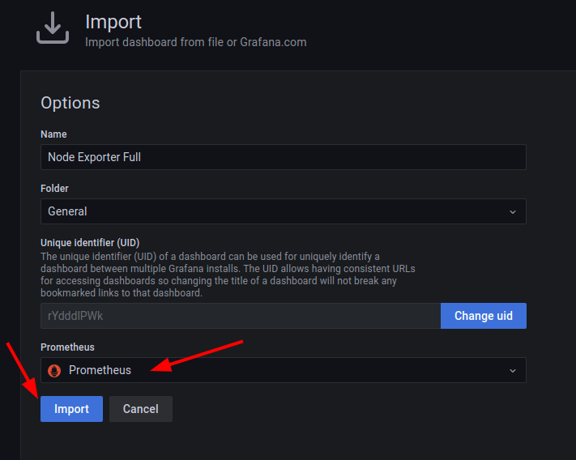

# Capítulo 07 - Monitoramento

Agora que já sabemos como efetuar o deploy das stacks e entendemos como funcionam os placements, podemos aproveitar estes recursos para fazer o deploy de uma stack de monitoramento.

## Stack de Monitoramento

Antes de efetuar o deploy da nossa stack de monitoramento do cluster, precisamos conhecer e entender alguns conceitos e ferramentas.

### Prometheus

Prometheus é um software open source de monitoramento desenvolvido pelos engenheiros do Soundcloud. O sistema de monitoramento do Prometheus agrega métricas de aplicações e infraestrutura em tempo real utilizando um banco de dados do tipo "time-series" através de recepção HTTP de dados.


### node-exporter

Quando precisamos exportar métricas de uma determinada máquina, precisamos de um software que "recolha" estas informações e entregue para um agregador de metricas, neste caso utilizamos o `node-exporter` que consegue ler as métricas do Sistema Operacional e do Hardware da máquina em que está sendo executado, o `node-exporter` coleta os dados e deixa disponível para que o prometheus possa consumí-los


### CAdvisor

CAdvisor ou Container Advisor é um exporter desenvolvido pelo google para exportar dados relacionados ao container, utilizamos o CAdvisor quando precisamos ter acesso aos dados de infraestrutura do Docker.

### Grafana

Grafana é uma aplicação web de análise de código aberto multiplataforma e visualização interativa da web. Ele fornece tabelas, gráficos e alertas para a web. Utilizamos o grafana para montar dashboards e dar visibilidade aos dados monitorados.

## Subindo a Stack de monitoramento

Na máquina `master` vamos criar o arquivo da stack de monitoramento.

Crie a estrutura de diretórios:
```bash
$ mkdir -p ~/monitoring/config
``` 

Primeiramente vamos criar o arquivo `prometheus.yml` que será responsável por parametrizar o prometheus.
```bash
$ vim ~/mnonitoring/config/prometheus.yml
```
```yml
global:
  scrape_interval:     15s 
  evaluation_interval: 15s 
  external_labels:
      monitor: 'my-project'

scrape_configs:
  - job_name: 'prometheus'
    scrape_interval: 5s
    static_configs:
         - targets: ['localhost:9090']

  - job_name: 'cadvisor'
    scrape_interval: 5s
    dns_sd_configs:
    - names:
      - 'tasks.cadvisor'
      type: 'A'
      port: 8080

  - job_name: 'node-exporter'
    scrape_interval: 5s
    dns_sd_configs:
    - names:
      - 'tasks.node-exporter'
      type: 'A'
      port: 9100
```

Agora vamos criar nosso arquivo da stack, que será responsável por subir os containers do `prometheus`, `node-exporter`, `cadvisor` e `grafana`

```bash
$ vim ~/monitoring/monitoring.yml
```
```yml
version: '3.9'

volumes:
  prometheus_data:
  grafana_data:

networks:
  monitoring:

services:

  cadvisor:
    image: google/cadvisor
    volumes:
      - /:/rootfs:ro
      - /var/run:/var/run:rw
      - /sys:/sys:ro
      - /var/lib/docker:/var/lib/docker:ro
    ports:
      - 8080:8080
    networks:
      - monitoring
    deploy:
      mode: global
      restart_policy:
        condition: on-failure

  prometheus:
    image: prom/prometheus
    volumes:
      - ./config/prometheus.yml:/etc/prometheus/prometheus.yml
      - prometheus_data:/prometheus
    ports:
      - 9090:9090
    depends_on:
      - cadvisor
    networks:
      - monitoring
    deploy:
      placement:
        constraints:
          - node.role==manager
      restart_policy:
        condition: on-failure

  node-exporter:
    image: prom/node-exporter
    volumes:
      - /proc:/host/proc:ro
      - /sys:/host/sys:ro
      - /:/rootfs:ro
    ports:
      - 9100:9100
    networks:
      - monitoring
    deploy:
      mode: global
      restart_policy:
          condition: on-failure

  grafana:
    image: grafana/grafana
    volumes:
      - grafana_data:/var/lib/grafana
    ports:
     - 3000:3000
    depends_on:
     - prometheus
    networks:
      - monitoring
    user: "472"
    deploy:
      placement:
        constraints:
          - node.role==manager
      restart_policy: 
        condition: on-failure
```

Agora que criamos os arquivos necessários, iremos subir nossa stack de monitoramento

```bash
$ docker stack deploy -c ~/monitoring/monitoring.yml monitoring
``` 

## Configurando a Stack de Monitoramento

Agora que fizemos o deploy da nossa stack, devemos ter os containers do `node-exporter` e do `cadvisor` em todos os nós do nosso cluster swarm, isso acontece porque definimos que o deploy será do tipo `global`. Teremos também os containers do `prometheus` e do `grafana` sendo executados apenas no nó manager, isso acontece porque definimos o deploy do tipo `local` e as placement constraints de `node.role==manager`

### Prometheus

O prometheus será acessivel em nosso cluster na porta `9090`, vamos acessar então o endereço http://master.docker-dca.example:9090 para visualizar o prometheus.

Ao clicar em `Status` e em seguida em `Targets` podemos ter acesso aos targets do prometheus.


Nessa lista podemos verificar todos os serviços que estão passando pelo prometheus para coleta de métricas.


Podemos também voltar na tela inicial ao clicar em `Prometheus` e digitar uma query utilizando o [PromQL (Prometheus Query Language)](https://prometheus.io/docs/prometheus/latest/querying/basics/) para verificar as métricas que estão sendo coletadas.

Vamos digitar por exemplo a seguinte query para verificar a quantidade de memória livre nos nodes e clique em execute

```sql
node_memory_MemFree_bytes
```


Será exibida a quantidade de memória livre disponível em cada um dos nós. Podemos também clicar em `Graph` para visualizar os dados em formato de gráfico, bem como escolher um período específico de visualização de dados.


### Grafana

Agora que já temos o prometheus recebendo os dados, temos uma maneira mais agradável de visualizar os dados coletados, para isto utilizaremos o grafana.

Acesse o grafana através do endereço http://master.docker-dca.example:3000/

Efetue o login com o usuário e senha `admin`/`admin` e clique em `Log in`


Altere a senha padrão para `caiodelgadonew@youtube`  e clique em `Submit`


A primeira coisa que precisamos fazer no grafana é configurar um `data source` que será a fonte de fornecimento de dados para nossos gráficos.

Para isto, clique na engrenagem de configuração, em seguida clique em em ` Add data source`


O grafana aceita diversos `data sources`, vamos selecionar o Prometheus e clicar em `Select`


Iremos configurar a URL HTTP como `http://10.20.20.100:9090` e clicar em `Save & test`


Ao salvar será exibida uma mensagem que o `data source` está em funcionamento.


### Importando Dashboards

Agora que temos nosso `data source` em funcionamento, podemos clicar no icone `+` e em seguida em `import` para importar um dashboard


Através desta opção podemos importar diversos dashboards pré configurados no website do Grafana e adaptar as nossas necessidades.

Abra um novo navegador no endereço https://grafana.com/grafana/dashboards para visualizarmos os dashboards disponíveis.

Altere a pesquisa para `cadvisor exporter` e selecione o dashboard [CAdvisor exporter](https://grafana.com/grafana/dashboards/14282)


Podemos efetuar o download do dashboard de duas maneiras:
1. Copiando o ID e colando na tela de import do grafana.
2. Efetuando o download do JSON e importando no grafana.

Como estamos trabalhando com laboratórios de estudo, vamos efetuar o download do JSON.


Cole o conteúdo do `JSON` no campo `Import via panel json` e clique em `Load`


Selecione a fonte de dados `Prometheus` e clique em `Import`


Será exibida uma tela com o `CAdvisor exporter`, onde podemos visualizar dados de todos os containers que estão sendo executados, bem como filtrar por nodes e containers.


Vamos importar agora um dashboard para o Node-Exporter


Abra um novo navegador no endereço https://grafana.com/grafana/dashboards para visualizarmos os dashboards disponíveis.

Altere a pesquisa para `node exporter full` e organize por `downloads`  selecione o dashboard [Node Exporter Full](https://grafana.com/grafana/dashboards/1860)


Faça o Download do JSON e importe o dashboard da mesma maneira que fizemos para o `Cadvisor`

Escolha o `data source` do `Prometheus` e clique em `import`



Será exibido o dashboard do `Node Exporter` onde teremos acesso a métricas do hardware das máquinas como `CPU`, `Memória`, `Disco`, `Rede`, dentre diversas outras métricas.


