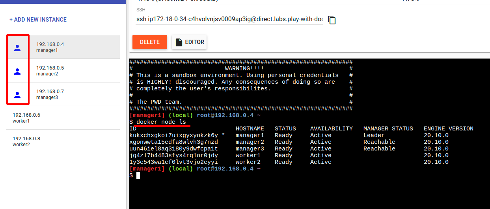
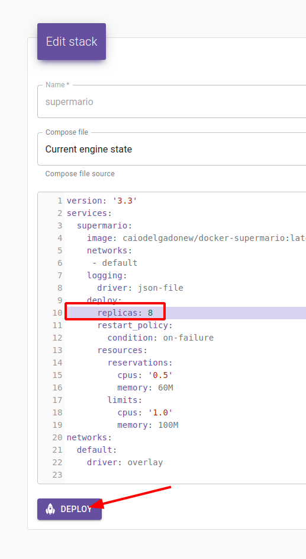

# Capítulo 08 - Ferramentas

Neste capítulo veremos diversas ferramentas para facilitar nossa gerencia e utilização do Docker

## Play With Docker

O [Play With Docker](https://labs.play-with-docker.com/) é um ambiente fornecido pela Docker na qual é possível utilizar um laboratório por 4 horas. É necessário uma conta no [Docker Hub](https://hub.docker.com/).

> O PWD (Play With Docker) costuma ficar indisponivel devido a alta utilização do mesmo por diversos usuários. Utilize o mesmo apenas para fins de estudo. 

Ao acessar o laboratório e clicar em `Start` teremos acesso a uma interface simples na qual podemos executar diversos containers dentro do período específicado.

Para adicionar uma instância basta clicar em `+ ADD NEW INSTANCE`


Na tela a direita, temos alguns campos importantes que precisamos conhecer:
1. PWD Id
2. Instance Private IP
3. Exposed Ports
4. Memory Usage
5. CPU Usage
6. SSH Command
7. Delete / File Editor
8. Live Terminal


Podemos interagir com o `PWD` através do terminal. Vamos executar um container simples do nginx através do comando
```bash
$ docker container run -dit --name nginx -p 80:80 nginx
```

Note que ao executar um container com uma porta publicada, será exibida a porta que foi publicada ao lado do IP, se clicarmos no numero da porta teremos acesso a aplicação


Podemos também copiar o endereço SSH e executar em nosso terminal para ter acesso ao terminal através de nossa máquina


Vamos remover nossa instância clicando em `Delete`


Podemos também usufruir de clusters pré configurados de Docker Swarm, para isto basta clicar no icone de chave inglesa e escolher qual template gostaria de utilizar.

Vamos escolher o template `3 Managers and 2 Workers`


Verifique que todas as instâncias serão criadas e exibidas no menu a esquerda, sendo as managers as instâncias que exibem um icone de usuário.

Para verificar o cluster, execute o comando `docker node ls` em um nó do tipo manager.



Por hora não iremos destruir o nosso ambiente, iremos utiliza-lo com a próxima ferramenta.


## Swarmpit

O [Swarmpit.io](https://swarmpit.io/) é uma ferramenta de dashboard focada em docker swarm, simples e intuitivo de se utilizar e simples de instalar.


### Instalação

Podemos executar o swarmpit através do comando:

```bash
$ docker run -it --rm \
  --name swarmpit-installer \
  --volume /var/run/docker.sock:/var/run/docker.sock \
swarmpit/install:1.9
```

Mas iremos executar o swarmpit através do deploy de uma stack, dessa forma os serviços serão distribuidos da maneira correta entre os nós.

No play with docker, execute o seguinte comando em um nó manager.
```bash
$ curl -fsSL https://raw.githubusercontent.com/swarmpit/swarmpit/master/docker-compose.yml -o swarmpit.yml
$ docker stack deploy -c swarmpit.yml swarmpit
$ docker stack services swarmpit
$ docker service logs -f swarmpit_app
```

> O service `swarmpit_app` demora alguns minutos para ser executado.

Após o service estar funcional, clique na porta 888 para acessar o dashboard do swarmpit e crie o primeiro usuario `admin` com a senha `caiodelgadonew@youtube` e clique em `CREATE ADMIN`


Após a criação do Usuário admin você conseguirá visualizar o dashboard com todas as informações do nosso cluster bem como um overview dos recursos.


### Dashboard

No dashboard do swarmpit temos informações dos nós em execução bem como a utilização dos recursos


### Registries

Nos registries podemos conectar a registries como:
* Dockerhub
* Registry v2
* Amazon ECR
* Azure ACR
* Gitlab registry


vamos fazer um deploy de um registry v2 rapidamente em nosso PWD através do comando na máquina manager1:

```bash
$ docker container run -dit --name registry -p 5000:5000 registry:2
```

1. Selecione `Registry v2` na lista de registries e clique em `Next` 
2. Preencha com o endereço `http://192.168.0.4:5000` e clique em `Next`
> Substitua o IP do manager
3. Marque `Make account Public` e clique em `Finish`


### Stacks

Em stacks podemos visualizar todas as stacks em execução em nosso cluster, podemos também clicar em `New Stack` para fazer o deploy de uma nova stack


De um nome a stack e insira o conteúdo da stack, como por exemplo o `supermario` e clique em `deploy`

```bash
version: "3.8"

services:

  supermario:
    image: caiodelgadonew/docker-supermario
    ports:
     - 8600:8080
    deploy:
      mode: replicated
      replicas: 3
      restart_policy:
        condition: on-failure
      resources:
        limits:
          cpus: "1"
          memory: 100M
        reservations:
          cpus: "0.5"
          memory: 60M
``` 

Podemos editar nosso service `on-the-flỳ` clicando em `edit`


Vamos alterar a linha `replicas: 3` para `replicas: 8` e clicar em deploy




Podemos verificar que nosso service será atualizado, clique no service para visualizar os status do serviço


### Services

Na visão de services, temos todas as informações relacionadas a um serviço, bem como a possibilidade de criar um novo serviço, editar e visualizar os logs


### Tasks

Na visão de tasks, podemos ter acesso a todas as tasks bem como qual nó esta sendo executada a task, uso de cpu e memória.


### Networks

Na parte de Networks podemos visualizar e criar novas redes


### Nodes

Em nodes podemos visualizar os recursos e informações de cada nó do nosso cluster


### Volumes

Em volumes podemos visualizar e criar novos volumes

### Secrets

Em secrets podemos visualizar e criar novos secrets

### Config

Em config podemos armazenar informações não confidenciais como arquivos de configuração.


## Portainer

O [Portainer](https://www.portainer.io/) é uma ferramenta de `container-as-a-service` a qual fornece um dashboard e diversas funções de administração do Docker e do Docker Swarm.

### Instalação

Iremos instalar o portainer em nosso cluster local, para isto acesse a máquina manager e execute os seguintes comandos:

```bash
$ curl -fsSL https://downloads.portainer.io/portainer-agent-stack.yml -o portainer-agent-stack.yml
$ docker stack deploy -c portainer-agent-stack.yml portainer
``` 

Acesse a interface do portainer no endereço http://master.docker-dca.example:9000

Crie o usuário admin com a senha `caiodelgadonew@youtube`


### Dashboard

No dashboard do Portainer, temos acesso a todas as informaçÕes do nosso cluster e os endpoints.

Clique no endpoint `primary` para visualizar mais configurações do node


### App Templates

Em App templates temos acesso a uma biblioteca de stacks e containers para efetuarmos deploys.

Podemos também criar custom templates com arquivos de stack para que seja fácil o deploy de novas aplicações.

Vamos efetuar o deploy de uma stack wordpress, para isto clique em `Wordpress`


De um nome a stack e coloque a senha para o banco de dados como `caiodelgadonew@youtube` e clique em `Deploy the stack`


### Stacks

Em stacks conseguimos visualizar todas as stacks criadas e gerenciar as stacks que foram criadas pelo portainer.


Ao clicar em uma stack, por exemplo a `wordpress`, teremos acesso a informações dos services e também a possibilidade de editar o deploy, fazer scale e editar as portas publicadas.


### Services 

Em services temos acesso a todos os services bem como a possibilidade de atualizar e editar os serviços


### Containers

Em containers, temos acesso a todos os containers bem como a informação de onde ele está sendo executado


### Images

Em images podemos visualizar todas as imagens, efetuar o pullm de imagens diretamente do dockerhub e até construir novas imagens.


### Networks

Em Networks, podemos visualizar, criar e remover as redes do nosso cluster.


### Volumes

Em volumes, podemos visualizar, criar e remover os volumes do nosso cluster


### Configs e Secrets

Em configs e secrets podemos visualizar, criar e remover informações sensíveis (secrets) ou configurações não sensíveis (configs) em nosso cluster

### Swarm

Em swarm podemos ver o status do nosso cluster e as configurações dos nossos nodes. 


Clicando em `Go to cluster visualizer` temos uma exibição visual dos containers que estão sendo executados em cada um dos nodes


### Settings

Em settings podemos criar usuários, roles e teams, configurar endpoints e registries, alterar configurações de autenticação e visualizar informações sobre o portainer

> Algumas configurações como `roles` e `oAuth` só estão disponíveis na versão `Business Edition` que é a versão paga da plataforma.


## Harbor

O [Harbor](https://goharbor.io/) é um registry open source que faz o armazenamento de artefatos e possibilita RBAC (Role based access control, ou acesso baseado em perfis) com interface gráfica.

É um dos melhores registries existentes para se utilizar em sua própria infraestrutura.

### Instalação

Acesse a máquina `registry`
```bash
$ vagrant ssh registry
```

Remova o container `registry` e garanta que o docker-compose esta instalado
```bash
$ docker container rm -f registry
$ sudo curl -L "https://github.com/docker/compose/releases/download/1.29.2/docker-compose-$(uname -s)-$(uname -m)" -o /usr/local/bin/docker-compose
$ sudo chmod +x /usr/local/bin/docker-compose
```


Execute o download e a instalação do Harbor
```bash
$ HARBORVERSION=$(curl -s https://github.com/goharbor/harbor/releases/latest/download 2>&1 | grep -Po [0-9]+\.[0-9]+\.[0-9]+)
$ curl -s https://api.github.com/repos/goharbor/harbor/releases/latest | grep browser_download_url | grep online | cut -d '"' -f 4 | wget -qi -
$ tar xvf harbor-online-installer-v$HARBORVERSION.tgz
$ cd harbor
$ wget https://gist.githubusercontent.com/caiodelgadonew/2c41e8d7fc95ddb9e53ab28ae0c6197f/raw/4d3d5fd77db1aac7afacf91fcfa39bf37383afb7/harbor.yml 
$ sudo ./install.sh
``` 

Uma vez instalado o harbor, acesse o endereço http://registry.docker-dca.example/

Efetue o login com usuário `admin` e senha `Harbor12345`


### Dashboard

Na pagina principal do harbor temos as informações dos repositórios e projetos.


Vamos criar um novo projeto clicando em `+ New Project`


Vamos chamar o projeto de docker-dca e clicar em `OK`


Agora que temos nosso repositório, podemos clicar no nome `docker-dca` e em repositório para visualizar o `push command`, será exibido os comandos para fazer o push da imagem


### Users

Antes de enviar qualquer imagem para o harbor, precisamos criar um novo usuário, afinal não queremos que o usuário admin seja utilizado para este fim.

Clique em `Users` e em seguida em em `+ NEW USER`

Criaremos o usuário `caiodelgadonew` com a senha `caiodelgadonew@YT2021` 
> Desta vez precisamos que a senha tenha no mínimo 8 caracteres sendo 1 maiúsculo, 1 minúsculo, 1 número e 1 caractere especial


### Enviando imagens

Precisamos primeiramente alterar os `insecure-registries` em todos os nodes. Faça isso através do comando:
```bash
$ echo '{ "insecure-registries" : ["registry.docker-dca.example"] }' | sudo tee /etc/docker/daemon.json ; sudo systemctl restart docker
```

Agora que temos nosso usuário criado, vamos acessar a máquina `master` e efetuar o docker login

```bash
$ vagrant ssh master
$ docker login http://registry.docker-dca.example -u caiodelgadonew -p caiodelgadonew@YT2021
```

> Lembrem-se de não utilizar a flag -p em máquinas compartilhadas/ambientes de produção

Vamos editar a tag da imagem `caiodelgadonew/docker-supermario` e envia-la para o harbor
```bash
$ docker image pull caiodelgadonew/docker-supermario
$ docker image tag caiodelgadonew/docker-supermario registry.docker-dca.example/docker-dca/docker-supermario:latest
$ docker image push registry.docker-dca.example/docker-dca/docker-supermario:latest
``` 

Uma mensagem de erro será exibida:
```bash
unauthorized: unauthorized to access repository: docker-dca/docker-supermario, action: push: unauthorized to access repository: docker-dca/docker-supermario, action: push
```

Isso acontece porque precisamos dar permissão para o usuário `caiodelgadonew` no projeto `docker-dca` com perfil de `Mantainer` ou `Project Admin`

Vamos clicar em `Projects` , `docker-dca`, `members` e em `+ USER`.


Vamos voltar para o terminal e efetuar o push novamente

```bash
$ docker image push registry.docker-dca.example/docker-dca/docker-supermario:latest
``` 

Vamos efetuar o push também da imagem do traefik
```bash
$ docker image pull traefik:v2.4
$ docker image tag traefik:v2.4 registry.docker-dca.example/docker-dca/traefik:v2.4
$ docker image push registry.docker-dca.example/docker-dca/traefik:v2.4
``` 

Voltando ao harbor e clicando em `Repositories` no projeto `docker-dca` conseguiremos ver a nossas imagem disponíveis.


## Docker Machine

[Docker Machine](https://github.com/docker/machine) é uma ferramenta que possibilita a instalação do `Docker Engine` em hosts virtuais e a administração através do comando `docker-machine`


O Docker Machine pode ser utilizado localmente através do Virtualbox/HyperV ou até mesmo nas clouds.

### Instalando o Docker Machine

Instalaremos o `docker-machine` em nossa máquina host que esta rodando Linux. 
> Caso você deseje instalar o `docker-machine` em macOS ou Windows, verifique a [Documentação Oficial](https://docs.docker.com/machine/install-machine/)

Execute os comandos:

```bash
$ base=https://github.com/docker/machine/releases/download/v0.16.0 
$ curl -L $base/docker-machine-$(uname -s)-$(uname -m) >/tmp/docker-machine 
$ sudo mv /tmp/docker-machine /usr/local/bin/docker-machine 
$ chmod +x /usr/local/bin/docker-machine
```

Para verificar se a instalação foi feita com sucesso execute o comando:
```bash
$ docker-machine --version
```

Será exibida uma mensagem com a versão do `docker-machine`

### Provisionando docker-machines em uma máquina virtual local

Primeiramente iremos aprender como provisionar uma Docker Machine localmente utilizando o virtualbox. Vamos visualizar se existe alguma docker-machine criada no atual momento através do comando:

```bash
$ docker-machine ls
```

Para criar uma docker machine podemos utilizar o subcomando `create` informando qual driver queremos utilizar.

```bash
$ docker-machine create --driver virtualbox default
``` 
> Note que o ultimo argumento é o nome da `docker-machine` que será criada

O comando acima faz o download de uma distribuição linux muito leve chamada [boot2docker](https://github.com/boot2docker/boot2docker) que será responsável por executar o Docker Engine.

### Interagindo com o Docker Machine

Vamos listar novamente as máquinas criadas até o momento:
```bash
$ docker-machine ls
``` 
```bash
NAME      ACTIVE   DRIVER       STATE     URL                         SWARM   DOCKER      ERRORS
default   -        virtualbox   Running   tcp://192.168.99.100:2376           v19.03.12   
```

Agora que temos nossa Docker Machine criada, precisamos configurar nossas variáveis de ambiente para que seja possível conectar e interagir com o Docker Engine.

Fazemos isto através do comando `docker-machine env <machine>`

```bash
$ docker-machine env default
```

Será exibida uma mensagem com as variáveis de ambiente que precisamos configurar. 
```bash
export DOCKER_TLS_VERIFY="1"
export DOCKER_HOST="tcp://192.168.99.100:2376"
export DOCKER_CERT_PATH="/home/caiodelgado/.docker/machine/machines/default"
export DOCKER_MACHINE_NAME="default"
# Run this command to configure your shell: 
# eval $(docker-machine env default)
```

Podemos também executar o comando `eval` para configurar automaticamente as variaveis de ambiente.

```bash
$ eval $(docker-machine env default)
```

> O comando `eval` funciona apenas em shell unix (com exeção do `fish`) e serve para construir um comando através de concatenação de argumentos, no nosso caso ele irá executar todos os comandos exibidos pelo comando `docker-machine env default`.


Podemos executar agora algum container normalmente como se estivessemos utilizando nosso docker local, uma vez que temos as variaveis apontando para nosso docker-machine.

```bash
$ docker container run -dit --name webserver -p 80:80 caiodelgadonew/webserver:apache2

$ docker container ls
``` 

A aplicação não ficará disponível através do nosso localhost, uma vez que não esta sendo executada localmente

```bash
$ curl localhost

curl: (7) Failed to connect to localhost port 80: Connection refused
```

Ao invés disso precisamos coletar o IP da Docker Machine para acessar a aplicação para isto utilizamos o seguinte comando `docker-machine ip <machine>`:
```bash
$ docker-machine ip default
```

Agora podemos acessar o serviço pelo navegador através do endereço IP correto ou através do terminal com um subshell para facilitar
```bash
$ curl $(docker-machine ip default)
```


Podemos criar quantas docker-machine quisermos através do comando `docker-machine create <machine>`

```bash
$ docker-machine create docker02
$ docker-machine ls
```
```bash
NAME       ACTIVE   DRIVER       STATE     URL                         SWARM   DOCKER      ERRORS
default    *        virtualbox   Running   tcp://192.168.99.100:2376           v19.03.12   
docker02   -        virtualbox   Running   tcp://192.168.99.102:2376           v19.03.12   
```

Para desconfigurar as variaveis de ambientes do docker, podemos utilizar o comando `docker-machine env -u` , e será exibido os comandos para remover as configurações de conexão, podemos também utilizar o eval neste caso

```bash
$ docker-machine env -u
$ eval $(docker-machine env -u)
```

Podemos também parar e iniciar docker-machines através dos subcomandos `stop` e `start`
```bash
$ docker-machine stop default
$ docker-machine ls
$ docker-machine start default
``` 

Para inspecionar uma Docker Machine, utilizamos o subcomando `inspect`
```bash
$ docker-machine inspect default 
```

> Podemos também utilizar o `| jq` para facilitar a leitura

Para remover a Docker machine, utilizamos o subcomando `rm` seguido da confirmação `y`
```bash
$ docker-machine rm default
$ docker-machine rm docker02 -y
$ docker-machine ls
```

### Provisionando Docker Machines em Cloud

Quando instalamos o Docker Machine, temos acesso aos Cloud Providers:
* Amazon Web Services
* DigitalOcean
* Microsoft Azure
* Google Compute Engine
* etc...

> Para uma lista completa de drivers disponíveis veja a [Documentação Oficial](https://docs.docker.com/machine/drivers/)

Vamos criar uma Docker Machine na AWS, para isto precisamos que as credenciais da AWS já estejam configuradas em nosso ambiente, podemos também passar esses dados através da cli com os parametros:
```bash
$  docker-machine create --driver amazonec2 --amazonec2-access-key AKI******* --amazonec2-secret-key 8T93C*******  aws-sandbox
```

> Lembre-se de alterar os dados pelos seus dados de acesso.

```bash
$ docker-machine create --driver amazonec2 aws-sandbox
$ docker-machine ls
```

Vamos executar um container na cloud e verificar seu funcionamento
```bash
$ eval $(docker-machine env aws-sandbox)
$ docker container run -dit --name nginx -p 80:80 nginx
```

Ainda não será possível acessar a aplicação, uma vez que a amazon terá um `security-group` que não esta liberando o acesso a porta `80`.
```bash
$ curl $(docker-machine ip aws-sandbox)
```

Para isto, precisamos alterar as regras de ingress do `security-group`, podemos alterar através da web-ui ou através da `aws-cli`

```bash
$ aws ec2 describe-security-groups --group-names docker-machine
$ aws ec2 authorize-security-group-ingress --group-name docker-machine --protocol tcp --port 80 --cidr 0.0.0.0/0
$ aws ec2 describe-security-groups --group-names docker-machine
```

Agora que temos nosso `security-group` habilitando o acesso a porta 80, podemos acessar a aplicação:
```bash
$ curl $(docker-machine ip aws-sandbox)
```

Vamos remover nossa Docker Machine
```bash
$ docker-machine rm aws-sandbox
```

> Não esqueça de verificar no painel da aws ou na cli se a máquina foi removida para evitar custos inesperados
