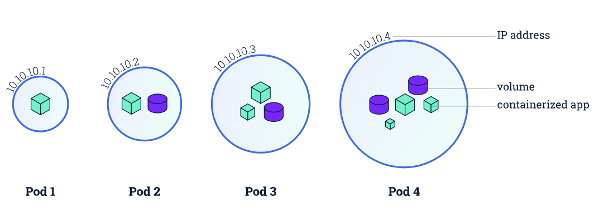
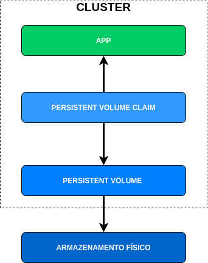
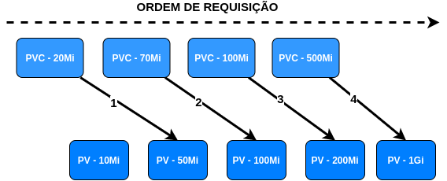

# Capitulo 9 - Kubernetes

## O que é o Kubernetes

Kubernetes é uma ferramenta de orquestração de containers criado pelo google em 2014, amplamente utilizada no mercado.

Kubernetes é um sistema open source para automatização de deployments, escalonamento e gerenciamento de aplicativos em contêineres.

Kubernetes também é conhecido pelo nome k8s ou kube.

O nome k8s é uma abreviação de kubernetes, sendo `k` + `8 letras` + `s`.

Nos anos 80 os programadores eram "preguiçosos" e gostavam de abreviar as palavras baseando sempre em primeira letra, ultima letra e o numero de letras entre eles. Seguindo este padrão, surgiu o k8s.

Alguns Exemplos de termos abreviados:

- Kubernetes (k8s)
- Internationalization (i18n)
- Localization (l10n)
- Globalization (g11n)
- Localizability (l12y)

Também vemos alguns termos como k3s e k0s quando falamos de kubernetes, estes se referem a distribuições de kubernetes.

- [K3s](https://k3s.io/) - Distribuição com foco em ter a metade do tamanho em consumo de memória. Kubernetes é uma palavra de 10 letras estilizada como k8s. Portanto, algo com a metade do tamanho do Kubernetes seria uma palavra de 5 letras estilizada como K3s.
- [k0s](https://k0sproject.io/) - Distribuição com foco em facilitação. *_"K0s é para Kubernetes o que Docker é para containers"_*. O nome zero é utilizado para significar zero atrito, zero custo e zero sobrecarga.

## Pods

No Docker, a menor unidade computacional possível é o Container, já no Kubernetes a menor unidade computacional possivel é o Pod.

O Pod representa uma unica instância de um processo em execução no cluster. Pods podem conter um ou mais containers.

> A palavra ****Pod**** significa:  unidade destacável ou independente em uma aeronave, espaçonave, veículo ou navio, tendo uma função particular. Muitas vezes Pod é referido a um grupo de baleias que é o simbolo do docker.

Pods também contem redes compartilhadas e recursos de armazenamento entre os containers.

- Redes: Pods recebem endereços IP's únicos e compartilham o mesmo namespace, incluindo endereços IP e portas de rede. Containers em um mesmo pod se communicam através de `localhost`
- Armazenamento: Pods podem especificar uma série de volumes de armazenamento que podem ser compartilhados entre containers.

O modelo de rede do Kubernetes dita que os Pods precisam ser acessiveis pelo seu endereço IP através dos nós. Isso quer dizer que o endereço IP de um pod está sempre visível para oturos Pods na rede, e cada Pod visualiza seu próprio endereço IP da mesma forma que outros Pods o veem.




Uma vez que o foco deste livro/curso é Docker e sua certificação DCA, não iremos nos aprofundar no assunto de Kubernetes, passaremos apenas pelos tópicos necessários da certifição

## Minikube

Minikube é um Kubernetes local, criado para facilitar o aprendizado e o desenvolvimento de Kubernetes.

Para utilizar o Minikube precisamos do Docker ou uma máquina virtual, e o minikube funciona de uma forma bem semelhante ao Docker Machine

### Recursos Necessários:
* 2 CPU's
* 2GB de memória livre
* 20GB de espaço livre em disco
* Conexão com Internet
* Container ou Gerenciador de Máquinas Virtuais como:
  * Docker
  * Hyperkit
  * Hyper-V
  * Parallels
  * Podman
  * VirtualBox
  * VMWare

### Instalação e Configuração

Cobriremos a instalação em sistemas Linux, para instalar em macOS ou Windows, verifique a [Documentação Oficial](https://minikube.sigs.k8s.io/docs/start/)

Execute os seguintes comandos:
```bash
$ curl -LO https://storage.googleapis.com/minikube/releases/latest/minikube-linux-amd64
$ sudo install minikube-linux-amd64 /usr/local/bin/minikube
$ minikube version
``` 

Iremos utilizar o Minikube com o Docker, para inciar um novo ambiente, execute o comando:
```bash
$ minikube start --driver=docker
```

> Chamamos este processo de `KinD` ou `Kubernetes in Docker` que se refere a executar o Kubernetes dentro de um container Docker.

Será criado um container com o minikube.

```bash
$ docker container ls 
```

## Estrutura dos Comandos

Para trabalhar com o Kubernetes, utilizamos o binário do [kubectl](https://kubectl.docs.kubernetes.io/)


> `kubectl` é uma sigla para Kubernetes Control, muitas das vezes podemos ouvir seu nome pronunciado como "Kube C T L", "Kube Control" e "Kube Cuttle/Cuddle", esse ultimo surgiu como um apelido, devido ao seu "Mascote" ser o cuttlefish (Em português Choco, sibas ou sépia) que é uma espécie de molusco parecido com o polvo

Alguns dos comandos do `kubectl` são similares aos comandos do Docker, como por exemplo o comando `kubectl get nodes` para listar os nós do cluster
```bash
$ kubectl get nodes

NAME       STATUS   ROLES                  AGE   VERSION
minikube   Ready    control-plane,master   13m   v1.22.1
```

Os comandos do `kubectl` seguem a seguinte semântica:
```bash
kubectl + VERBO + recurso + OPÇÕES
```

Alguns exemplos de verbos:
```bash
get, list, describe, create, update, patch, delete ...
```

Alguns exemplos de recursos:
```bash
nodes, pods, namespaces, services, deployment, replicaset, pv(persistent volume), pvc(persistent volume claim) ...
```
> No Kubernetes podemos utilizar o termo `all` como recurso para trabalhar com todos os recursos.

## Descrevendo Aplicações

Diferentemente do Docker, não podemos executar uma simples linha de comando para criar os recursos do Kubernetes, para isto precisamos definir um arquivo `YAML`.

> Muitas pessoas dizem ser possível executar linhas de comando com o Kubernetes e de fato existe uma maneira, utilizando o `EOF` e passando o arquivo diretamente no terminal, porém é utilizado o `yaml` e não um simples comando como o `docker container run`

A estrutura básica de um Kubernetes YAML é composta dos seguintes dados

```yaml
---
apiVersion: v1
kind: Pod
metadata:
  name: webservers
spec:
  containers:
    - name: web1
      image: nginx
      ports:
        - containerPort: 80
    - name: web2
      image: httpd
      ports:
        - containerPort: 81
``` 

Vamos criar nosso primeiro pod:

```bash
$ vim pod.yml
```
```yaml
apiVersion: v1
kind: Pod
metadata:
  name: demo
spec:
  containers:
  - name: testpod
    image: alpine:3.5
    command: ["ping", "8.8.8.8"]
```

Para efetuar o deploy do pod executamos o seguinte comando:

```bash
$ kubectl apply -f pod.yml
```

Podemos verificar os status do pod através do comando:

```bash
$ kubectl get pods
```
```bash
NAME   READY   STATUS              RESTARTS   AGE
demo   0/1     ContainerCreating   0          5s
```

Após alguns segundos o pod entrará em estado de `Running` ou seja, em execução
```bash
NAME   READY   STATUS    RESTARTS   AGE
demo   1/1     Running   0          30s
``` 

Para acessar os logs do pod utilizamos o subcomando `logs` 
```bash
$ kubectl logs demo
```

Para remover o pod utilizamos o subcomando `delete`
```bash
$ kubectl delete -f pod.yml
```
ou
```bash
$ kubectl delete pod demo
``` 

## Pod Multi-container

Podemos ter pods que possuem mais que um único container, fazemos isto quando, por exemplo, precisamos que mais de um container tenha acesso a um mesmo volume.

Vamos criar nosso pod multi container:
```bash
$ vim multi-container.yml
```
```yml
apiVersion: v1
kind: Pod
metadata:
  name: multi-container
spec:
  restartPolicy: Never
  volumes:
  - name: shared-data
    emptyDir: {}
  containers:
  - name: nginx-container
    image: nginx
    volumeMounts:
    - name: shared-data
      mountPath: /usr/share/nginx/html
  - name: debian-container
    image: debian
    volumeMounts:
    - name: shared-data
      mountPath: /pod-data
    command: ["/bin/sh"]
    args: ["-c", "echo Hello from the debian container > /pod-data/index.html"]
```

No arquivo de configuração, conseguimos ver a existencia de um Volume com o nome de `shared-data` que será montado no segundo container no caminho `/pod-data`.

Através desse volume, o container `debian-container` irá popular o arquivo `/pod-data/index.html` que foi montado em ambos os containers, tornando o arquivo acessivel pelo pimeiro container no caminho `/usr/share/nginx/html`.

Vamos criar nosso pod
```bash
$ kubectl apply -f multi-container.yml
$ kubectl get pods
```
```bash
NAME             READY   STATUS              RESTARTS   AGE
multi-container   0/2     ContainerCreating   0          7s
```

Veja que agora temos dois containers criados em um pod de nome `multi-container`. Como nosso `debian-container` tinha apenas o propósito de popular o arquivo `index.html` ele está em estado de `terminated`. podemos verificar isto através do comando abaixo:

```bash
$ kubectl get pod multi-container --output=yaml
```
```yml
apiVersion: v1
kind: Pod
metadata:
  ...
spec:
  ...
  containerStatuses:
  - containerID: docker://6bb386f758d0dd102da7177bca17ed8e1b22a5735ab5f3427d913254e3096c4d
    image: debian:latest
    ...
    name: debian-container
    ...
    state:
      terminated:
        containerID: docker://6bb386f758d0dd102da7177bca17ed8e1b22a5735ab5f3427d913254e3096c4d
        exitCode: 0
        finishedAt: "2021-09-12T20:23:44Z"
        reason: Completed
        startedAt: "2021-09-12T20:23:44Z"
  - containerID: docker://f9f4bfc457ee4d734e434b8cd656cb30b53f62d073fd2a8443a1fbd730a785e8
    image: nginx:latest
    ...
    name: nginx-container
    ...
    state:
      running:
        startedAt: "2021-09-12T20:23:42Z"
  ...
```

> A opção `--output=yaml` é uma ótima maneira de gerar um arquivo YAML de algum recurso ja existente no kubernetes

Vamos conectar ao container nginx através de um shell e verificar se o nginx está sendo executado

```bash
$ kubectl exec -it multi-container -c nginx-container -- /bin/bash

root@multi-container:/# curl localhost
```

Um dos motivos para executarmos estes pods multi containers é oferecer suporte do aplicativo auxiliar ao aplicativo principal. Este container auxiliar muitas das vezes é chamado de _sidecar_, normalmente é um extrator ou fornecedor de dados, ou até mesmo um proxy.

> Um _sidecar_ é um dispositivo de uma única roda preso na lateral de uma motocicleta, scooter ou bicicleta, fazendo com que se transforme em um veículo de três rodas suportando mais um passageiro.

Podemos agora remover nossos containers

```bash
$ kubectl delete -f multi-container.yml
```

## ClusterIP e NodePort

Assim como o Docker Swarm, fazemos o deploy de serviços em nosso cluster. Podemos utilizar diversos recursos de rede para disponibilizar o acesso a este serviço. Para a certificação Docker DCA precisamos saber de dois destes recursos.

- `ClusterIP`: Expõe o serviço a um IP interno ao cluster. Quando escolhemos este valor fazemos com que o serviço seja acessivel apenas por dentro do cluster. É o modelo padrão de `ServiceType`.
- `NodePort`: Expõe o serviço em todos os IP's dos nós em uma porta estática (a `NodePort`). Você conseguirá acessar o serviço por fora do cluster através de `<NodeIP>:<NodePort>`.

### ClusterIP

Para efetuar o deploy de um serviço como `ClusterIP` não precisamos definir nenhum parâmetro adicional.

Vamos criar um pod do nginx
```bash
$ nginx-pod.yml
```
```yml
apiVersion: v1
kind: Pod
metadata:
  name: nginx
  labels:
    app: nginx-dca 
spec:
  containers:
  - name: nginx
    image: nginx
    ports:
      - containerPort: 80
```
```bash
$ kubectl apply -f nginx-pod.yml
```

Verifique os pods
```bash
$ kubectl get pods
``` 
```bash
NAME        READY   STATUS    RESTARTS   AGE
nginx-dca   1/1     Running   0          10s
```

Agora que temos nosso deployment e nossos containers, podemos criar nosso service.
```bash
$ vim nginx-svc.yml
```
```yaml
apiVersion: v1
kind: Service
metadata:
  name: nginx-dca
spec:
  selector:
    app: nginx-dca
  ports:
  - port: 80
    protocol: TCP
```
```bash
$ kubectl apply -f nginx-svc.yml
$ kubectl get services
$ kubectl describe service nginx-dca
```
```bash
Name:              nginx-dca
Namespace:         default
Labels:            <none>
Annotations:       <none>
Selector:          app=nginx-dca
Type:              ClusterIP
IP Family Policy:  SingleStack
IP Families:       IPv4
IP:                10.100.82.164
IPs:               10.100.82.164
Port:              <unset>  80/TCP
TargetPort:        80/TCP
Endpoints:         172.17.0.3:80
Session Affinity:  None
Events:            <none>
```

Podemos verificar que nosso `nginx-dca` teve seu deploy realizado como `ClusterIP`, sendo assim podemos acessar os serviços através do `<ClusterIP>:<Port>`. Porém nossa máquina não possui um IP no mesmo range do cluster, uma vez que estamos utilizando o `minikube`. Para acessar este serviço iremos acessar o container do minikube

```bash
$ docker container exec -it minikube bash
$ curl 10.100.82.164:80
```
Destrua o service
```bash
$ kubectl delete -f nginx-svc.yml 
``` 

### Node Port

Quando configuramos um serviço para `NodePort`, o kubernetes aloca uma porta de um range (por padrão 30000-32767). Cada nó faz um proxy para aquela porta no serviço.

Vamos criar um serviço novo para nosso `nginx-dca`.
```bash
$ vim nginx-svc-nodeport.yml
```
```yml
apiVersion: v1
kind: Service
metadata:
  name: nginx-dca
spec:
  type: NodePort
  selector:
    app: nginx-dca
  ports:
    - protocol: TCP
      port: 8080
      targetPort: 80
      nodePort: 30033
```

Quando falamos de `NodePort` temos 3 parametros importantes:
* `port` - expõe o serviço kubernetes na `port` para o cluster, outros pods conseguem se comunicar através da porta especificada
* `targetPort` - porta na qual o serviço enviará requests para o pod
* `nodePort` - porta na qual o serviço sera acessivel através dos IP's dos nodes

Vamos aplicar nosso service
```bash
$ kubectl apply -f nginx-svc-nodeport.yml
$ kubectl get services
``` 
```bash
NAME         TYPE        CLUSTER-IP       EXTERNAL-IP   PORT(S)          AGE
kubernetes   ClusterIP   10.96.0.1        <none>        443/TCP          3d16h
nginx-dca    NodePort    10.108.187.120   <none>        8080:30033/TCP   10s
```

Veja que o serviço agora encontra-se como NodePort.

```bash
$ kubectl describe service nginx-dca
``` 
```bash
Name:                     nginx-dca
Namespace:                default
Labels:                   <none>
Annotations:              <none>
Selector:                 app=nginx-dca
Type:                     NodePort
IP Family Policy:         SingleStack
IP Families:              IPv4
IP:                       10.108.187.120
IPs:                      10.108.187.120
Port:                     <unset>  8080/TCP
TargetPort:               80/TCP
NodePort:                 <unset>  30033/TCP
Endpoints:                172.17.0.3:80
Session Affinity:         None
External Traffic Policy:  Cluster
Events:                   <none>
``` 

Podemos verificar o acesso ao serviço internamente ao cluster ao executar um pod e efetuar um curl em `nginx-dca:8080`
```bash
$ kubectl run --rm -it alpine --image=alpine --restart=Never -- ash
$ apk update; apk add curl
$ curl nginx-dca:8080
$ exit
```

O serviço também estará acessivel através do `<ClusterIP>:<NodePort>`. Como estamos utilizando o minikube, precisaremos verificar o IP do mesmo:
```bash
$ minikube ip
$ curl $(minikube ip):30033
``` 

Podemos também utilizar de um recurso do minikube para obter a url de acesso ao serviço
```bash
$ minikube service --url nginx-dca
$ curl $(minikube service --url nginx-dca)
```

Vamos agora excluir nosso service e nosso pod
```bash
$ kubectl delete -f nginx-svc-nodeport.yml
$ kubectl delete -f -f nginx-pod.yml
```


## Deployments

Deployments no kubernetes são utilizados para fornecer atualizações declarativas para `Pods` e `ReplicaSets`

> `ReplicaSets` no kubernetes funcionam como `Replicas` do Docker Swarm

Nós descrevemos um estado desejado em um deployment, e o controlador de Deploment modifica o estado atual para que seja alcançado o estado desejado.

Vamos criar um deployment:
```bash
$ vim nginx-deploy.yml
```
```yaml
apiVersion: apps/v1
kind: Deployment
metadata:
  name: nginx-deployment
  labels:
    app: nginx-dca
spec:
  replicas: 3
  selector:
    matchLabels:
      app: nginx-dca
  template:
    metadata:
      labels:
        app: nginx-dca
    spec:
      containers:
      - name: nginx-dca
        image: nginx
        ports:
        - containerPort: 80
```

Vamos verificar nosso deployment
```bash
$ kubectl get deployments
$ kubectl describe deployment nginx-deployment
```

Podemos verificar tudo que foi criado pelo nosso deployment através do comando:

```bash
$ kubectl get all -l app=nginx-dca
```
```bash
NAME                                    READY   STATUS    RESTARTS   AGE
pod/nginx-deployment-58b7d66d67-2gzsw   1/1     Running   0          91s
pod/nginx-deployment-58b7d66d67-ckp2g   1/1     Running   0          91s
pod/nginx-deployment-58b7d66d67-pn6ng   1/1     Running   0          91s

NAME                               READY   UP-TO-DATE   AVAILABLE   AGE
deployment.apps/nginx-deployment   3/3     3            3           91s

NAME                                          DESIRED   CURRENT   READY   AGE
replicaset.apps/nginx-deployment-58b7d66d67   3         3         3       91s
```

Um ponto interessante de um `deployment` é que o `replicaset` sempre tentará atingir o estado desejado dos `pods`. 
Ou seja, mesmo que os pods sejam deletados, o `replicaset` se encarregará de garantir o deployment dos mesmos.

```bash
$ kubectl delete pods -l app=nginx-dca
$ kubectl get all -l app=nginx-dca
```
```bash
NAME                                    READY   STATUS              RESTARTS   AGE
pod/nginx-deployment-58b7d66d67-85db6   0/1     ContainerCreating   0          4s
pod/nginx-deployment-58b7d66d67-979ng   0/1     ContainerCreating   0          4s
pod/nginx-deployment-58b7d66d67-mds5d   1/1     Running             0          4s

NAME                               READY   UP-TO-DATE   AVAILABLE   AGE
deployment.apps/nginx-deployment   1/3     3            1           4m3s

NAME                                          DESIRED   CURRENT   READY   AGE
replicaset.apps/nginx-deployment-58b7d66d67   3         3         1       4m3s
```

Essa é uma das grandes "magias" do kubernetes, e é uma das maiores "pegadinhas" para aqueles que não conhecem o funcionamento do mesmo e tentam apagar os pods porem eles continuam reparecendo. 

Para remover nossos pods precisamos remover o deployment.

```bash
$ kubectl delete -f nginx-deploy.yml
$ kubectl get all
```
```bash
NAME                 TYPE        CLUSTER-IP   EXTERNAL-IP   PORT(S)   AGE
service/kubernetes   ClusterIP   10.96.0.1    <none>        443/TCP   3d17h
```

## configMaps e secrets

ConfigMaps e Secrets são objetos de API utilizamos para armazenar dados no kubernetes. A diferença básica entre o `configMap` e o `secret` é que o `configMap` armazena os dados não confidenciais em formato chave-valor, ou seja, em texto plano. Enquanto o `secret` armazena dados sensíveis, ou seja, criptografado que pode ser utilizado na especificação de um Pod. No geral, podemos dizer que o `configMap` e o `secret` do kubernetes funcionam da mesma maneira que o `configMap` e o `secret` do Docker Swarm.

### Criando um configMap

Para criar um configmap utilizamos uma definição em yaml. Vamos criar nosso `configMap`
```bash
$ vim configmap.yml
```
```yaml
apiVersion: v1
kind: ConfigMap
metadata:
  name: configmap-app1
data:
  initial_refresh_value: "4"
  ui_properties_file_name: "user-interface.properties"
  user-interface.properties: |
    color.good=green
    color.bad=red
```
```bash
$ kubectl apply -f configmap.yml
$ kubectl get configmap
```
```bash
NAME               DATA   AGE
configmap-app1     3      10s
kube-root-ca.crt   1      4d12h
```

Podemos visualizar a `configMap` através do comando
```bash
$ kubectl describe configmap configmap-app1 
```
```bash
Name:         configmap-app1
Namespace:    default
Labels:       <none>
Annotations:  <none>

Data
====
initial_refresh_value:
----
4
ui_properties_file_name:
----
user-interface.properties
user-interface.properties:
----
color.good=green
color.bad=red

Events:  <none>
```

Para utilizarmos a `configMap` podemos configurar a mesma como um volume
```bash
$ vim pod-configmap.yml
```
```yaml
apiVersion: v1
kind: Pod
metadata:
  name: app1
spec:
  containers:
  - name: app1
    image: alpine
    command: ["ping", "8.8.8.8"]
    volumeMounts:
    - name: configs
      mountPath: "/etc/configs"
      readOnly: true
  volumes:
  - name: configs
    configMap:
      name: configmap-app1
```

Podemos agora conectar no pod e verificar nosso volume com o `configMap`

```bash
$ kubectl apply -f pod-configmap.yml 
$ kubectl exec -it pod/app1 -- ash
$ ls /etc/configs
$ cat /etc/configs/initial_refresh_value
$ cat /etc/configs/ui_properties_file_name 
$ cat /etc/configs/user-interface.properties
$ exit
``` 
Com isso podemos apontar nossos containers para ler os arquivos de configuração.

Vamos remover nosso pod
```bash
$ kubectl delete pod/app1
```

Existem 4 maneiras diferentes de utilizarmos um configmap para configurar um container dentro de um pod.
1. Dentro de um container através de comandos e argumentos
2. Variáveis de ambiente para um container
3. Adicionando o arquivo em um volume somente leitura para a aplicação ler.
4. Escrever o codigo a ser executado dentro de um pod que usa a Kubernetes API para ler o configMap

Para aprender sobre as outras maneiras, veja a [Documentação Oficial](https://kubernetes.io/docs/concepts/configuration/configmap/)

## Configurando Secrets

Quando criamos secrets, precisamos definir o tipo do secret a ser criado, existem diversos modelos de secrets por padrão no kubernetes, tais como:

| **Builtin Type**                       | **Uso**                                     | 
| -------------------------------------- | ------------------------------------------- | 
| `Opaque`                               | Valor arbitrário definido pelo usuário      |
| `kubernetes.io/service-account-token`	 | Token de conta de Serviço                   |
| `kubernetes.io/dockercfg`              | Arquivo `~/.dockercfg` serializado          | 
| `kubernetes.io/dockerconfigjson`       | Arquivo `~/.docker/config.json` serializado |
| `kubernetes.io/basic-auth`             | Credenciais para autenticação Básica        | 
| `kubernetes.io/ssh-auth`               | Credenciais para autenticação SSH           |
| `kubernetes.io/tls`	                   | Informação TLS para um cliente ou servidor  |
| `bootstrap.kubernetes.io/token`        | Dados de token bootstrap                    |

Vamos criar um secret do tipo `basic-auth`.
```bash
$ vim secret.yml
```
```bash
apiVersion: v1
kind: Secret
metadata:
  name: senha-mysql
type: kubernetes.io/basic-auth
stringData:
  username: root
  password: caiodelgadonew@youtube
```
```bash
$ kubectl apply -f secret.yml
$ kubectl get secrets
$ kubectl describe secret senha-mysql
```
```bash
Name:         senha-mysql
Namespace:    default
Labels:       <none>
Annotations:  <none>

Type:  kubernetes.io/basic-auth

Data
====
password:  22 bytes
username:  4 bytes
```

> Note que o secret fica criptografado, não sendo possível visualizar seu conteúdo.

Para utilizarmos o secret podemos acessa-lo através de variáveis de ambiente
```bash
$ vim pod-secret.yml
```
```bash
apiVersion: v1
kind: Pod
metadata:
  name: mysql-db
spec:
  containers:
  - name: mysql-db
    image: mysql
    env:
    - name: MYSQL_ROOT_PASSWORD
      valueFrom:
        secretKeyRef:
          name: senha-mysql
          key: password
```

Vamos verificar se o secret foi configurado corretamente
```bash
$ kubectl exec -it mysql-db -- mysql -u root -pcaiodelgadonew@youtube
mysql> show databases;
mysql> exit
```

Agora podemos remover nosso pod
```bash
$ kubectl delete pod/mysql-db
```

Existem 3 maneiras diferentes configurarmos secrets
1. Como variáveis de ambiente de um container
2. Como arquivos dentro de um volume montado em um ou mais containers
3. Pelo `kubelet` ao fazer o download de imagens para um Pod.


Para aprender sobre as outras maneiras e tipos de secrets, veja a [Documentação Oficial](https://kubernetes.io/docs/concepts/configuration/secret/)


## Persistent Storage

Quando falamos de armazenamento persistente em Kubernetes, precisamos entender dois recursos, o `PersistentVolumes` ou `PV` e o `PersistentVolumeClaim` ou `PVC`



* **Persistent Volume ou PV** - `PVs` é um recurso de armazenamento virtual disponível no cluster, que aponta para um armazenamento físico na infraestrutura.  
* **Persistent Volume Claim ou PVC** - `PVCs` são solicitações de volume feitas pelo kubernetes que será atrelado a um APP. 

Podemos resumir como `PV` sendo a unidade lógica atribuida a uma unidade de armazenamento físico que será disponibilizado para o kubernetes, e o `PVC` como a solicitação do kubernetes para que um volume com especificação `x` seja utilizado.

Um ponto importante a se notar é que o `PVC` sempre irá buscar o menor armazenamento possível que entregue todos os recursos que forem solicitados.



Caso um `PVC` solicite 500Mb e o menor volume com todas as características requisitadas tenha 1Gb, o `PVC` irá adquirir o `PV` de 1Gb e o utilizará para a aplicação.

### Modos de Acesso

Os volumes no kubernetes podem ter diversos modos de acesso:

* `ReadWriteOnce` ou `RWO` - O volume pode ser montado como leitura e escrita por apenas um único nó 
* `ReadOnlyMany` ou `ROX` - O volume pode ser montado como apenas leitura por diversos nós
* `ReadWriteMany` ou `RWX` - O volume pode ser montado como leitura e escrita por diversos nós
* `ReadWriteOncePod` ou `RWOP` - O volume pode ser montado como leitura e escrita por apenas um pod. (Apenas no Kubernetes 1.22+)

Precisamos descrever o modo de acesso quando criamos nossos volumes.

## Criando PVs

Como todo recurso no kubernetes, criamos `PVs` através de arquivos yaml. Porém precisaremos criar os volumes antes de criar os `PVs`, vamos conectar em nosso minikube e criar os volumes

```bash
$ minikube ssh
$ sudo mkdir /mnt/dados{1..3}
$ sudo sh -c "echo 'Kubernetes Storage Dados 1' > /mnt/dados1/index.html"
$ sudo sh -c "echo 'Kubernetes Storage Dados 2' > /mnt/dados2/index.html"
$ sudo sh -c "echo 'Kubernetes Storage Dados 3' > /mnt/dados3/index.html"
$ ls -lR /mnt
$ exit
```

Agora que temos nossos diretórios de dados, vamos criar nossos PersistentVolumes

```bash
$ vim pv.yml
```
```yml
apiVersion: v1
kind: PersistentVolume
metadata:
  name: pv10m
  labels:
    type: local
spec:
  storageClassName: manual
  capacity:
    storage: 10Mi
  accessModes:
    - ReadWriteOnce
  hostPath:
    path: "/mnt/dados1"
---
apiVersion: v1
kind: PersistentVolume
metadata:
  name: pv200m
  labels:
    type: local
spec:
  storageClassName: manual
  capacity:
    storage: 200Mi
  accessModes:
    - ReadWriteOnce
  hostPath:
    path: "/mnt/dados2"
---
apiVersion: v1
kind: PersistentVolume
metadata:
  name: pv1g
  labels:
    type: local
spec:
  storageClassName: manual
  capacity:
    storage: 1Gi
  accessModes:
    - ReadWriteOnce
  hostPath:
    path: "/mnt/dados3"
```
> Podemos descrever diversos recursos abrindo um novo yaml através do `---` em um mesmo arquivo

Vamos criar e listar nossos `PVs`
```bash
$ kubectl apply -f pv.yml
$ kubectl get persistentvolumes
$ kubectl get pv
``` 
```bash
NAME     CAPACITY   ACCESS MODES   RECLAIM POLICY   STATUS      CLAIM   STORAGECLASS   REASON   AGE
pv10m    10Mi       RWO            Retain           Available           manual                  42s
pv1g     1Gi        RWO            Retain           Available           manual                  42s
pv200m   200Mi      RWO            Retain           Available           manual                  42s
```
## Criando PVCs

Vamos criar nossos PVCs através de um arquivo yaml

```bash
$ vim pvc.yml
```
```yml
apiVersion: v1
kind: PersistentVolumeClaim
metadata:
  name: pvc100m
spec:
  storageClassName: manual
  accessModes:
    - ReadWriteOnce
  resources:
    requests:
      storage: 100Mi
---
apiVersion: v1
kind: PersistentVolumeClaim
metadata:
  name: pvc700m
spec:
  storageClassName: manual
  accessModes:
    - ReadWriteOnce
  resources:
    requests:
      storage: 700Mi
```

Vamos criar e listar nossos `PVs`
```bash
$ kubectl apply -f pvc.yml
$ kubectl get persistentvolumeclaims
$ kubectl get pvc
$ kubectl get pv 
```
```bash
NAME      STATUS   VOLUME   CAPACITY   ACCESS MODES   STORAGECLASS   AGE
pvc100m   Bound    pv200m   200Mi      RWO            manual         30s
pvc700m   Bound    pv1g     1Gi        RWO            manual         30s
```
```bash
NAME     CAPACITY   ACCESS MODES   RECLAIM POLICY   STATUS      CLAIM             STORAGECLASS   REASON   AGE
pv10m    10Mi       RWO            Retain           Available                     manual                  10m
pv1g     1Gi        RWO            Retain           Bound       default/pvc700m   manual                  10m
pv200m   200Mi      RWO            Retain           Bound       default/pvc100m   manual                  10m
```


Podemos ver que o os `PVs` que solicitamos foram atrelados ao `PV` que satisfaz todas suas necessidades listadas, ligando o `PVC` que solicitou 100Mi ao `pv200m` e o `PVC` que solicitou 700m ao `pv1g`.

## Atrelando Pod a Volumes.

Para ligar um Pod a um volume, precisamos declara-lo no yaml de criação do pod.

```bash
$ vim webserver.yml
```
```yml
apiVersion: v1
kind: Pod
metadata:
  name: webserver
spec:
  volumes:
    - name: webdata
      persistentVolumeClaim:
        claimName: pvc100m
  containers:
    - name: webserver
      image: nginx
      ports:
        - containerPort: 80
          name: "http-server"
      volumeMounts:
        - mountPath: "/usr/share/nginx/html"
          name: webdata
```

> Note que a configuração do Pod aponta para um `PVC` porém não especificamos o `PV`. Isso se dá porque pelo ponto de vista do Pod, um `Claim` é um volume. 

Vamos executar nosso pod e verificar o volume

```bash
$ kubectl apply -f webserver.yml
$ kubectl get pods
$ kubectl exec -it webserver -- /bin/bash
$ curl localhost
$ exit
```

Vamos alterar nosso pod para utilizar o outro `PVC`.

```bash
$ kubectl detele pod/webserver
$ vim webserver.yml
```
```yaml
apiVersion: v1
kind: Pod
metadata:
  name: webserver
spec:
  volumes:
    - name: webdata
      persistentVolumeClaim:
        claimName: pvc700m
  containers:
    - name: webserver
      image: nginx
      ports:
        - containerPort: 80
          name: "http-server"
      volumeMounts:
        - mountPath: "/usr/share/nginx/html"
          name: webdata
```

Vamos executar nosso pod e verificar o volume

```bash
$ kubectl apply -f webserver.yml
$ kubectl get pods
$ kubectl exec -it webserver -- /bin/bash
$ curl localhost
$ exit
```

Mais informações sobre Volumes podem ser vistas na [Documentação Oficial](
https://kubernetes.io/docs/concepts/storage/persistent-volumes/)

## Destruindo o Ambiente

Agora que passamos por todos os conceitos base do kubernetes, podemos destruir nosso ambiente do minikube

```bash
$ minikube delete
```
