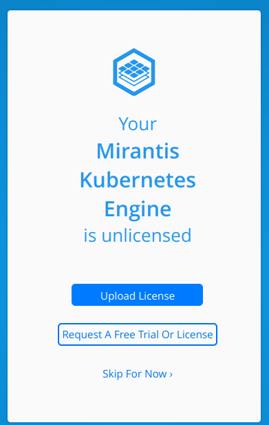
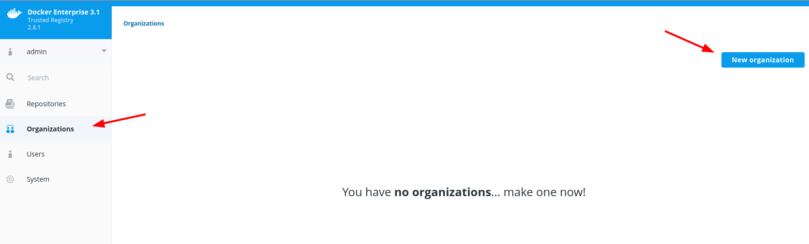
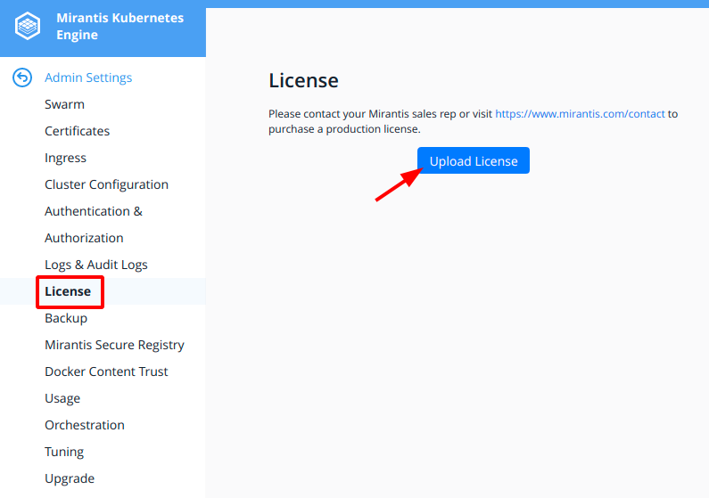
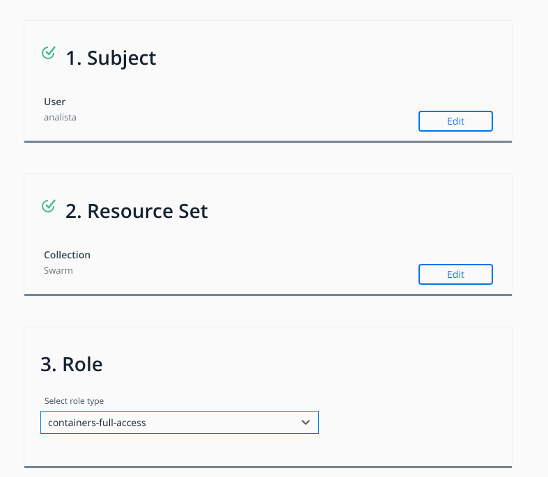

# Capitulo 10 - Enterprise

Toda a parte enterprise da certificação Docker DCA está relacionado a sua plataforma chamada **MKE** ou **Mirantis Kubernetes Engine**


## Mirantis Kubernetes Engine

O **MKE** é uma plataforma que anteriormente era chamada de **Docker Enterprise** ou **UCP**. Ela fornece uma maneira de gerenciamento de clusters e deploy de aplicações através do uso de Docker Swarm e Kubernetes.


O **MKE** é composto de um conjunto de diversas ferramentas como:
* **Universal Control Plane - UCP** - Interface de Gerenciamento Web
* **Calico** - Solução open source de redes e segurança de redes
* **Istio** - Ingress Gateway para o cluster
* **Mirantis Secure Registry** - Registry com features de segurança (anteriormente conhecido como **dtr**)

### Requisitos Mínimos

* 8GB of RAM para nodes manager
* 4GB of RAM para nodes worker
* 2 vCPUs para nodes manager
* 25GB de disco livre.

### Requisitos para Produção 

* 16GB of RAM para nodes manager
* 4 vCPUs para nodes manager
* 25~100GB de disco livre. Recomendado o uso de SSD.

> **ATENÇÃO**: Caso não tenha os requisitos mínimos para executar o **MKE** em sua máquina, não se preocupe, a prova é teórica e você precisa entender apenas o funcionamento e os conceitos.

## Instalando o MKE

Começaremos alterando nosso `Vagrantfile` para as configurações mínimas.

```bash
$ vim Vagrantfile
```

```hcl
machines = {
   "master"   => {"memory" => "8096", "cpu" => "2", "ip" => "100", "image" => "ubuntu/bionic64"},
   "node01"   => {"memory" => "4096", "cpu" => "2", "ip" => "110", "image" => "ubuntu/bionic64"},
   "node02"   => {"memory" => "4096", "cpu" => "2", "ip" => "120", "image" => "centos/7"},
   "registry" => {"memory" => "4096", "cpu" => "2", "ip" => "200", "image" => "ubuntu/bionic64"}
}
```

Recrie as máquinas através do comando `vagrant up` e faça a instalação do Docker em todas as máquinas

Agora que temos nossas máquinas disponíveis vamos instalar o MKE na máquina master, para isto iremos acessar a máquina e executar o container do `mirantis/ucp` para verificar a ultima versão disponível

```bash
$ vagrant ssh master
$ docker container run --rm -it --name ucp -v /var/run/docker.sock:/var/run/docker.sock mirantis/ucp --version
```

> Como se trata de uma solução de gerenciamento, precisamos que o `docker.sock` esteja exposto para o container.

```bash
docker run --rm -it \
        -v /var/run/docker.sock:/var/run/docker.sock \
        mirantis/ucp \
         version 3.4.6 (1b0bd58)
``` 

Agora que temos a versão atual do nosso UCP podemos executar a instalação do mesmo. Como o UCP precisa de diversos outros containers, é uma boa prática ter todas as imagens já baixadas na máquina que será o manager, podemos fazer isto através do comando:

```bash
$ docker container run --rm -it --name ucp -v /var/run/docker.sock:/var/run/docker.sock mirantis/ucp:3.4.6 images --pull missing
```

> O processo é um pouco demorado pelo tamanho e quantidade de imagens que serão baixadas, note também que estamos fixando a versão do UCP na execução, isto é altamente necessário.

Após a conclusão do processo podemos executar a instalação do UCP através do comando

```bash
$  docker container run --rm -it --name ucp -v /var/run/docker.sock:/var/run/docker.sock mirantis/ucp:3.4.6 install --host-address 10.20.20.100 --interactive
```

Vamos agora responder algumas perguntas e aguardar a instalação:
```bash
Admin Username: admin
Admin password: caiodelgadonew@youtube
Confirm Admin password: caiodelgadonew@youtube
Additional Aliases:    <ENTER>
``` 

A instalação estará completa ao exibir a mensagem:
```bash
INFO[0121] All Installation Steps Completed             
``` 

## Acessando o Dashboard

Para acessar o dashboard vamos abrir o browser no endereço https://master.docker-dca.example e conectar com o usuário e senha que criamos 


Após o login podemos enviar uma licença, requisitar uma licença de teste ou pular. Vamos clicar em `Skip For Now`

> Para solicitar uma licença de teste é preciso entrar em contato com a Mirantis através do website https://www.mirantis.com/contact/



Será exibido o dashboard do MKE, e agora precisamos entender o funcionamento do mesmo.


No dashboard temos um menu a esquerda onde temos as opções:

* **admin** - Configurações de perfil, administrador, sobre e support bundle
* **Dashboard** - Tela inicial com informações do Swarm, Kubernetes e recursos.
* **Access Control** - Controle de acesso para Organizações e Times, Usuários, Regras e Concessões
* **Shared Resources** - Collections, Stacks, Containers, Imagens, Nós
* **Kubernetes** - Todos os recursos e configurações do Kubernetes
* **Swarm** - Todos os recursos e configurações do swarm.


## Adicionando Nós

O primeiro passo é adicionar os nós restantes ao nosso cluster, o dashboard já nos entrega o comando completo para execução, basta clicar em **Add Nodes** na parte inferior do dashboard


Será exibida uma tela com todas as informações necessárias para adicionar um nó ao nosso cluster, deixaremos as opções de **node type** `Linux` e **node role** `Worker` vamos copiar o comando e executa-lo em todos os outros nós.

```bash
$ vagrant ssh node01
$ docker swarm join --token SWMTKN-1-40xlaju97ux404y2z8p5tixyy5q5ag0064uo367og5i98nzuwt-7kvbotg83csbjskcxzbfsjgnp 10.20.20.100:2377
$ exit

$ vagrant ssh node02
$ docker swarm join --token SWMTKN-1-40xlaju97ux404y2z8p5tixyy5q5ag0064uo367og5i98nzuwt-7kvbotg83csbjskcxzbfsjgnp 10.20.20.100:2377
$ exit

$ vagrant ssh registry
$ docker swarm join --token SWMTKN-1-40xlaju97ux404y2z8p5tixyy5q5ag0064uo367og5i98nzuwt-7kvbotg83csbjskcxzbfsjgnp 10.20.20.100:2377
$ exit
```

Voltando para a página do **UCP** vamos em **Shared Resources** e em seguida em **Nodes**


Vamos aguardar o processo até que os nodes fiquem em estado de `Healthy`


Voltando ao dashboard conseguimos visualizar as métricas dos nodes managers e workers.


## Mirantis Secure Registry

Agora que temos os nós adicionados em nosso cluster, podemos definir o nó que será nosso **DTR** (Mirantis Secure Registry era anteriormente chamado de **DTR** Docker Trusted Registry)

Para adicionarmos o registry vamos no menu **Admin**>**Admin Settings**>**Mirantis Secure Registry**

E vamos selecionar o `UCP NODE` `registry.docker-dca.example` e marcar `Use a PEM-encoded TLS CA certificate for MKE` após isto podemos copiar o comando para `Unix Shell` e executar na máquina `registry`


```bash
$ vagrant ssh registry
$ docker run -it --rm docker/dtr install --ucp-node registry.docker-dca.example --ucp-username admin --ucp-url https://master.docker-dca.example --ucp-ca  "-----BEGIN CERTIFICATE-----
MIIBfjCCASSgAwIBAgIUaRHfl3/fvCS+PhFfq/gQiEpw/8QwCgYIKoZIzj0EAwIw
HTEbMBkGA1UEAxMSVUNQIENsaWVudCBSb290IENBMB4XDTIxMTAyMzE1NDEwMFoX
DTI2MTAyMjE1NDEwMFowHTEbMBkGA1UEAxMSVUNQIENsaWVudCBSb290IENBMFkw
EwYHKoZIzj0CAQYIKoZIzj0DAQcDQgAEa4NQLljC7h3eWFdLxljHpCvXBvoEgpvk
DNdTzpnFYrpUHgdLbCCRLZCnemoWDTbAUnj1D0rN7ZnalxF8FLe5cqNCMEAwDgYD
VR0PAQH/BAQDAgEGMA8GA1UdEwEB/wQFMAMBAf8wHQYDVR0OBBYEFKC1J6c292rz
j16c85hbCTt8klgFMAoGCCqGSM49BAMCA0gAMEUCIQD4VcngZ/ZHR98nXTX2u5Ef
1P0J6zKxElbGuQhHkuToDwIgSrX4eftF4SX1byWbpwMi7Q5mpNdOUW686FweqxAq
xdw=
-----END CERTIFICATE-----
"

ucp-password: caiodelgadonew@youtube
```

A instalação será concluida quando a mensagem a seguir for exibida:

```bash
INFO[0156] Installation is complete
```

Acesse o **DTR** através do endereço https://registry.docker-dca.example/ e efetue o login com o usuário e senha de administrador


Após o login clique em `Skip for now`

## Criando Usuários e Organizações no DTR

Na tela inicial do **DTR** clique em `Users`>`New user`


Coloque o nome do usuário de `analista` com a senha `caiodelgadonew@youtube` e clique em Save


clique em `Organizations`>`New organization`



Preencha o nome como `docker-dca` e clique em Save


Agora que temos nosso usuário e nossa organização, podemos adicionar o usuário a organização indo em `Organizations`>`docker-dca` e em seguida clicar em `Add user`


Preencha os dados e adicione o usuário a organização, vamos alterar seu nivel de permissionamento para `Org Owner`


## Criando Repositórios no DTR

Clique em `Repositories` e em seguida em `New Repository`


Vamos criar o repositório `nginx` como público e clicar em `Save`


Após a criação do repositório podemos clicar em `View Details` para visualizar os detalhes do repositório 


Na tela a seguir teremos diversas informações do repositório, mirrors e como efetuar o pull de uma nova imagem


## Enviando imagens para o DTR (sem licença ativa)

O processo de envio de imagens para o DTR é o mesmo que utilizamos com qualquer outro registry.

Como não temos uma licença do Docker Enterprise não podemos enviar imagens para o mesmo. Uma mensagem de erro será exibida, porém iremos passar por todos os passos para o envio da imagem

Em uma das máquinas do cluster iremos adicionar o parametro `insecure-registries`,  efetuar o pull de uma imagem do nginx, efetuar o login no registry, alterar a tag da imagem e enviar para o DTR

```bash
$ vagrant ssh master
$ echo '{ "insecure-registries" : ["registry.docker-dca.example"] }' | sudo tee /etc/docker/daemon.json ; sudo systemctl restart docker
$ docker image pull nginx
$ docker image tag nginx registry.docker-dca.example/docker-dca/nginx
$ docker login registry.docker-dca.example -u analista -p caiodelgadonew@youtube
$ docker push registry.docker-dca.example/docker-dca/nginx
``` 

A mensagem de erro será exibida porque não temos uma licença válida do DTR, porém o cenário esperado seria a imagem disponível no DTR

```bash
Using default tag: latest
The push refers to repository [registry.docker-dca.example/docker-dca/nginx]
9959a332cf6e: Preparing 
f7e00b807643: Preparing 
f8e880dfc4ef: Preparing 
788e89a4d186: Preparing 
43f4e41372e4: Preparing 
e81bff2725db: Waiting 
error parsing HTTP 402 response body: invalid character 'D' looking for beginning of value: "DTR doesn't have a license\n"
```

## Adicionando a Licença no MKE/DTR

Para seguir com esta etapa você deve possuir uma licença do MKE 

> Para solicitar uma licença de teste é preciso entrar em contato com a Mirantis através do website https://www.mirantis.com/contact/

Acesse o dashboard através do endereço https://master.docker-dca.example e conecte-se com o usuário e senha que criamos 


Após o login podemos enviar uma licença, clicando em upload a license, porém vamos ver outra maneira de enviar a licença, clique em _Skip For Now_ 

No menu principal, clique em `admin` e em seguida em `Admin Settings`

Para enviar a licença clique em `Upload License` e selecione o arquivo de licença em seu computador.



Após isto será exibida a tela com a licença válida


Acesse o **DTR** através do endereço https://registry.docker-dca.example/ e efetue o login com o usuário e senha de administrador


Após o login podemos enviar uma licença, clicando em upload a license, porém vamos ver outra maneira de enviar a licença, clique em _Skip For Now_ 


Para adicionar a licença ao DTR clique em `admin` e em seguida em `System`.

Na aba `General` clique em apply a new license e selecione o arquivo


Após isto será exibida a tela com a licença válida


Agora que temos nosso sistema licenciado, podemos retornar ao envio da imagem ao DTR

## Enviando imagens para o DTR (com licença ativa)

Acesse a máquina master e execute novamente o comando para enviar a imagem

```bash
$ vagrant ssh master
$ docker login registry.docker-dca.example -u analista -p caiodelgadonew@youtube
$ docker push registry.docker-dca.example/docker-dca/nginx
``` 

Agora nossa imagem pode ser enviada com sucesso uma vez que temos o licenciamento ativo

```bash
Using default tag: latest
The push refers to repository [registry.docker-dca.example/docker-dca/nginx]
9959a332cf6e: Pushed 
f7e00b807643: Pushed 
f8e880dfc4ef: Pushed 
788e89a4d186: Pushed 
43f4e41372e4: Pushed 
e81bff2725db: Pushed 
latest: digest: sha256:7250923ba3543110040462388756ef099331822c6172a050b12c7a38361ea46f size: 1570
``` 

## Docker Content Trust

O Docker Content Trust (DCT) fornece a habilidade de usar assinaturas digitais para dados enviados para e pelos Docker Registries, o Docker Trusted Registry (DTR) é um deles. Essas assinaturas habilitam a verificação pelo cliente ou pelo runtime (docker no nosso caso) a verificação da integridade e o responsável por publicar tags específicas.

O registro de uma imagem segue o seguinte padrão.

```bash
[REGISTRY_HOST[:REGISTRY_PORT]/]REPOSITORY[:TAG]

registry.docker-dca.example[:5000]/docker-dca/nginx[:latest]

REGISTRY_HOST: registry.docker-dca.example
REGISTRY_PORT: default (5000)
REPOSITORY: docker-dca/nginx (projeto/imagem)
TAG: default (latest)
``` 

Um determinado repositório pode ter diversas tags, como por exemplo `latest`, `1.2.3`, `alpine`, etc... Um usuário pode fazer a publicação de uma imagem assinada com tag `latest`. Mais tarde essa imagem pode ser substituida imagem não assinada. O segundo envio substitui a imagem fazendo com que a `latest` não seja mais assinada. porém a não irá afetar a imagem que foi assinada anteriormente. Por este e outros motivos o ideal é efetuar o tag da imagem como `latest` e uma versão estática, com isso garantindo que a imagem tenha por exemplo `latest` e `1.0.0`. E quando substituirmos a latest, teremos ainda a versão `1.0.0` assinada, e a latest "não-assinada".

Para ativar o Docker Content Trust basta exportar a variável de ambiente `DOCKER_CONTENT_TRUST=1`

> O Docker Content Trust é desativado por padrão no Docker Client.

```bash
$ export DOCKER_CONTENT_TRUST=1
$ docker image pull caiodelgadonew/docker-supermario
```

Como a imagem não é assinada, veremos que o Download irá falhar:

```bash
Using default tag: latest
Error: remote trust data does not exist for docker.io/caiodelgadonew/docker-supermario: notary.docker.io does not have trust data for docker.io/caiodelgadonew/docker-supermario
```

Caso desativemos o Docker content Trust a imagem poderá ser baixada com sucesso.

```bash 
$ export DOCKER_CONTENT_TRUST=0
$ docker image pull caiodelgadonew/docker-supermario
```


### Assinando imagens com o Docker Content Trust


> Os passos a seguir serão executados no docker hub e em sua máquina local, uma vez que nosso registry não tem os certificados adicionados e é um "Insecure Registry".

Para assinarmos uma imagem precisamos gerar as chaves através do comando `docker trust`. Vamos acessar a nossa máquina efetuar o login no dockerhub e criar nossa chave.

> As chaves podem ser geradas localmente ou delegadas por uma autoridade certificadora, para fim de estudos iremos gerar localmente nossas chaves.

```bash
$ docker login -u <username>
$ docker trust key generate caiodelgadonew
```

Será solicitada uma senha para a chave, utilizaremos `caiodelgadonew@youtube`

```bash
Generating key for caiodelgadonew...
Enter passphrase for new caiodelgadonew key with ID f0e7172: caiodelgadonew@youtube
Repeat passphrase for new caiodelgadonew key with ID f0e7172: caiodelgadonew@youtube
Successfully generated and loaded private key. Corresponding public key available: caiodelgadonew.pub
```

Caso já possua uma chave, podemos carrega-la através do comando `docker trust key load <key.pub> --name <key_name>`

Após obtermos a chave, precisamos adicionar a delegação da chave no servidor, fazemos isso através do comando

```bash
$ docker trust signer add --key <key_name> <user_name> <repo_name> 
```

Será solicitada a senha para a chave e para o repositório, para fins de estudo utilizaremos `caiodelgadonew@youtube`

```bash
$ docker trust signer add --key caiodelgadonew.pub caiodelgadonew caiodelgadonew/nginx

Adding signer "caiodelgadonew" to caiodelgadonew/nginx...
Initializing signed repository for caiodelgadonew/nginx...
Enter passphrase for root key with ID 61e8fca: caiodelgadonew@youtube
Enter passphrase for new repository key with ID ed6f165: caiodelgadonew@youtube
Repeat passphrase for new repository key with ID ed6f165: caiodelgadonew@youtube
Successfully initialized "caiodelgadonew/nginx"
Successfully added signer: caiodelgadonew to caiodelgadonew/nginx
``` 

Para fins de estudo utilizaremos a imagem do nginx, vamos efetuar o download e adicionar uma nova tag a imagem

```bash
$ docker image pull nginx
$ docker image tag nginx caiodelgadonew/nginx
``` 

Finalmente podemos assinar e enviar a imagem para o registry:

> Será solicitada a senha para a chave

```bash
$ docker trust sign caiodelgadonew/nginx:latest

Signing and pushing trust data for local image caiodelgadonew/nginx:latest, may overwrite remote trust data
The push refers to repository [docker.io/caiodelgadonew/nginx]
2bed47a66c07: Mounted from library/nginx 
82caad489ad7: Mounted from library/nginx 
d3e1dca44e82: Mounted from library/nginx 
c9fcd9c6ced8: Mounted from library/nginx 
0664b7821b60: Mounted from library/nginx 
9321ff862abb: Mounted from library/nginx 
latest: digest: sha256:4424e31f2c366108433ecca7890ad527b243361577180dfd9a5bb36e828abf47 size: 1570
Signing and pushing trust metadata
Enter passphrase for caiodelgadonew key with ID 6b878e6: caiodelgadonew@youtube
Successfully signed docker.io/caiodelgadonew/nginx:latest
``` 

Podemos validar nossa imagem através do comando:
```bash
$ DOCKER_CONTENT_TRUST=1 docker image pull caiodelgadonew/nginx
```

Uma mensagem será exibida informando que a imagem esta atualizada 
```bash
Using default tag: latest
Pull (1 of 1): caiodelgadonew/nginx:latest@sha256:4424e31f2c366108433ecca7890ad527b243361577180dfd9a5bb36e828abf47
docker.io/caiodelgadonew/nginx@sha256:4424e31f2c366108433ecca7890ad527b243361577180dfd9a5bb36e828abf47: Pulling from caiodelgadonew/nginx
Digest: sha256:4424e31f2c366108433ecca7890ad527b243361577180dfd9a5bb36e828abf47
Status: Image is up to date for caiodelgadonew/nginx@sha256:4424e31f2c366108433ecca7890ad527b243361577180dfd9a5bb36e828abf47
Tagging caiodelgadonew/nginx@sha256:4424e31f2c366108433ecca7890ad527b243361577180dfd9a5bb36e828abf47 as caiodelgadonew/nginx:latest
docker.io/caiodelgadonew/nginx:latest
```

Após o download podemos inspecionar a imagem para verificar sua integridade.

```bash
$ docker trust inspect caiodelgadonew/nginx
$ docker trust inspect --pretty caiodelgadonew/nginx
``` 

```bash
Signatures for caiodelgadonew/nginx

SIGNED TAG   DIGEST                                                             SIGNERS
latest       4424e31f2c366108433ecca7890ad527b243361577180dfd9a5bb36e828abf47   caiodelgadonew

List of signers and their keys for caiodelgadonew/nginx

SIGNER           KEYS
caiodelgadonew   6b878e6e710f

Administrative keys for caiodelgadonew/nginx

  Repository Key:       ed6f165932c8bd0e3c6fb0fa326157229788fede24d49e16ac798b5560cdf5e4
  Root Key:     49e0e996f6fb02c4c2841dd8d29ffbd4f77a7c64722a47f3f622c6b5d17d78e5
```

Caso efetuemos o download da imagem sem o Docker Content Trust ativo, a mensagem exibida não verificará o digest

```bash
$ DOCKER_CONTENT_TRUST=0 docker image pull caiodelgadonew/nginx

Using default tag: latest
latest: Pulling from caiodelgadonew/nginx
Digest: sha256:4424e31f2c366108433ecca7890ad527b243361577180dfd9a5bb36e828abf47
Status: Image is up to date for caiodelgadonew/nginx:latest
docker.io/caiodelgadonew/nginx:latest
```

## UCP/MKE Role Based Access Control 

RBAC (Role Based Access Control) ou controle de acesso baseado em papéis, é a maneira utilizada pelo UCP/MKE para controlar o acesso a seus recursos.

Para criar ou configurar uma role, vamos acessar o dashboard em https://master.docker-dca.example e navegar até o menu `Access Control` > `Roles`. Para criar uma nova role basta selecionar `Swarm` e clicar em `Create`


> Também é possível criar roles para o Kubernetes através da aba `Kubernetes`

De um nome a role como por exemplo `containers-full-access` e em operations vamos selecionar as operações que desejamos liberar o acesso.

Selecione em `Container Operations` a opção `All container operations` e clique em create


Para atrelar uma role a um usuário, vamos em `Grants`, `Swarm`, `Create Grant`


Selecione o usuário `analista`, o Resource Set `Swarm` e a Role `containers-full-access` e clique em create



Agora nosso usuário analista terá o acesso concedido.

## UCP/MKE Client Bundle

O `Client Bundle` é utilizado para o usuário obter acesso direto ao cluster do UCP/MKE, para criar e efetuar o download do bundle, vamos acessar o dashboard em https://master.docker-dca.example e navegar até o menu `Access Control` > `Users`. Selecionar o usuário `analista`e na tela que se abrir clicar no icone da engrenagem no canto superior direito.

Selecione o menu `Client Bundle` e em seguida clique em `New Client Bundle` > `Generate Client Bundle`


Clique em `Confirm` e será feito o download do client bundle para sua máquina.

O client bundle consiste de todos os arquivos necessários para acessar o UCP/MKE.

Vamos copiar o bundle para nossa pasta atual e remover o mesmo do pacote zip.

```bash
$ mv ~/Downloads/ucp-bundle-analista.zip .
$ unzip ucp-bundle-analista.zip
``` 

Para utilizar o pacote podemos utilizar o arquivo `env.sh`
```bash
$ source env.sh

Cluster "ucp_master.docker-dca.example:6443_analista" set.
User "ucp_master.docker-dca.example:6443_analista" set.
Context "ucp_master.docker-dca.example:6443_analista" created.
``` 

Podemos executar o comando `docker version` para verificar se nosso ambiente foi configurado com sucesso.

```bash
$ docker version

Server: Mirantis Cloud Native Platform
 Engine:
  Version:          20.10.9
  API version:      1.41 (minimum version 1.12)
  Go version:       go1.16.8
  Git commit:       79ea9d3
  Built:            Mon Oct  4 16:06:34 2021
  OS/Arch:          linux/amd64
  Experimental:     false
 containerd:
  Version:          1.4.11
  GitCommit:        5b46e404f6b9f661a205e28d59c982d3634148f8
 runc:
  Version:          1.0.2
  GitCommit:        v1.0.2-0-g52b36a2
 docker-init:
  Version:          0.19.0
  GitCommit:        de40ad0
 Mirantis Kubernetes Engine:
  Version:          3.4.6
  ApiVersion:       1.40
  Arch:             amd64
  BuildTime:        Wed Oct  6 19:07:18 UTC 2021 
  GitCommit:        1b0bd58
  GoVersion:        go1.16.4
  MinApiVersion:    1.20
  Os:               linux
 Kubernetes:
  Version:          1.20+
  buildDate:        2021-09-18T04:05:21Z
  compiler:         gc
  gitCommit:        c0557aa1a9571c353503500cb7130a2f491d073f
  gitTreeState:     clean
  gitVersion:       v1.20.11-mirantis-1
  goVersion:        go1.15.15
  major:            1
  minor:            20+
  platform:         linux/amd64
 Calico:
  Version:          v3.19.1
  cni:              v3.19.1
  kube-controllers: v3.19.1
  node:             v3.19.1
```

Executar os seguintes comandos:
```bash
$ docker node ls 
$ docker container ls
```

Note que não conseguimos ver nenhuma informação dos nodes, porém podemos visualizar todos os dados dos containers em execução, isso é possível pela role que configuramos. Como expermimento, adicione a role `Full Control` ao usuário `analista` e verifique novamente o comando `docker node ls`


```bash
$ docker node ls     
ID                            HOSTNAME                      STATUS    AVAILABILITY   MANAGER STATUS   ENGINE VERSION
8axa7grquom38yqmp8uoykt8r *   master.docker-dca.example     Ready     Active         Leader           20.10.9
xm5sn34f86o0cvtfvsozdruvi     node01.docker-dca.example     Ready     Active                          20.10.9
pwdjpq0iq9p9bs00t81dda9sw     node02.docker-dca.example     Ready     Active                          20.10.9
3pvpxesooexiibjy8dbnv6rw0     registry.docker-dca.example   Ready     Active                          20.10.9
``` 

Agora com o devido acesso, o usuário `analista` pode efetuar qualquer ação em nosso cluster.

## Integrando o UCP/MKE com LDAP/SAML/SCIM

Para integrar o UCP ou o MKE com algum protocolo de Autenticação e Autorização podemos acessar o dashboard em https://master.docker-dca.example e navegar até o menu `admin`, `Admin Settings`, `Authentication & Authorization`.

Para habilitar o LDAP basta ativar a opção `LDAP` e preencher os dados da conexão.

> LDAP (Lightweight Directory Access Protocol) é um protocolo de aplicação aberto e livre para diretório de usuários, bastante conhecido em sua implementação como Microsoft Active Directory ou OpenLDAP

Para habilitar o SAML basta ativar a opção `SAML` e preencher os dados da conexão.

> SAML (Security Assertion Markup Language) é um padrão aberto para troca de dados de autenticação e autorização entre partes. Muitas aplicações aceitam a autenticação via SAML, muita das vezes atrelado ao SSO (Single Sign On)

Para habilitar o SCIM basta ativar a opção `SCIM` e preencher os dados da conexão.

> SCIM (System for Cross-domain Identity Management) é um padrão para automatizar a troca de informações de identidade do usuário entre domínios de identidade ou sistemas de TI. De todos os protocolos comentados o SCIM é o menos utilizado, porém não menos importante.

